# **Google Cloud Cortex Framework**


# About the Data Foundation for Google Cloud Cortex Framework
The Data Foundation for [Google Cloud Cortex Framework](https://cloud.google.com/solutions/cortex) is a set of analytical artifacts, that can be automatically deployed together with reference architectures.

The current repository contains the analytical views and models that serve as a foundational data layer for the Google Cloud Cortex Framework in BigQuery. You can find the entity-relationship diagram [for SAP ECC here](images/erd_ecc.png) ([PDF](docs/erd_ecc.pdf)), the one for [SAP S/4 here](images/erd_s4.png)([PDF](docs/erd_s4.pdf)) and one for [Salesforce.com here](images/erd_sfdc.png) ([PDF](docs/erd_sfdc.pdf)).


# TL;DR for setup
If you are in a hurry and already know what you are doing, clone this repository recursively with submodules (`--recurse-submodules`)  .

```bash
git clone --recurse-submodules https://github.com/GoogleCloudPlatform/cortex-data-foundation
```
Then change into the cloned directory execute the following command

```bash
gcloud builds submit --project <execution project, likely the source> \
--substitutions \
_PJID_SRC=<project for landing raw data>,_PJID_TGT=<project to deploy user-facing views>,_DS_CDC=<BQ dataset to land the result of CDC processing - must exist before deployment>,_DS_RAW=<BQ dataset to land raw data from replication - must exist before deployment>,_DS_REPORTING=<BQ dataset where Reporting views are created, will be created if it does not exist>,_DS_MODELS=<BQ dataset where ML views are created, will be created if it does not exist>,_GCS_BUCKET=<Bucket for logs - Cloud Build Service Account needs access to write here>,_TGT_BUCKET=<Bucket for DAG scripts - don’t use the actual Airflow bucket - Cloud Build Service Account needs access to write here>,_TEST_DATA=true,_DEPLOY_CDC=true,_GEN_EXT=true,_DEPLOY_SAP=true,_DEPLOY_SFDC=true

```


# **Deployment**

You can find a step-by-step video going through a deployment with sample data in YouTube: [`[English version]`](https://youtu.be/pxfxOYPQw9E) - [`[Version en Español]`](https://youtu.be/1j1Kz27VHVo )

# Prerequisites


## Understand the Framework

Before continuing with this guide, make sure you are familiar with:

-   Google Cloud Platform [fundamentals](https://www.cloudskillsboost.google/course_templates/60)
-   How to navigate the Cloud Console, [Cloud Shell](https://cloud.google.com/shell/docs/using-cloud-shell) and [Cloud Shell Editor](https://cloud.google.com/shell/docs/editor-overview)
-   Fundamentals of [BigQuery](https://cloud.google.com/bigquery/docs/introduction)
-   Fundamentals of [Cloud Composer](https://cloud.google.com/composer/docs/concepts/overview) or [Apache Airflow](https://airflow.apache.org/docs/apache-airflow/stable/concepts/index.html)
-   Fundamental concepts of[ Change Data Capture and dataset structures](#understanding-change-data-capture).
-   General navigation of [Cloud Build](https://cloud.google.com/build/docs/overview)
-   Fundamentals of [Identity and Access Management](https://cloud.google.com/iam/docs/)


## Establish project and dataset structure

You will require at least one GCP project to host the BigQuery datasets and execute the deployment process.

This is where the deployment process will trigger Cloud Build runs. In the project structure, we refer to this as the [Source Project](#dataset-structure).


You will need to identify:

*   **Deploy SAP, Salesforce.com or everything?:** Decide whether you want to deploy models for both workloads at the same time or only one set of models (SAP or Salesforce).
*   **Source Google Cloud Project:** Project where the source data is located, from which the data models will consume. This project is normally accessed by technical practitioners.
*   **Target Google Cloud Project:** Project where the Data Foundation predefined data models will be deployed and accessed by end-users. This may or may not be different from the source project depending on your needs.
*   **Source BigQuery Dataset (RAW):** BigQuery dataset where the source SAP or Salesforce data is replicated to or where the test data will be created. The recommendation is to have two separate datasets, one for each source (i.e., one raw dataset for SAP and one raw dataset forSalesforce).
*   **CDC BigQuery Dataset:** BigQuery dataset where the CDC processed data lands the latest available records. This may or may not be the same as the source dataset if the tool landing the data performs the CDC merge operation. The recommendation is to have two separate CDC datasets, one for each source (i.e., one cdc dataset for SAP and one cdc dataset forSalesforce).
*   **Target BigQuery reporting dataset:** BigQuery dataset where the Data Foundation predefined data models will be deployed. The recommendation is to have two separate reporting datasets, one for each source (i.e., one reporting dataset for SAP and one reporting dataset forSalesforce). This dataset is automatically created by the deployer if it does not exist.
*   **Target BigQuery machine learning dataset:** BigQuery dataset where the BQML predefined models will be deployed. This dataset is automatically created by the deployer if it does not exist.

**Alternatively**, if you do not have a replication tool set up or do not wish to use the replicated data, the deployment process can generate test tables and fake data for you. You will still need to [create](https://cloud.google.com/bigquery/docs/datasets) and identify the datasets ahead of time.

### Loading SAP data into BigQuery

If you currently have a replication tool from SAP ECC or S/4 HANA, such as the [BigQuery Connector for SAP](https://cloud.google.com/solutions/sap/docs/bq-connector-for-sap-install-config), you can use the same project (Source Project) or a different one for reporting.

**Note:** If you are using an existing dataset with data replicated from SAP, you can find the list of required tables in [`setting.yaml`](https://github.com/GoogleCloudPlatform/cortex-dag-generator/blob/main/setting.yaml). If you do not have all of the required tables replicated, only the views that depend on missing tables will fail to deploy.

### Loading Salesforce data into Bigquery

We provide a replication solution based on Python scripts scheduled in [Apache Airflow](https://airflow.apache.org/) and [Salesforce Bulk API 2.0](https://developer.salesforce.com/docs/atlas.en-us.api_asynch.meta/api_asynch/bulk_api_2_0.htm). These Python scripts can be adapted and scheduled in the tool of choice.

There are three sets of processing options for data integration:
- API call and load into RAW, updating existing records if needed
- Source-to-target structure mapping views
- CDC processing scripts

If you have datasets already loaded through a different tool in append-always mode, the CDC processing scripts contain mapping files to map the schema of the tables as generated by your tool into the names and data types of the structure required by the reporting views in Cortex Data Foundation. You can also add custom fields in the schema definition so they are incorporated in the CDC processing.

 ❗For CDC scripts to work, the **Id** for each API (e.g., `Account Id`) and the [**SystemModStamp**](https://developer.salesforce.com/docs/atlas.en-us.object_reference.meta/object_reference/system_fields.htm) need to be present in the source table. These fields should either have their original name (Id, SystemModstamp) or being mapped respectively to the {object_name}Id and SystemModstamp.

For example, the source table with data of Account object should have original Id and SystemModstamp fields. If these fields have different names, then src/SFDC/src/table_schema/accounts.csv file must be updated with id field's name mapped to AccountId and whatever system modification timestamp field mapped to SystemModstamp.


If you already have the replication and CDC working for Salesforce APIs and only need the mapping, you can edit the [mapping files](https://github.com/GoogleCloudPlatform/cortex-salesforce/tree/main/src/cdc_dag_generator/table_schema) to generate views that translate the structure generated by the integration tool to the strcuture expercted by Cortex Data Foundation reporting views.

## Enable Required Components

The following Google Cloud components are required:

*   Google Cloud Project
*   BigQuery instance and datasets
*   Service Account with Impersonation rights
*   Cloud Storage Buckets
*   Cloud Build API
*   Cloud Resource Manager API
*   Optional components:
    *   [Cloud Composer](https://console.cloud.google.com/marketplace/product/google/composer.googleapis.com) for change data capture (CDC) processing (SAP and Salesforce), hierarchy flattening (SAP only), and data replication (Salesforce only) through Directed Acyclic Graphs ([DAG](https://airflow.apache.org/docs/apache-airflow/stable/concepts/dags.html)s). You can find how to set up an instance of Cloud Composer in the [documentation](https://cloud.google.com/composer/docs/how-to/managing/creating).
    *   Looker **(optional, connects to reporting templates. Requires manual setup) **
    *   [Analytics Hub](https://cloud.google.com/analytics-hub) linked datasets (**optional**) are currently used for some external sources, such as the Weather DAG. You may choose to fill this structure with any other available source of your choice for advanced scenarios.

From the [Cloud Shell](https://shell.cloud.google.com/?fromcloudshell=true&show=ide%2Cterminal), you can enable Google Cloud Services using the _gcloud_ command line interface in your Google Cloud project.

Replace the `<SOURCE_PROJECT>` placeholder with your source project. Copy and paste the following command into the cloud shell:


```bash
gcloud config set project <SOURCE_PROJECT>

gcloud services enable bigquery.googleapis.com \
                       cloudbuild.googleapis.com \
                       composer.googleapis.com \
                       storage-component.googleapis.com \
                       cloudresourcemanager.googleapis.com

```


You should get a success message:

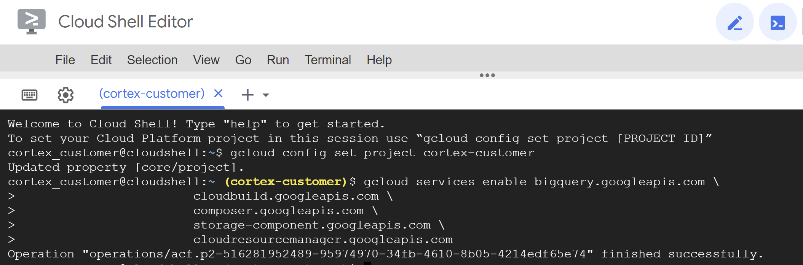


## Data Requirements


### Raw tables

The Data Foundation data models require a number of raw tables to be replicated to BigQuery before deployment. For a full list of tables required to be replicated, check the [SAP setting.yaml](https://github.com/GoogleCloudPlatform/cortex-dag-generator/blob/main/setting.yaml) file and [SFDC setting.yaml](https://github.com/GoogleCloudPlatform/cortex-salesforce/blob/main/config/setting.yaml).

If you do not wish to use replicated data, the deployment process can create the tables and populate them with sample test data. The sample test data caters to very specific demo scenarios and has no guarantee of referential integrity or functional validity.

Notes:
*   If a table does not exist during deployment, only the views that require it will fail.
*   The SQL files refer to the tables in lowercase. See the [documentation in BigQuery](https://cloud.google.com/bigquery/docs/reference/standard-sql/lexical#case_sensitivity) for more information on case sensitivity.

Depending on the source system, the following applies as well:

**Salesforce.com**
*   The structure of the source tables follows *snake_case* naming in plural, i.e. `some_objects`. The columns have the same data types as how Salesforce represents them internally. Some fields have been renamed for better readability in the reporting layer.
*   Data Foundation comes with a set of replication and mapping scripts to load Salesforce data into BigQuery (see Appendix). You can use your own replication tool as long as the schema in the `CDC processed` dataset matches the schema [documented in the mapping](https://github.com/GoogleCloudPlatform/cortex-salesforce/tree/main/src/raw_dag_generator/table_schema). A one-time mapping tool is provided to assist with this.
*   Any required tables that did not exist within the raw dataset will be created as empty tables during deployment. This is to ensure the CDC deployment step runs correctly.
*  For CDC scripts to work, the **Id** for each API (e.g., `Account Id`) and the [**SystemModStamp**](https://developer.salesforce.com/docs/atlas.en-us.object_reference.meta/object_reference/system_fields.htm) need to be present in the source table. The provided RAW processing scripts fetch these fields automatically from the APIs and update the target replication table.
*  The provided RAW processing scripts do not require additional change data capture processing. This behavior is set during deployment by default.

**SAP ECC or S/4**
*   The structure of the source SAP table is expected to be the same as SAP generates it. That is, the same name and the same data types. If in doubt about a conversion option, we recommend following the [default table mapping](https://cloud.google.com/solutions/sap/docs/bq-connector/latest/planning#default_data_type_mapping).
*   The Data Foundation can work with any replication tool that produces the schema as noted above.

### CDC processing flags for SAP

If not using test data, make sure the replication tool includes the fields required for CDC processing or merges changes when inserting them into BigQuery. You can find more details about this requirement [here](#setting-up-cdc-processing). For SAP, the BigQuery Connector for SAP can include these fields by default with the [Extra Field flag](https://cloud.google.com/solutions/sap/docs/bq-connector-for-sap-planning#default-field-names).


### DD03L for SAP metadata

If you are **not planning on deploying test data**, and if you **are planning on generating CDC DAG scripts** during deployment, make sure table **DD03L** is replicated from SAP in the source project.

This table contains metadata about tables, like the list of keys, and is needed for the CDC generator and dependency resolver to work. This table will also allow you to add tables not currently covered by the model to generated CDC scripts, like custom or `Z` tables.

## Grant permissions to the executing user

If an individual is executing the deployment with their own account, they will need, at minimum, the following permissions in the project where Cloud Build will be triggered:

*   Service Usage Consumer
*   Storage Object Viewer for the Cloud Build default bucket or bucket for logs
*   Object Writer to the output buckets
*   Cloud Build Editor
*   Project Viewer or Storage Object Viewer

These permissions may vary depending on the setup of the project. Consider the following documentation if you run into errors:
*   [Permissions to run Cloud Build](https://cloud.google.com/build/docs/securing-builds/configure-access-to-resources)
*   [Permissions to storage for the Build Account](https://cloud.google.com/build/docs/securing-builds/store-manage-build-logs)
*   [Permissions for the Cloud Build service account](https://cloud.google.com/build/docs/securing-builds/configure-access-for-cloud-build-service-account)
*   [Viewing logs from Builds](https://cloud.google.com/build/docs/securing-builds/store-manage-build-logs#viewing_build_logs)

## Configure the Cloud Build account

In the source project, navigate to the [Cloud Build](https://console.cloud.google.com/cloud-build/settings/service-account) and locate the account that will execute the deployment process.

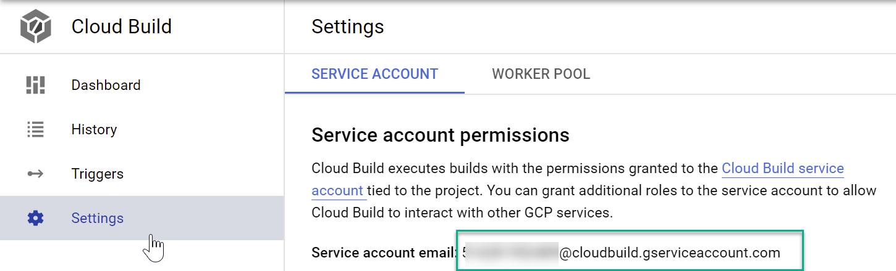

Locate the build account in [IAM](https://pantheon.corp.google.com/iam-admin/iam) (make sure it says _cloudbuild_):


Grant the following permissions to the Cloud Build service account in both the source and target projects if they are different:

- BigQuery Data Editor
- BigQuery Job User

## [Optional] Create a Service Account for deployment with impersonation

The deployment can run through a service account with impersonation rights, by adding the flag [\--impersonate-service-account](https://cloud.google.com/sdk/gcloud/reference/builds/submit). This service account will trigger a Cloud Build job, that will in turn run specific steps through the Cloud Build service account. This allows a user to trigger a deployment process without direct access to the resources.

The impersonation rights to the new, triggering service account need to be granted to the person running the command.

Navigate to the [Google Cloud Platform Console](https://console.cloud.google.com/iam-admin/serviceaccounts/create) and follow the steps to create a service account with the following role:

*   Cloud Build Service Account

This role can be applied during the creation of the service account:


Authorize the ID of user who will be running the deployment to impersonate the service account that was created in the previous step. Authorize your own ID so you can run an initial check as well.


Once the service account has been created, navigate to the[ IAM Service Account administration](https://console.cloud.google.com/iam-admin/serviceaccounts), click on the service account, and into the Permissions tab.

Click **Grant Access**, type in the ID of the user who will execute the deployment and has impersonation rights, and assign the following role:


*   Service Account Token Creator


**Alternatively,** you can complete this step from the Cloud Shell:

```bash
gcloud iam service-accounts create <SERVICE ACCOUNT> \
    --description="Service account for Cortex deployment" \
    --display-name="my-cortex-service-account"

gcloud projects add-iam-policy-binding <SOURCE_PROJECT> \
--member="serviceAccount:<SERVICE ACCOUNT>@<SOURCE_PROJECT>.iam.gserviceaccount.com" \
--role="roles/cloudbuild.builds.editor"

gcloud iam service-accounts add-iam-policy-binding <SERVICE ACCOUNT>\
  --member="user:<EXECUTING USER EMAIL>" \
  --role="roles/iam.serviceAccountTokenCreator"
```


## Create a Storage bucket

A storage bucket will be required to leave any processing scripts that are generated. These scripts will be manually moved into a Cloud Composer or Apache Airflow instance after deployment.

Navigate to [Cloud Storage](https://console.cloud.google.com/storage/create-bucket) and create a bucket **in the same region** as your BigQuery datasets.

**Alternatively**, you can use the following command to create a bucket from the Cloud Shell:

```bash
gsutil mb -l <REGION/MULTI-REGION> gs://<BUCKET NAME>
```

Navigate to the _Permissions_ tab. Grant `Storage Object Creator` to the user executing the Build command or to the Service account you created for impersonation.

## [Optional] Create a Storage bucket for logs

You can create a specific bucket for the Cloud Build process to store the logs. This is useful if you want to restrict data that may be stored in logs to a specific region. Create a [GCS bucket](https://console.cloud.google.com/storage) with uniform access control, in the same region where the deployment will run.

**Alternatively**, here is the command line to create this bucket:

```bash
gsutil mb -l <REGION/MULTI-REGION> gs://<BUCKET NAME>
```

You will need to grant `Object Admin` permissions to the Cloud Build service account.

# Setup

## Check setup

You can now run a simple script, the Cortex Deployment Checker, to simulate the deployment steps and make sure the prerequisites are fulfilled.

You will use the service account and Storage bucket created as prerequisites to test permissions and make sure the deployment is successful.


1. Clone repository from https://github.com/lsubatin/mando-checker. You can complete this from the [Cloud Shell](https://shell.cloud.google.com/?fromcloudshell=true&show=ide%2Cterminal).

```bash
git clone  https://github.com/lsubatin/mando-checker
```


2. From Cloud Shell , change into the directory:

```bash
cd mando-checker
```


3. Run the following build command with the user that will run the deployment

```bash
gcloud builds submit \
   --project <SOURCE_PROJECT> \
   --substitutions _DEPLOY_PROJECT_ID=<SOURCE_PROJECT>,_DEPLOY_BUCKET_NAME=<GCS_BUCKET>,_LOG_BUCKET_NAME=<LOG_BUCKET> .
```

If using a service account for impersonation, add the following flag:

```bash
   --impersonate-service-account <SERVICE ACCOUNT>@<SOURCE_PROJECT>.iam.gserviceaccount.com \
```

Where


*   <code>SOURCE_PROJECT</code></strong> is the ID of the project that will receive the deployment
*   <strong><code>SERVICE_ACCOUNT</code></strong> is the impersonation service account to run the build
*   <strong><code>GCS_BUCKET</code></strong> is the bucket that will contain the CDC information
*   <strong><code>LOG_BUCKET</code></strong> is the bucket where logs can be written. You can skip this parameter if using the default.

You may further customize some parameters if desired (see table below).

You can check the progress from the build in the log from Cloud Build:


The build will complete successfully if the setup is ready or fail if permissions need to be checked:


## Parameters for Checker

The table below contains the parameters that can be passed to the build for further customizing the test.


<table>
  <tr>
   <td style="background-color: #3362b5"><strong>Variable name</strong>
   </td>
   <td style="background-color: #3362b5"><strong>Req ?</strong>
   </td>
   <td style="background-color: #3362b5"><strong>Description</strong>
   </td>
  </tr>
  <tr>
   <td style="background-color: #e3f2fd"><strong><code> _DEPLOY_PROJECT_ID</code></strong>
   </td>
   <td style="background-color: #e3f2fd">Y
   </td>
   <td style="background-color: #e3f2fd">The project ID that will contain the tables and bucket. Defaults to the same project ID running the build
   </td>
  </tr>
  <tr>
   <td style="background-color: null"><strong><code> _DEPLOY_BUCKET_NAME</code></strong>
   </td>
   <td style="background-color: null">Y
   </td>
   <td style="background-color: null">Name of the GCS bucket which will contain the logs.
   </td>
  </tr>
  <tr>
   <td style="background-color: #e3f2fd"><strong><code> _DEPLOY_TEST_DATASET</code></strong>
   </td>
   <td style="background-color: #e3f2fd">N
   </td>
   <td style="background-color: #e3f2fd">Test dataset to be created.
<p>
Default: "DEPLOY_DATASET_TEST"
   </td>
  </tr>
  <tr>
   <td style="background-color: null"><strong><code> _DEPLOY_TEST_TABLE</code></strong>
   </td>
   <td style="background-color: null">N
   </td>
   <td style="background-color: null">Test table to be created.
<p>
Default: "DEPLOY_TABLE_TEST"
   </td>
  </tr>
  <tr>
   <td style="background-color: #e3f2fd"><strong><code> _DEPLOY_TEST_FILENAME</code></strong>
   </td>
   <td style="background-color: #e3f2fd">N
   </td>
   <td style="background-color: #e3f2fd">Test file to be created.
<p>
Default: "deploy_gcs_file_test_cloudbuild.txt"
   </td>
  </tr>
  <tr>
   <td style="background-color: null"><strong><code> _DEPLOY_TEST_DATASET_LOCATION</code></strong>
   </td>
   <td style="background-color: null">N
   </td>
   <td style="background-color: null">Location used for BQ (https://cloud.google.com/bigquery/docs/locations)
<p>
Default: "US"
   </td>
  </tr>
</table>


## How it works

The Cortex Deployment Checker is a very simple utility that will try to exercise the required permissions to ensure that they are correctly set up.

1. List the given bucket
2. Write to the bucket
3. Create a BQ dataset
4. Create a BQ table in the dataset
5. Write a test record

The utility will also clean up the test file and dataset - however this operation may fail since the deletion permissions are not actually required for the deployment, then it needs to be manually cleaned up without any repercussions.

If the build completes successfully all mandatory checks passed, otherwise review the build logs for the missing permission and retry.


# Deploy the Data Foundation

## Clone the Data Foundation repository

Clone this repository with submodules (`--recurse-submodules`) into an environment where you can execute the `gcloud builds submit` command and edit the configuration files. We recommend using the [Cloud Shell](https://shell.cloud.google.com/?fromcloudshell=true&show=ide%2Cterminal).

If you have done a previous deployment, remember to navigate into the previously downloaded folder and execute a `git pull --recurse-submodules` to pull the latest changes.

## Configure CDC for SAP

_You can skip this step if not implementing SAP or if using test data._

You can use the configuration in the file [`setting.yaml`](https://github.com/GoogleCloudPlatform/cortex-dag-generator/blob/main/setting.yaml) if you need to generate change-data capture processing scripts. See the [Appendix - Setting up CDC Processing](#setting-up-cdc-processing) for options. For test data, you can leave this file as a default.

Make any changes to the [DAG templates](https://github.com/GoogleCloudPlatform/cortex-dag-generator/blob/main/src/template_dag/dag_sql.py) as required by your instance of Airflow or Cloud Composer. You will find more information in the [Appendix - Gathering Cloud Composer settings](#gathering-cloud-composer-settings).

This module is optional. If you want to add/process tables individually after deployment, you can modify the `setting.yaml` file to process only the tables you need and re-execute the specific module with calling `src/SAP_CDC/deploy_cdc.sh` or `src/SAP_CDC/cloudbuild.cdc.yaml` directly.

## Configure API integration and CDC for Salesforce

_You can skip this step if not implementing Salesforce or if using test data._

Following a principle of openness, customers are free to use the provided replication scripts for Salesforce or a data replication tool of their choice as long as data meets the same structure and level of aggregation as provided by the Salesforce APIs. If you are using another tool for replication, this tool can either append updates as new records (_[append always](https://cloud.google.com/bigquery/docs/migration/database-replication-to-bigquery-using-change-data-capture#overview_of_cdc_data_replication)_ pattern) or update existing records with changes when landing the data in BigQuery. If the tool does not update the records and replicates any changes as new records into a target (RAW) table, Cortex Data Foundation provides the option to create change-data-capture processing scripts.

To ensure the names of tables, names of fields, and data types are consistent with the structures expected by Cortex regardless of the replication tool, you can modify the mapping configuration to map your replication tool or existing schemata. This will generate mapping views compatible with the structure expected by Cortex Data Foundation.

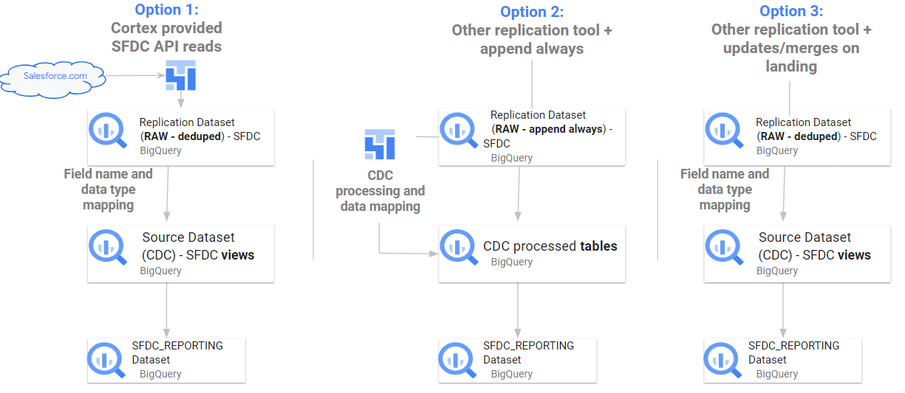

You can use the configuration in [`setting.yaml`](https://github.com/GoogleCloudPlatform/cortex-salesforce/blob/main/config/setting.yaml) to configure the generation of scripts to call the salesforce APIs and replicate the data into the RAW dataset (section `salesforce_to_raw_tables`) and the generation of scripts to process changes incoming into the RAW dataset and into the CDC processed dataset (section `raw_to_cdc_tables`).

By default, the scripts provided to read from APIs update changes into the RAW dataset, so CDC processing scripts are not required, and mapping views to align the source schema to the expected schema are created instead.

The generation of CDC processing scripts is not executed if `SFDC.createMappingViews` in the [config.json](https://github.com/GoogleCloudPlatform/cortex-data-foundation/blob/main/config/config.json#L29) file remains true (default behavior). If CDC scripts are required, set `SFDC.createMappingViews` to false.  This second step also allows for mapping between the source schemata into the required schemata as required by Cortex Data Foundation.

The following example of a `setting.yaml` configuration file illustrates the generation of mapping views when a replication tool updates the data directly into the replicated dataset, as illustrated in `option 3` (i.e., no CDC is required, only re-mapping of tables and field names). Since no CDC is required, this option executes as long as the parameter `SFDC.createMappingViews` in the config.json file remains `true`.


In this example, removing the configuration for a base table or all of them from the sections will skip the generation of DAGs of that base table or the entire section, as illustrated for `salesforce_to_raw_tables`. For this scenario, setting the parameters _GEN_CDC=false has the same effect, as no CDC processing scripts need to be generated.

The following example illustrates the mapping of the field `unicornId` as landed by a replication tool to the name and type expected by Cortex Data Foundation, `AccountId` as a `String`.

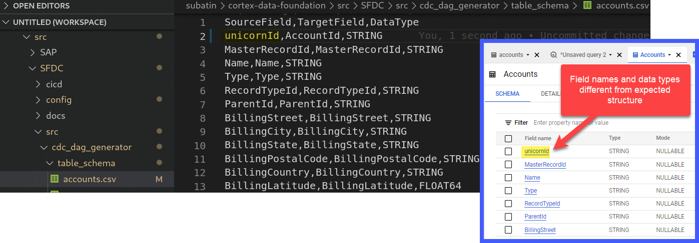

Make any changes to the [DAG templates for CDC](https://github.com/GoogleCloudPlatform/cortex-salesforce/tree/main/src/cdc_dag_generator/templates) or for [RAW](https://github.com/GoogleCloudPlatform/cortex-salesforce/tree/main/src/raw_dag_generator/templates) as required by your instance of Airflow or Cloud Composer. You will find more information in the [Appendix - Gathering Cloud Composer settings](#gathering-cloud-composer-settings).

If you do not need any DAGs for RAW data generation from API calls or CDC processing, set [parameter](#gather-the-parameters-for-deployment) `_GEN_CDC` or `deployCDC` to `false`. Alternatively, you can remove the contents of the sections in [`setting.yaml`](https://github.com/GoogleCloudPlatform/cortex-salesforce/blob/main/config/setting.yaml). If data structures are known to be consistent with those expected by Cortex Data Foundation, you can skip the generation of mapping views with [parameter](#gather-the-parameters-for-deployment) `SFDC.createMappingViews` set to `false`.

**Note**: If you do not have an instance of Cloud Composer, you can still generate the scripts and create it later.


### Performance optimization for CDC Tables
For certain CDC datasets, you may want to take advantages of BigQuery [table partitioning](https://cloud.google.com/bigquery/docs/partitioned-tables), [table clustering](https://cloud.google.com/bigquery/docs/clustered-tables) or both. This choice depends on many factors - the size and data of the table, columns available in the table, and your need of real time data with views vs data materialized as tables. By default, CDC settings do not apply table partitioning or table clustering - the choice is yours to configure it based on what works best for you.

You can read more about partitioning and clustering for SAP [here](https://cloud.google.com/blog/products/sap-google-cloud/design-considerations-for-sap-data-modeling-in-bigquery).

**NOTE**:
1. This feature only applies when a dataset in `setting.yaml` is configured for replication as a table (e.g. `load_frequency = "@daily"`) and not defined as a view (`load_frequency = "RUNTIME"`).
2. A table can be both - a partitioned table as well as a clustered table.

#### Table Partitioning

Partition can be enabled by specifying `partition_details` property in `setting.yaml` for any base table.

Example:

```yaml
   - base_table: vbap
     load_frequency: "@daily"
     partition_details: {
       column: "erdat", partition_type: "time", time_grain: "day"
     }
```

| Property               | Description                                                            | Value           |
| ---------------------  | ---------------------------------------------------------------------- | --------------- |
| `column`               | Column by which the CDC table will be partitioned                      | Column name     |
| `partition_type`       | Type of Partition                                                      | `"time"` for time based partition ([More details](https://cloud.google.com/bigquery/docs/partitioned-tables#date_timestamp_partitioned_tables))<br>`"integer_range"` for integer based partition ([More details](https://cloud.google.com/bigquery/docs/partitioned-tables#integer_range)) |
| `time_grain`           | Time part to partition with <br>Required when `partition_type = "time"`| `"hour"`, `"day"`, `"month"` OR `"year"` |
| `integer_range_bucket` | Bucket range <br>Required when `partition_type = "integer_range"`      | `"start"` = Start value<br> `"end"` = End value<br>`"interval`" = Interval of range |

**NOTE**: See BigQuery Table Partition [documentation](https://cloud.google.com/bigquery/docs/partitioned-tables) details to understand these options and related limitations.

#### Table Clustering

Clustering can be by specifying `cluster_details` property in `setting.yaml` for any base table.

Example:

```yaml
   - base_table: vbak
     load_frequency: "@daily"
     cluster_details: {columns: ["vkorg"]}
```
| Property               | Description                                | Value                                             |
| ---------------------  | -------------------------------------------| ------------------------------------------------- |
| `columns`              | Columns by which a table will be clustered | List of column names<br>e.g. `["mjahr", "matnr"]` |


**NOTE**: See BigQuery Table Cluster [documentation](https://cloud.google.com/bigquery/docs/clustered-tables) details to understand these options and related limitations.


## Configure SAP Hierarchies

You can use the configuration in the file [`sets.yaml`](https://github.com/GoogleCloudPlatform/cortex-dag-generator/blob/main/sets.yaml) if you need to generate scripts to flatten hierarchies. See the [Appendix - Configuring the flattener](#configuring-the-flattener-for-sap-hierarchies) for options. This step is only executed if the CDC generation flag is set to `true`.

## Configure External Datasets for SAP

Some advanced use cases may require external datasets to complement an enterprise system of record such as SAP. In addition to external exchanges consumed from [Analytics hub](https://cloud.google.com/analytics-hub), some datasets may need custom or tailored methods to ingest data and join them with the reporting models. To deploy these sample datasets, if deploying fully for the first time, keep the `_GEN_EXT` flag as its default (`true`) and complete the prerequisites listed below. If complementing an existing deployment (i.e., the target datasets have already been generated), execute the  `cloudbuild.cdc.yaml` with `_DEPLOY_CDC=false` or the script `/src/SAP_CDC/generate_external_dags.sh`. Use flag `-h` for help with the parameters.

If you want to only deploy a subset of the DAGs, remove the undesired ones from the `EXTERNAL_DAGS` variable in the beginning of `/src/SAP_CDC/generate_external_dags.sh`.

**Note:** You will need to configure the DAGs as follows:

1. **Holiday Calendar**: This DAG retrieves the holiday calendars from  [PyPi Holidays](https://pypi.org/project/holidays/). You can adjust the list of countries and years to retrieve holidays, as well as parameters of the DAG from the file `holiday_calendar.ini`. Leave the defaults if using test data.
2. **Product Hierarchy Texts**: This DAG flattens materials and their product hierarchies. The resulting table can be used to feed the `Trends` list of terms to retrieve Interest Over Time. You can adjust the parameters of the DAG from the file `prod_hierarchy_texts.py`. Leave the defaults if using test data. You will need to adjust the levels of the hierarchy and the language under the markers for `## CORTEX-CUSTOMER:`. If your product hierarchy contains more levels, you may need to add an additional SELECT statement similar to the CTE `h1_h2_h3`.
3. **Trends**: This DAG retrieves Interest Over Time for a specific set of terms from [Google Search trends](https://trends.google.com/trends/). The terms can be configured in `trends.ini`. You will need to adjust the time frame to `'today 7-d'` in `trends.py` after an initial run. We recommend getting familiarized with the results coming from the different terms to tune parameters. We also recommend partitioning large lists to multiple copies of this DAG running at different times. For more information about the underlying library being used, see [Pytrends](https://pypi.org/project/pytrends/).
2. **Weather**: By default, this DAG uses the publicly available test dataset [**bigquery-public-data.geo_openstreetmap.planet_layers**](https://console.cloud.google.com/bigquery/analytics-hub/exchanges(analyticshub:search)?queryText=open%20street%20map). The query also relies on an NOAA dataset only available through Analytics Hub, [**noaa_global_forecast_system**](https://console.cloud.google.com/bigquery/analytics-hub/exchanges(analyticshub:search)?queryText=noaa%20global%20forecast).  **`This dataset needs to be created in the same region as the other datasets prior to executing deployment`**. If the datasets are not available in your region, you can continue with the following instructions and follow additional steps to transfer the data into the desired region.

**You can skip this configuration if using test data.**

*  Navigate to [BigQuery > Analytics Hub](https://console.cloud.google.com/bigquery/analytics-hub)
* Click **Search Listings**. Search for "`NOAA Global Forecast System`"
* Click **Add dataset to project**. When prompted, keep "`noaa_global_forecast_system`" as the name of the dataset. If needed, adjust the name of the dataset and table in the FROM clauses in `weather_daily.sql`.
* Repeat the listing search for Dataset "`OpenStreetMap Public Dataset`".
* Adjust the `FROM ` clauses containing `bigquery-public-data.geo_openstreetmap.planet_layers` in `postcode.sql`.

[**Analytics hub is currently only supported in EU and US locations**](https://cloud.google.com/bigquery/docs/analytics-hub-introduction) and some datasets, such as NOAA Global Forecast, are only offered in a single multilocation.
If you are targeting a location different from the one available for the required dataset, we recommend creating a [scheduled query](https://cloud.google.com/bigquery/docs/scheduling-queries) to copy the new records from the Analytics hub linked dataset followed by a [transfer service](https://cloud.google.com/bigquery-transfer/docs/introduction) to copy those new records into a dataset located in the same location or region as the rest of your deployment. You will then need to adjust the SQL files (e.g., `src/SAP_CDC/src/external_dag/weather/weather_daily.sql`)

**Important Note:** Before copying these DAGs to Cloud Composer, you will need to **add the required python modules (`holidays`, `pytrends`) [as dependencies](https://cloud.google.com/composer/docs/how-to/using/installing-python-dependencies#options_for_managing_python_packages)**.

## Gather the parameters for deployment

Consider your target deployment:


You will need the following parameters ready for deployment, based on your target structure:

|Parameter              | Parameter Name    | Path in file      | Description                                                                                 |
|---------------------  |------------------|------------------|---------------------------------------------------------------------------------------------|
|Source Project         |`_PJID_SRC`    |`projectIdSource`    | Project where the source dataset is and the build will run.                                 |
|Target Project         |`_PJID_TGT`    |`projectIdTarget`    | Target project for user-facing datasets (reporting and ML datasets).                        |
|Raw landing dataset    |`_DS_RAW`      |`SAP.datasets.raw`    | Used by the CDC process, this is where the replication tool lands the data from SAP.  If using test data, create an empty dataset.|
|Raw landing dataset ECC    | N/A: File only    |`SAP.datasets.rawECC`    | Used by the CDC process, this is where the replication tool lands the data from SAP ECC.  This is required when using UNION as SQL flavor. |
|Raw landing dataset S4    | N/A: File only     |`SAP.datasets.rawS4`    | Used by the CDC process, this is where the replication tool lands the data from SAP S/4HANA.  This is required when using the UNION as SQL flavor. |
|CDC Processed Dataset  |`_DS_CDC`      |`SAP.datasets.cdc`    | Dataset that works as a source for the reporting views, and target for the records processed DAGs. If using test data, create an empty dataset.|
|CDC Processed Dataset ECC  | N/A: File only      |`SAP.datasets.cdcECC`    | Dataset that works as a source for the reporting views, and target for the records processed DAGs. If using test data, create an empty dataset. This is required when using the UNION as SQL flavor.|
|CDC Processed Dataset S4  | N/A: File only      |`SAP.datasets.cdcS4`    | Dataset that works as a source for the reporting views, and target for the records processed DAGs. If using test data, create an empty dataset. This is required when using the UNION as SQL flavor.|
|Reporting Dataset SAP     | N/A: File only |`SAP.datasets.reporting`     | Name of the dataset that is accessible to end users for reporting, where views and user-facing tables are deployed. Default: `REPORTING`. |
|ML dataset             |`_DS_MODELS`   |`SAP.datasets.ml`    | Name of the dataset that stages results of Machine Learning algorithms or BQML models. Default: `ML_MODELS`.|
|Raw landing dataset SFDC   | N/A: File only      |`SFDC.datasets.raw`    | Used by the CDC process, this is where the replication tool lands the data from SAP.  If using test data, create an empty dataset. If a value is not provided, the scirpt will attempt to default to the value provided for SAP Raw.|
|CDC Processed Dataset SFDC  | N/A: File only      |`SFDC.datasets.cdc`    | Dataset that works as a source for the reporting views, and target for the records processed DAGs. If using test data, create an empty dataset. If a value is not provided, the scirpt will attempt to default to the value provided for SAP CDC. |
|Reporting Dataset SFDC     | N/A: File only |`SFDC.datasets.reporting`     | Name of the dataset that is accessible to end users for reporting, where views and user-facing tables are deployed. If a value is not provided, the scirpt will attempt to default to the value provided for SAP Reporting.|
|Logs Bucket            |`_GCS_BUCKET`  | N/A: Parameter only    | Bucket for logs. Could be the default or [created previously](#create-a-storage-bucket).|
|DAGs bucket            |`_TGT_BUCKET`  | N/A: Parameter only     | Bucket where DAGs will be generated as [created previously](#create-a-storage-bucket). Avoid using the actual airflow bucket.|
| Deploy SAP |`_DEPLOY_SAP`  | N/A: Parameter only    | Execute SAP deployment steps. Default in cloudbuild.yaml: `true`.|
| Deploy SFDC |`_DEPLOY_SFDC`  | N/A: Parameter only    | Execute SFDC deployment steps. Default in cloudbuild.yaml: `true`.|
|Generate and deploy CDC|`_DEPLOY_CDC`  | N/A: Parameter only    | Generate the DAG files into a target bucket based on the tables in `settings.yaml`.<br>If using test data, set it to `true` so data is copied from the generated raw dataset into this dataset. <br>If set to `false`, DAGs won't be generated and it should be assumed the `_DS_CDC` is the same as `_DS_RAW`.|
|Deploy test data       |`_TEST_DATA`   | N/A: Parameter only     | Set to `true` if you want the `_DS_REPORTING` and `_DS_CDC` (if `_DEPLOY_CDC` is `true`) to be filled by tables with sample data, mimicking a replicated dataset. <br>If set to `false`, `_DS_RAW` should contain the tables replicated from the SAP source. <br>Default for table creation is `--noreplace`, meaning if the table exists, the script will not attempt to overwrite it.|


Optional parameters:

|Parameter              | Parameter Name    | Path in file      | Description                                                                                 |
|---------------------  |------------------|------------------|---------------------------------------------------------------------------------------------|
|Location or Region|`_LOCATION`| `location` | Location where the BigQuery dataset and GCS buckets are. <br><br>Default is `US`. <br><br>**Note:** Restrictions listed under [BigQuery dataset locations](https://cloud.google.com/bigquery/docs/locations). Currently supported values are: `us` and `eu` (multi-regions), `us-central1`, `us-west4`, `us-west2`, `northamerica-northeast1`, `northamerica-northeast2`, `us-east4`, `us-west1`, `us-west3`, `southamerica-east1`, `southamerica-west1`, `us-east1`, `asia-south2`, `asia-east2`, `asia-southeast2`, `australia-southeast2`, `asia-south1`, `asia-northeast2`, `asia-northeast3`, `asia-southeast1`, `australia-southeast1`, `asia-east1`, `asia-northeast1`, `europe-west1`, `europe-north1`, `europe-west3`, `europe-west2`, `europe-west4`, `europe-central2`, `europe-west6`.|
|Mandant or Client|`_MANDT`| `SAP.mandt` |Default mandant or client for SAP. For test data, keep the default value (`100`). For Demand Sensing, use `900`.|
|Mandant or Client for ECC | N/A: File only | `SAP.mandtECC` |Default mandant or client for SAP ECC in UNION scenario. For test data, keep the default value (`100`). For Demand Sensing, use `900`.|
|Mandant or Client for S4 | N/A: File only | `SAP.mandtS4` |Default mandant or client for SAP ECC in UNION scenario. For test data, keep the default value (`100`). For Demand Sensing, use `900`.|
|SQL flavor for source system|`_SQL_FLAVOUR`|  `SAP.SQLFlavor` |`S4`, `ECC` or `UNION`.<br><br>See the documentation for options. For test data, keep the default value (`ECC`). For Demand Sensing, only `ECC` test data is provided at this time. `UNION` is currently an experimental feature and should be used after both an S4 and an ECC deployments have been completed.|
|Generate External Data|`_GEN_EXT`| N/A: Parameter only | Generate DAGs to consume external data (e.g., weather, trends, holiday calendars). Some datasets have external dependencies that need to be configured before running this process. If `_TEST_DATA` is `true`, the tables for external datasets will be populated with sample data. <br><br>Default: `true`.|
|Currency | N/A: File only| `currencies` | If not using test data, enter a single currency (e.g., `[ "CAD" ]`) or multiple currencies (e.g., `[ "CAD", "USD" ]`) as relevant to your business.  These valueas are used to replace placeholders in SQL in SAP models. |
|Language | N/A: File only| `languages` | If not using test data, enter a single language (e.g., `[ "E" ]`) or multiple languages (e.g., `[ "E", "S" ]`) as relevant to your business. These valueas are used to replace placeholders in SQL in SAP models.|
|Turbo | N/A: File only| `turboMode` | Execute all views builds as a step in the same Cloud Build process, in parallel for a faster deployment. If set to `false`, each reporting views is generated in its own sequential build step. We recommend only setting it to `true` when using test data or after any mismatch between reporting columns and the source data have been resolved. |
|Create mapping views | N/A: File only| `SFDC.createMappingViews` | The provided DAGs to fetch new records from the Salesforce APIs update records on landing. This value set to **true** will generate views in the CDC processed dataset to surface tables with the "latest version of the truth" from the RAW dataset. If **false**  and `_GEN_CDC=true`, DAGs will be generated with change data capture processing based on SystemModstamp. See details on [CDC processing for Salesforce](#configure-api-integration-and-cdc-for-salesforce). Default: `true` |


## Configure the Deployment File
As of release 4.0, a deployment file `config/config.json` is introduced as an option to provide more flexibility and additional configuration parameters, like those specific to Salesforce.

For backwards compatibility, the parameters in the [TL;DR section](#tldr-for-setup) can continue to be passed to the deployment command through the `--substitutions` parameter in the command line.

Open the file in cortex-data-foundation/config/config.json. You can use the Cloud Shell to edit this file. Use the previous table to populate the file according to your needs.


&#x1F53B; **Note**: If a parameter is passed when invoking the ```gcloud builds submit``` through the --substitutions flag, it overrides the value in the `config.json` file. The `substitutions` definitions in the cloudbuild.yaml file act as a parameter passed in the command line, and also override file configurations.

For example, consider this config.json file with these values for SAP datasets:

```json
[...]
"SAP" : {
        "datasets" : {
            "cdc" : "json_cdc_value",
            "raw" : "SCARYJSON13",
[...]
```

And the following sample call:

```bash

gcloud builds submit  \
--substitutions \
_DS_CDC=UNICORN,_GEN_EXT=false,_TGT_BUCKET=some_gcs_bucket,_GCS_BUCKET=some_logging_cbucket
```

The previous call will point the CDC dataset to a dataset called `UNICORN` from the substitution parameter, and the RAW dataset to one called `SCARYJSON13` as no substitution parameter is passed. The generation of extra data is disabled by the parameter passed in the call (`_GEN_EXT=false`), while all other boolean parameters that control the execution of build steps (i.e., `_TEST_DATA`,`_DEPLOY_SAP`,`_DEPLOY_SFDC`,`_DEPLOY_CDC`) are defaulted to `true` in the `config.json` file.

## Check for `CORTEX_CUSTOMER` tags
Many SAP and Salesforce customers will have specific customizations of their systems, such as additional documents in a flow or specific types of a record. These are specific to each customer and configured by functional analysts as the business needs arise. The spots on the SQL code where these specific enhancements could be done are marked with a comment starting with `## CORTEX-CUSTOMER`. You can check for these comments after cloning the repository with a command like:

```bash
grep -R CORTEX-CUSTOMER
```
## [Optional - SAP only] Configure the UNION option to combine SAP ECC and S/4HANA data

**This feature is experimental.**

The UNION option for `_SQL_FLAVOUR` allows for an additional implementation to apply a `UNION` operation between views sourcing data from an ECC system and views sourcing data from an S/4HANA system. This feature is currently experimental and we are seeking feedback on it. The `UNION` dataset depends on the ECC and S/4HANA reporting datasets to exist. The following chart explains the flow of data when using `UNION`:

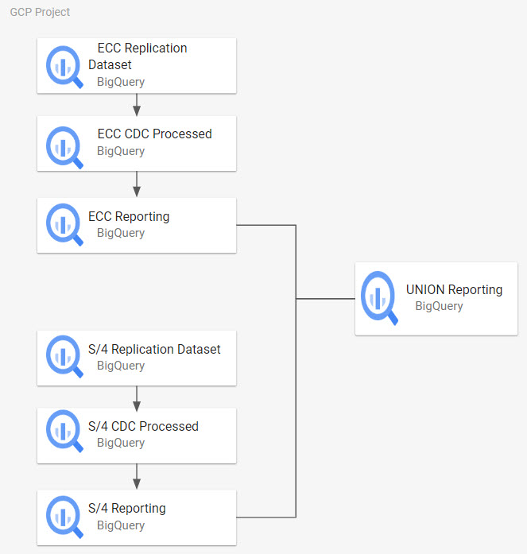


After deploying the reporting datasets for S/4 and ECC, open the file `config/config.json` and configure the datasets for ECC and S/4 respectively (i.e., `SAP.datasets.cdcECC`, `SAP.datasets.cdcS4`, `SAP.datasets.rawECC`, `SAP.datasets.rawS4`). You can leave the datasets that do not have a `_SQL_FLAVOUR` in their name empty.

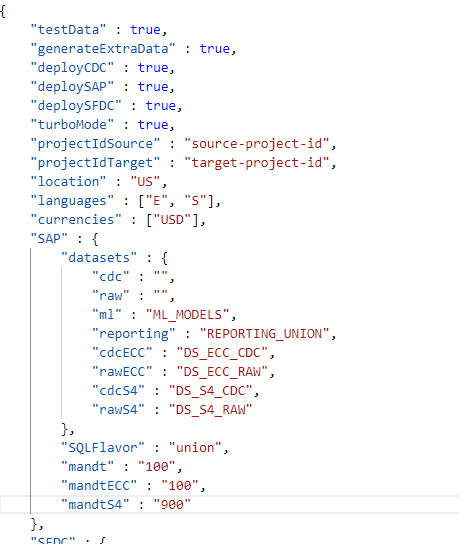

Since the deployment for CDC and DAG generation needs to occur first and for each source system, the UNION option will only execute the SAP_REPORTING submodule. You can execute the submodule directly or from the Data Foundation deployer. If using the Data Foundation, after configuring the `config.json` file, this is what the command would look like:

```bash
gcloud builds submit --project <Source Project> \
--substitutions _PJID_SRC=<Source Project>,_PJID_TGT=<Target Project>,_GCS_BUCKET=<Bucket for Logs>,_GEN_EXT=false,_SQL_FLAVOUR=union

```

**NOTE**: If you are looking to ONLY execute the Reporting build from the build in the [sap_reporting submodule](https://github.com/GoogleCloudPlatform/cortex-reporting), the configuration is currently taken from [sap_config.env](https://github.com/GoogleCloudPlatform/cortex-reporting/blob/main/sap_config.env). This configuration file will be replace in future releases for config.json.

## Execute the build

Clone the repository and its submodules:

```bash
git clone --recurse-submodules https://github.com/GoogleCloudPlatform/cortex-data-foundation
```
Switch to the directory where the data foundation was cloned:

```bash
cd cortex-data-foundation
```

Run the Build command with the parameters you identified earlier.

The following command assumes the file `config/config.json` has been [populated with values](#configure-the-deployment-file):

```bash
gcloud builds submit --project <execution project, likely the source> \
--substitutions=_GCS_BUCKET=<Bucket for logs - Cloud Build Service Account needs access to write here>,_TGT_BUCKET=<Bucket for DAG scripts - don’t use the actual Airflow bucket - Cloud Build Service Account needs access to write here>,_TEST_DATA=true,_DEPLOY_SAP=true,_DEPLOY_SFDC=true,_DEPLOY_CDC=true,_GEN_EXT=true
```


If you have enough permissions, you can see the progress from [Cloud Build](https://console.cloud.google.com/cloud-build/).


**Alternatively**, the following example shows a call with all the available substitution values. These override the values in `config.json`.

```bash
gcloud builds submit --project <execution project, likely the source> \
--substitutions \
_PJID_SRC=<project for landing raw data>,_PJID_TGT=<project to deploy user-facing views>,_DS_CDC=<BQ dataset to land the result of CDC processing - must exist before deployment>,_DS_RAW=<BQ dataset to land raw data from replication - must exist before deployment>,_DS_REPORTING=<BQ dataset where Reporting views are created, will be created if it does not exist>,_DS_MODELS=<BQ dataset where ML views are created, will be created if it does not exist>,_GCS_BUCKET=<Bucket for logs - Cloud Build Service Account needs access to write here>,_TGT_BUCKET=<Bucket for DAG scripts - don’t use the actual Airflow bucket - Cloud Build Service Account needs access to write here>,_TEST_DATA=true,_DEPLOY_CDC=true
```

After the test data and CDC generation steps, you will see the step that generates views triggers one build process per view. If a single view fails, the parent process will appear as failed:


If TURBO=false, You can check the results for each individual view , following the main Build process.


And identify any issues with individual builds:

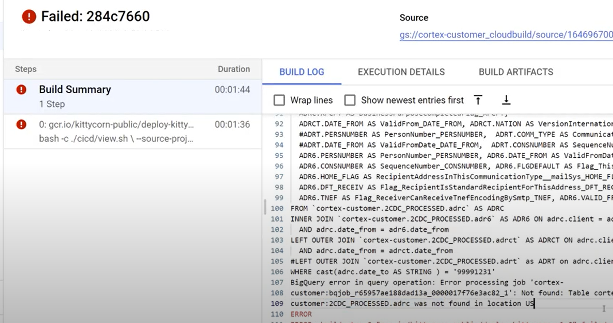

We recommend pasting the generated SQL into BigQuery to identify and correct the errors more easily. Most errors will be related to fields that are selected but not present in the replicated source. The BigQuery UI will help identify and comment those out.


## Move the files into the DAG bucket

If you opted to generate the CDC files and have an instance of Airflow, you can move them into their final bucket with the following command:

```bash
gsutil cp -r  gs://<output bucket>/dags* gs://<composer dag bucket>/dags
gsutil cp -r  gs://<output bucket>/data/* gs://<composer sql bucket>/data/
```
# Next steps

## Looker deployment
Instructions for deploying the pre-built Looker blocks can be found [here](https://cloud.google.com/looker/docs/marketplace#installing_a_tool_from_a_git_url). Please follow the individual block READMEs for detailed instructions on required dependencies to ensure successful deployment.

Optionally, you may also customize the blocks by forking the GitHub repositories into your own Looker project. Instructions can be found [here](https://cloud.google.com/looker/docs/blocks).

Available blocks for the Data Foundation include the following:
* [SAP Operational Dashboards for Cortex](https://github.com/looker-open-source/block-cortex-sap)
* [Salesforce Dashboards for Cortex](https://github.com/looker-open-source/block-cortex-salesforce)

## Demand Sensing
You can deploy the Demand Sensing use case [from the Marketplace](https://console.cloud.google.com/marketplace/product/cortex-public/cortex-demand-sensing). Learn more from the documentation.
## Application Layer
Deploy a sample micro-services based application through the [Google Cloud Marketplace](https://console.cloud.google.com/marketplace/product/cortex-public/cloud-cortex-application-layer).

## Customizations and upgrades
We strongly encourage you to fork this repository and apply your changes to the code in your own fork. You can make use of the delivered deployment scripts in your development cycles and incorporate your own test scripts as needed. When a new release is published, you can compare the new release from our repository with your own changes by merging our code into your own fork in a separate branch. Suggestions for changes or possible customizations in the code are flagged with the comment `## CORTEX-CUSTOMER`. We recommend listing these after the initial deployment.

## Enable TURBO mode

For your own customizations and a faster deployment in your own development pipelines, you can use the `turboMode` variable in `config/config.json`. When set to true, the deployment process will dynamically generate a `cloudbuild.views.yaml` file with each view in the right dependencies file (e.g., dependencies_ecc.txt or dependencies_s4.txt) as a single step of the build. This allows for a 10x faster deployment. The limitation is that if an error occurs when deploying a view, the build process will stop, and this is a slow way to find out all possible mismatches between the Cortex views and your datasource when compared to the turboMode=false option. If you are still fixing potential structure mismatches between the SELECT clauses in the views and the fields available in your replicated tables, `TURBO=false` will take longer but will attempt to generate all views even if one fails. This will help identify and fix more errors in a single run.

# Support

To file issues and feature requests against these models or deployers, create an issue in this repo.

# Appendix


## Understanding Change Data Capture


### Replicating raw data from SAP

The goal of the Data Foundation is to expose data and analytics models for reporting and applications. The models consume the data replicated from an SAP ECC or SAP S/4HANA system using a preferred replication tool, like those listed in the [Data Integration Guides for SAP](https://cloud.google.com/solutions/sap/docs/sap-data-integration-guides).

Data from SAP ECC or S/4HANA is expected to be replicated in raw form, that is, with the same structure as the tables in SAP and without transformations. The names of the tables in BigQuery should be lower case for cortex data model compatibility reasons.

For example, fields in table T001 are replicated using their equivalent data type in BigQuery, without transformations:

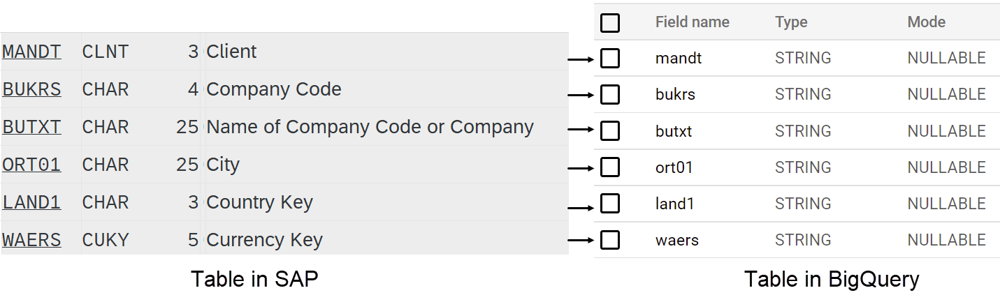


### Change Data Capture (CDC) Processing

BigQuery is an append preferred database. This means that the data is not updated or merged during replication. For example, an update to an existing record can be replicated as the same record containing the change. To avoid duplicates, a merge operation needs to be applied afterwards. This is referred to as [Change Data Capture processing](https://cloud.google.com/architecture/database-replication-to-bigquery-using-change-data-capture).

The Data Foundation for SAP includes the option to create scripts for Cloud Composer or Apache Airflow to [merge](https://cloud.google.com/bigquery/docs/reference/standard-sql/dml-syntax) or “upsert” the new records resulting from updates and only keep the latest version in a new dataset. For these scripts to work the tables need to have a field with an operation flag named **operation\_flag**  **(I = insert, U = update, D = delete) **and a timestamp named recordstamp.

For example, the following image shows the latest records for each partner record, based on the timestamp and latest operation flag:

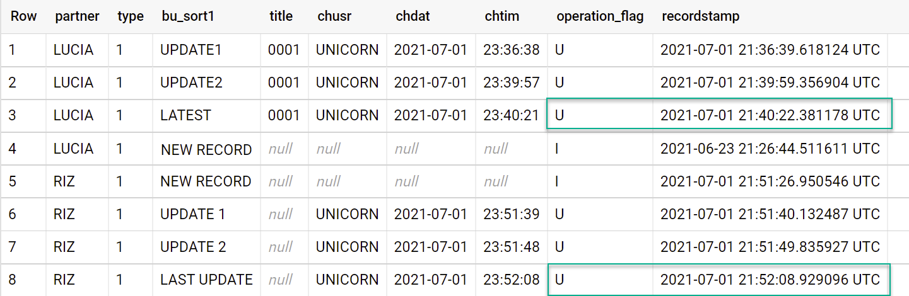


### Dataset structure

Data from SAP or Salesforce is replicated into a BigQuery dataset  -the source or replicated dataset- and the updated or merged results are inserted into another dataset- the CDC dataset. The reporting views select data from the CDC dataset, to ensure the reporting tools and applications always have the latest version of a table.

The following flow depicts the CDC processing for SAP, dependent on the `operational_flag` and `recordstamp`.

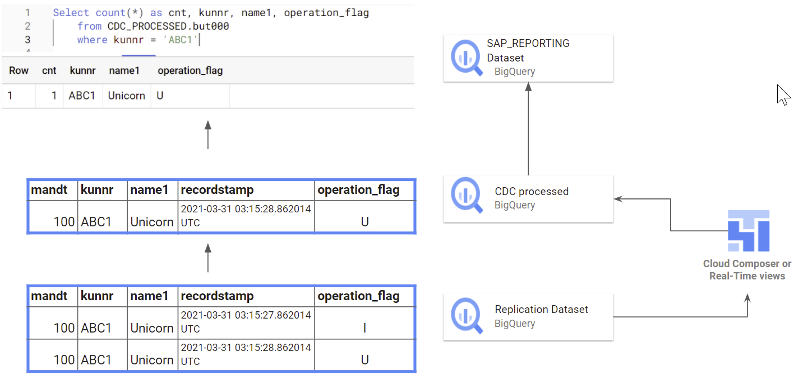

The following flow depicts the integration from APIs into RAW and CDC processing for Salesforce, dependent on the `Id` and `SystemModStamp` fields produced by Salesforce APIs.


Some replication tools can merge or upsert the records when inserting them into BigQuery, so the generation of these scripts is optional. In this case, the setup will only have a single dataset. The REPORTING  dataset will fetch updated records for reporting from that dataset.


## Optional - Using different projects to segregate access

Some customers choose to have different projects for different functions to keep users from having excessive access to some data. The deployment allows for using two projects, one for processing replicated data, where only technical users have access to the raw data, and one for reporting, where business users can query the predefined models or views.


Using two different projects is optional. A single project can be used to deploy all datasets.


## Setting up CDC processing

During deployment, you can choose to merge changes in real time using a view in BigQuery or scheduling a merge operation in Cloud Composer (or any other instance of Apache Airflow).

Cloud Composer can schedule the scripts to process the merge operations periodically. Data is updated to its latest version every time the merge operations execute, however, more frequent merge operations  translate into higher costs.

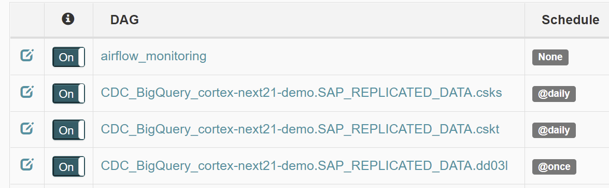


The scheduled frequency can be customized to fit the business needs.

Download and open the sample file using gsutil from the Cloud Shell as follows:


```bash
gsutil cp gs://cortex-mando-sample-files/mando_samples/settings.yaml .
```


You will notice the file uses[ scheduling supported by Apache Airflow](https://airflow.apache.org/docs/apache-airflow/1.10.1/scheduler.html#dag-runs).

The following example shows an extract from the configuration file:


```yaml
data_to_replicate:
  - base_table: adrc
    load_frequency: "@hourly"
  - base_table: adr6
    target_table: adr6_cdc
    load_frequency: "@daily"
```


This configuration will:


1. Create a copy from **source\_project\_id.REPLICATED\_DATASET.adrc**  into **target\_project\_id.DATASET\_WITH\_LATEST\_RECORDS.adrc** if the latter does not exist
2. Create a CDC script in the specified bucket
3. Create a copy from source\_project\_id.REPLICATED\_DATASET.adr6  into target\_project\_id.DATASET\_WITH\_LATEST\_RECORDS.adr6\_cdc if the latter does not exist
4. Create a CDC script in the specified bucket

**SAP only:** If you want to create DAGs or runtime views to process changes for tables that exist in SAP and are not listed in the file, add them to this file before deployment. For example, the following configuration creates a CDC script for custom table “_zztable\_customer”_ and a runtime view to scan changes in real time for another custom table called “_zzspecial\_table”_:


```yaml
  - base_table: zztable_customer
    load_frequency: "@daily"
  - base_table: zzspecial_table
    load_frequency: "RUNTIME"
```

This will work as long as the table DD03L is replicated in the source dataset and the schema of the custom table is present in that table.

### Sample generated template
The following template generates the processing of changes. Modifications, such as the name of the timestamp field, or additional operations, can be done at this point:


```sql
MERGE `${target_table}` T
USING (SELECT * FROM `${base_table}` WHERE recordstamp > (SELECT IF(MAX(recordstamp) IS NOT NULL, MAX(recordstamp),TIMESTAMP("1940-12-25 05:30:00+00")) FROM `${target_table}`)) S
ON ${p_key}
WHEN MATCHED AND S.operation_flag='D' AND S.is_deleted = true THEN
  DELETE
WHEN NOT MATCHED AND S.operation_flag='I' THEN
  INSERT (${fields})
  VALUES
  (${fields})
WHEN MATCHED AND S.operation_flag='U' THEN
UPDATE SET
    ${update_fields}
```


**SAP Only:** Alternatively, if your business requires near-real time insights and the replication tool supports it, the deployment tool accepts the option RUNTIME. This means a CDC script will not be generated. Instead, a  view will scan and fetch the latest available record at runtime for [immediate consistency](https://cloud.google.com/architecture/database-replication-to-bigquery-using-change-data-capture#immediate_consistency_approach).

### CDC fields required for MERGE operations
The following parameters will be required for the automated generation of change-data-capture batch processes:

*   Source project + dataset: Dataset where the SAP data is streamed or replicated. For the CDC scripts to work by default, the tables need to have a timestamp field (called recordstamp) and an operation field with the following values, all set during replication:
    *   I: for insert
    *   U: for update
    *   D: for deletion
*   Target project + dataset for the CDC processing: The script generated by default will generate the tables from a copy of the source dataset if they do not exist.
*   Replicated tables: Tables for which the scripts need to be generated
*   Processing frequency: Following the Cron notation, how frequently the DAGs are expected to run
*   Target GCS bucket where the CDC output files will be copied
*   The name of the connection used by Cloud Composer
*   Optional: If the result of the CDC processing will remain in the same dataset as the target, you can specify the name of the target table.


## Gathering Cloud Composer Settings

If Cloud Composer is available, create connection(s) to the Source Project[ in Cloud Composer](https://cloud.google.com/composer/docs/how-to/managing/connections#creating_new_airflow_connections).

*   For SAP deployments, create a connection named `sap_cdc_bq`.
*   For Salesforce deployments, create a connection named `sfdc_cdc_bq`.

Notes:
*   If you are deploying for both SAP and Salesforce, we recommend creating to create both connections assuming security limitations will be applied to each service account. Alternatively, modify the name of the connection in the templste prior to deployment to use the same connection to write into BigQuery as shone below.
*   If you have [Secret Manager Backend enabled for Airflow](https://cloud.google.com/composer/docs/secret-manager), you can also create these connections within Secret Manager under the same name.

The GCS bucket structure in the template DAG expects the folders to be in /data/bq\_data\_replication. You can modify this path prior to deployment.


If you do not have an environment of Cloud Composer available yet, you can create one afterwards and move the files into the DAG bucket.

**Note**: The scripts that process data in Airflow or Cloud Composer are purposefuly generated separately from the Airflow-specific scripts. This allows you to port those scripts to another tool of choice.

## (SAP Only) Configuring the flattener for SAP hierarchies

The deployment process can optionally flatten hierarchies represented as sets (e.g. transaction GS03) in SAP. The process can also generate the DAGs for these hierarchies to be refreshed periodically and automatically. This process requires configuration prior to the deployment and should be known by a Financial or Controlling consultant or power user.

Download and open the sample file using gsutil from the Cloud Shell as follows:


```bash
gsutil cp gs://cortex-mando-sample-files/mando_samples/sets.yaml .
```


This [video](https://youtu.be/5s0DzRa_7D4) explains how to perform the configuration to flatten hierarchies.

The deployment file takes the following parameters:


*   Name of the set
*   Class of the set (as listed by SAP in standard table SETCLS)
*   Organizational Unit: Controlling Area or additional key for the set
*   Client or Mandant
*   Reference table for the referenced master data
*   Reference key field for master data
*   Additional filter conditions (where clause)

The following are examples of configurations for Cost Centers and Profit Centers including the technical information. If unsure about these parameters, consult with a Finance or Controlling SAP consultant.


```
sets_data:
#Cost Centers:
# table: csks, select_fields (cost center): 'kostl', where clause: Controlling Area (kokrs), Valid to (datbi)
- setname: 'H1'
  setclass: '0101'
  orgunit: '1000'
  mandt:  '800'
  table: 'csks'
  key_field: 'kostl'
  where_clause: [ kokrs = '1000', datbi >= cast('9999-12-31' as date)]
  load_frequency: "@daily"
#Profit Centers:
# setclass: 0106, table: cepc, select_fields (profit center): 'cepc', where clause: Controlling Area (kokrs), Valid to (datbi)
- setname: 'HE'
  setclass: '0106'
  orgunit: '1000'
  mandt:  '800'
  table: 'cepc'
  key_field: 'prctr'
  where_clause: [ kokrs = '1000', datbi >= cast('9999-12-31' as date) ]
  load_frequency: "@monthly"
#G/L Accounts:
# table: ska1, select_fields (GL Account): 'saknr', where clause: Chart of Accounts (KTOPL), set will be manual. May also need to poll Financial Statement versions.

```


This configuration will generate two separate DAGs. For example, if there were two configurations for Cost Center hierarchies, one for Controlling Area 1000 and one for 2000, the DAGs would be 2 different files and separate processes but the target, flattened table would be the same.

**Important:** If re-running the process and re-initializing the load, make sure the tables are truncated. The CDC and initial load processes do not clear the contents of the tables which means the flattened data will be inserted again.

## Configuring Salesforce to BigQuery extraction module

These are the generic steps to use the Salesforce to BigQuery extraction module provided by Data Foundation. Your requirements and flow may vary depending on your system and existing configuration. You can alternatviely use other available tools.

### Setting up required credentials & Connected App in Salesforce

You need to login as an administrator to your Salesforce instance to complete the following:

1. Create or identify a profile in Salesforce that
      *   Is granted `permission for Apex REST Services & API Enabled` under **System Permissions**.
      *   Is granted `View All` permission for all objects that you would like to replicate. For example, Account, Cases, etc. Check for restrictions or issues with your security administrator.
      *   Is ideally **not granted any permissions related to user interface login** like Salesforce Anywhere in Lightning Experience,Salesforce Anywhere on Mobile,Lightning Experience User,Lightning Login User & etc. Check for restrictions or issues with your security administrator.
2. Create or use identify existing user in Salesforce. You need to know the user's **user name**, **password**, and **security token**.
      *   This should ideally be a user dedicated to execute this replication.
      *   The user should be assigned to the profile you have created or identified in Step 1.
      *   You can see **User Name** and reset **Password** here.
      *   You can [reset the security token](https://help.salesforce.com/s/articleView?id=sf.user_security_token.htm&type=5) if you do not have it and it is not used by another process.
3. Create a [Connected App](https://help.salesforce.com/s/articleView?id=sf.connected_app_overview.htm&type=5). It will be the only communication channel to establish connection to Salesforce from the external world with the help of profile, Salesforce API, standard user credentials and its security token.
      *   Follow the instructions to [enable OAuth Settings for API Integration](https://help.salesforce.com/s/articleView?id=sf.connected_app_create_api_integration.htm&type=5).
      *   Make sure `Require Secret for Web Server Flow` and `Require Secret for Refresh Token Flow` are enabled in **API (Enabled OAuth Settings)** section.
      *   See [the documentation](https://help.salesforce.com/s/articleView?id=sf.connected_app_rotate_consumer_details.htm&type=5) on how to get your **consumer key** (which will be later used as your **Client ID**). Check with your security adminsitrator for issues or restrictions.
4. Assign your Connected App created in Step 3 to the profile created in Step 1.
      *   Select **Setup** from the top right of the Salesforce home screen.
      *   In the _Quick Find_ box, enter `profile`, then select **Profile**. Search for the profile created / identified in Step 1.
      *   Open the profile.
      *   Click the **Assigned Connected Apps** link.
      *   Click **Edit**.
      *   Add the newly created Connected App from Step 3.
      *   Click on the **Save** button.

Note down **User Name**, **Password**, **Secret Token** and **Client ID** from steps above.

### Setting up Google Cloud Secret Manager

The Salesforce-to-BigQuery module relies on [Google Cloud Secret Manager](https://cloud.google.com/secret-manager/docs) to work. This process is thoroughly documented [in the documentation for Cloud Composer](https://cloud.google.com/composer/docs/secret-manager)

Please [create a secret](https://cloud.google.com/secret-manager/docs/create-secret) as follows:

Secret Name:

```
airflow-connections-salesforce-conn
```

Secret Value:

```
http://<username>:<password>@https%3A%2F%2F<instance-name>.lightning.force.com?client_id=<client_id>&security_token=<secret-token>
```

Where **User Name**, **Password**, **Secret Token** and **Client ID** were noted from the steps above.

See [the documentation](https://help.salesforce.com/s/articleView?id=000384755&type=1) on how to find your **Instance Name**.

### Cloud Composer libraries for Salesforce replication

To execute the Python scripts in the DAGs provided by the Data Foundation, you need to install some dependencies.

For **Airflow version 1.10**, follow [the documentation]((https://cloud.google.com/composer/docs/how-to/using/installing-python-dependencies)) to install the following packages, in order:

```
packaging~=21.3
requests~=2.28
urllib3~=1.26.8
apache-airflow-backport-providers-salesforce~=2021.3.3
```

For **Airflow version 2.x**, follow [the documentation](https://cloud.google.com/composer/docs/composer-2/install-python-dependencies) to install `apache-airflow-providers-salesforce~=52.0`.

Here is a command to install **each** required package:

```shell
$ gcloud composer environments update <ENVIRONMENT_NAME> \
    --location <LOCATION> \
     --update-pypi-package <PACKAGE_NAM><EEXTRAS_AND_VERSION>
```

For example,

```shell
$ gcloud composer environments update my-composer-instance \
    --location us-central-1 \
     --update-pypi-package apache-airflow-backport-providers-salesforce>=2021.3.3
```
### Enable Secret Manager as a backend
Enable Google Secret Manager as the security backend. See details [here](https://cloud.google.com/composer/docs/secret-manager).

### Allow the Composer service accouint to access secrets
Make sure your Composer service account (default: GCE service account) has `Secret Manager Secret Accessor` permission. See details [in the access control documentation](https://cloud.google.com/composer/docs/secret-manager#configure_access_control).

# License
This source code is licensed under Apache 2.0. Full license text is available in [LICENSE](https://github.com/GoogleCloudPlatform/cortex-data-foundation/blob/main/LICENSE).
