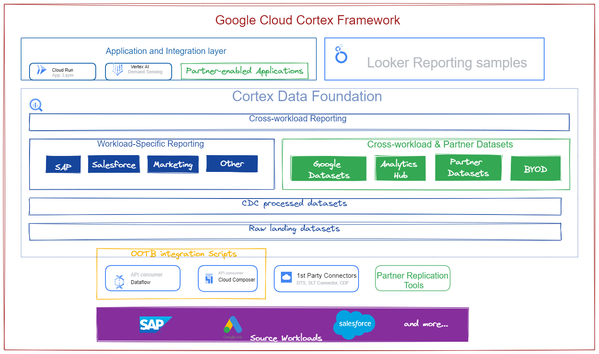
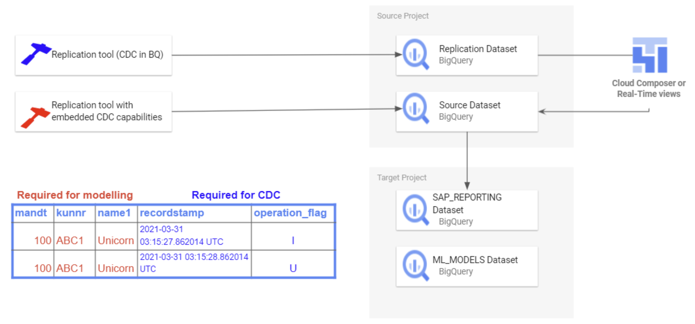
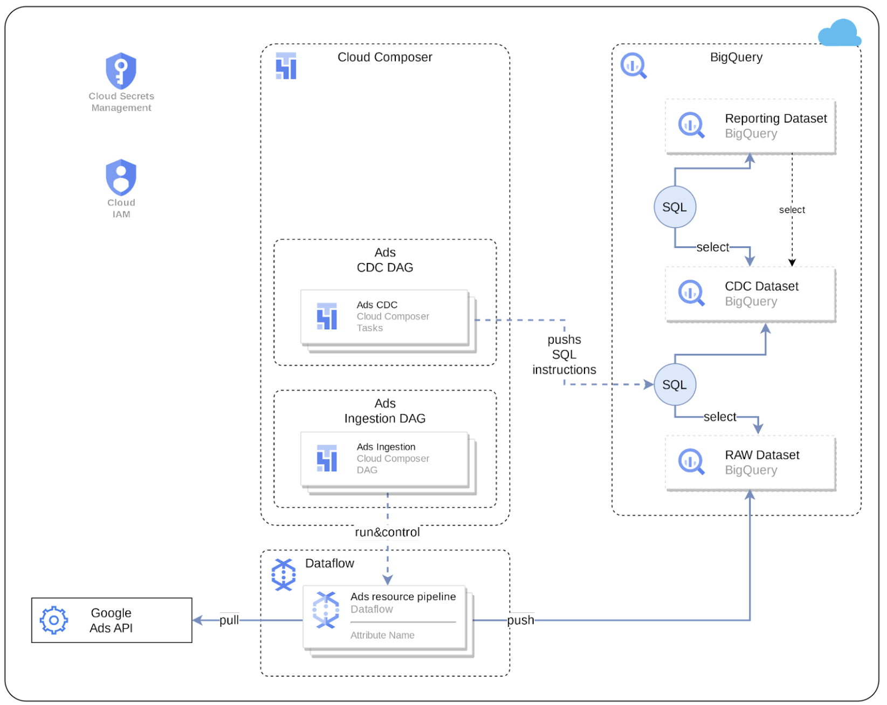
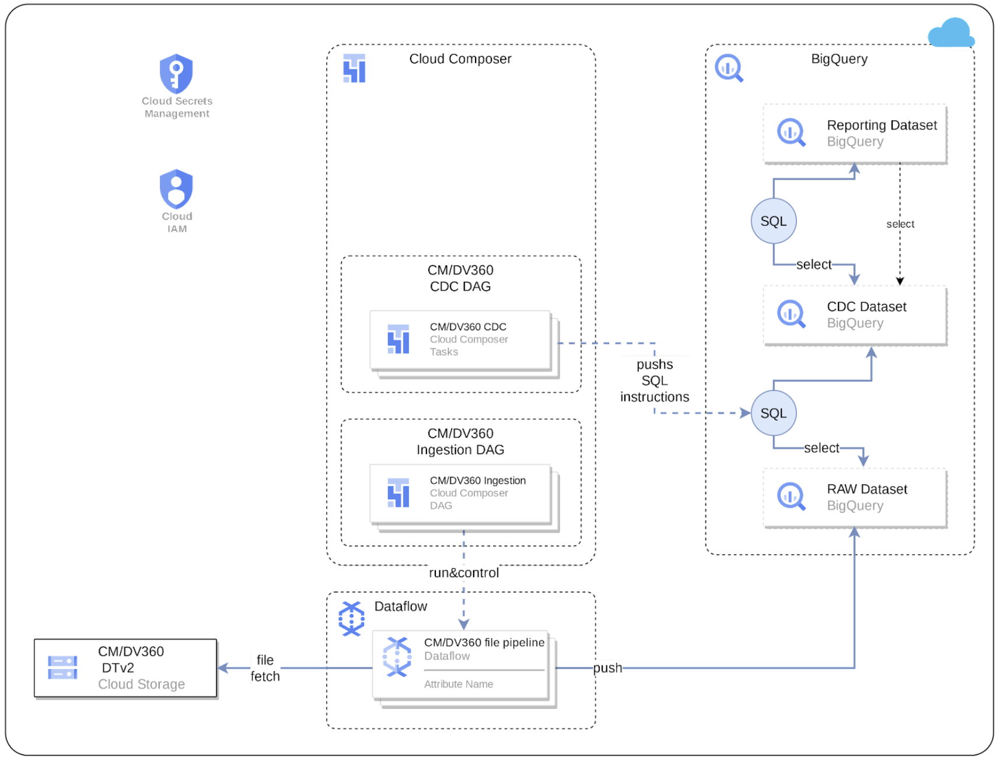
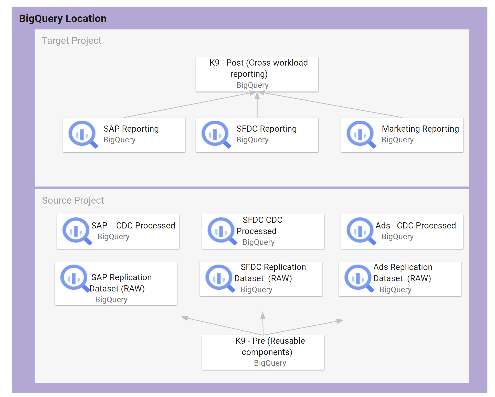
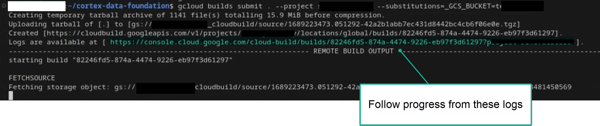
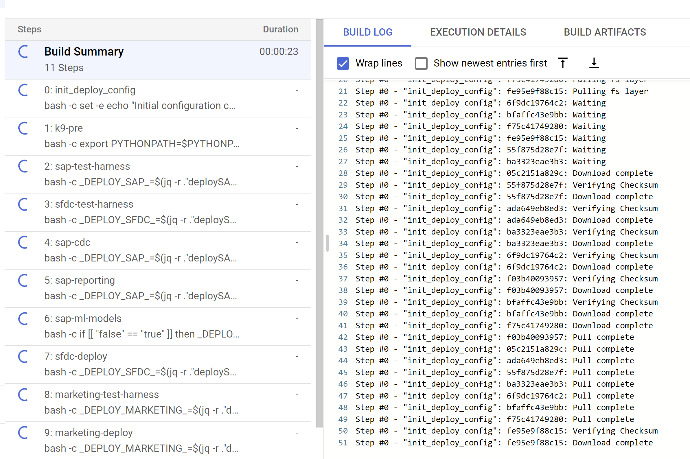
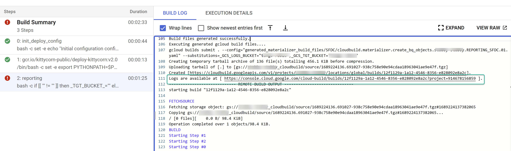

# **Google Cloud Cortex Framework**


## About the Data Foundation for Google Cloud Cortex Framework
The Data Foundation for [Google Cloud Cortex Framework](https://cloud.google.com/solutions/cortex) is a set of analytical artifacts, that can be automatically deployed together with reference architectures.



The current repository contains the analytical views and models that serve as a foundational data layer for the Google Cloud Cortex Framework in BigQuery. Here is the list of entity-relationship diagrams:
-  [SAP ECC](images/erd_ecc.png) ([PDF](docs/erd_ecc.pdf)),
-  [SAP S/4 here](images/erd_s4.png)([PDF](docs/erd_s4.pdf)),
-  [Salesforce.com here](images/erd_sfdc.png) ([PDF](docs/erd_sfdc.pdf))
-  [Google Ads](images/erd_gads.png) ([PDF](docs/erd_gads.pdf))
-  [CM360](images/erd_cm360.png) ([PDF](docs/erd_cm360.pdf))


# Quick demo setup
If you want to create a **demo** instance, with automatic generation of BigQuery datasets, automatic permission granting and test data, click this button:

[](https://shell.cloud.google.com/cloudshell/?terminal=true&show=terminal&cloudshell_git_repo=https%3A%2F%2Fgithub.com%2FGoogleCloudPlatform%2Fcortex-data-foundation&cloudshell_tutorial=docs%2Ftutorial.md)

🗈 **Note:**
- This demo deployment is ⚠️**not suitable for productive environments**⚠️.
- When prompted, we recommend you **click Trust repo** to avoid errors from using Ephemeral Cloud Shell.


# Deployment for Development or Productive environments

### Clone the Data Foundation repository

We recommend using the [Cloud Shell](https://shell.cloud.google.com/?fromcloudshell=true&show=ide%2Cterminal).

_These steps will require the `gcloud sdk` (already installed in Cloud Shell)._

Clone this repository with submodules (`--recurse-submodules`):

```
git clone --recurse-submodules https://github.com/GoogleCloudPlatform/cortex-data-foundation
```

Navigate into the previously downloaded folder.

```
cd cortex-data-foundation
```
If this is not the first time you clone the repository, execute `git pull --recurse-submodules` to pull the latest changes. If you are already an expert in configuration and requirements, you can skip to the build command in section [Execute deployment](#execute-deployment).

## **Deployment steps**

These are the steps for deployment:

0.  [Prerequisites](#prerequisites)
1.  [Establish project and dataset structure](#establish-project-and-dataset-structure)
2.  [Establish integration mechanism](#establish-integration-mechanism)
3.  [Configure Cloud Platform Components](#configure-google-cloud-platform-components)
4.  [Configure Deployment](#configure-deployment)
5.  [Execute deployment](#execute-deployment)
6.  [Test customize, prepare for upgrade](#test-customize-and-prepare-for-upgrade)
7.  [Next steps for reporting and add-ons](#next-steps)


## Prerequisites

### Understand the Framework

A successful deployment depends on good understanding of:
- Your company's business rules and requirements
- Functional understanding of the workload (e.g., SAP, Salesforce)
- Fundamentals of Google Cloud foundations and products

To help with the last point, before continuing with this guide, make sure you are familiar with:

-   Google Cloud Platform [fundamentals](https://www.cloudskillsboost.google/course_templates/60)
-   How to navigate the Cloud Console, [Cloud Shell](https://cloud.google.com/shell/docs/using-cloud-shell) and [Cloud Shell Editor](https://cloud.google.com/shell/docs/editor-overview)
-   Fundamentals of [BigQuery](https://cloud.google.com/bigquery/docs/introduction)
-   Fundamental concepts of [Change Data Capture and dataset structures](#understanding-change-data-capture).
-   General navigation of [Cloud Build](https://cloud.google.com/build/docs/overview)
-   Fundamentals of [Identity and Access Management](https://cloud.google.com/iam/docs/)
-   Fundamentals of [Cloud Composer](https://cloud.google.com/composer/docs/concepts/overview) or [Apache Airflow](https://airflow.apache.org/docs/apache-airflow/stable/concepts/index.html)
-   Fundamentals of [Cloud Dataflow](https://cloud.google.com/dataflow)


## Establish project and dataset structure

You will require at least one GCP project to host the BigQuery datasets and execute the deployment process.

This is where the deployment process will trigger Cloud Build runs. In the project structure, we refer to this as the [Source Project](#dataset-structure). Each workload should have at least one CDC and one reporting datasets (i.e., one CDC and one reporting dataset for SAP, one CDC and one Reporting dataset for SFDC).


**ℹ️ Note**: If you want to have separate sets of projects and datasets for each workload (e.g., one set of source and target projects for SAP and a different set of target and source projects for Salesforce), run separate deployments for each workload.

You will need to identify:

*   **Deploy SAP, Salesforce.com, marketing?:** Decide whether you want to deploy models for all workloads at the same time or only one set of models.
*   **Source Google Cloud Project:** Project where the source data is located, from which the data models will consume. This project is normally accessed by technical practitioners.
*   **Target Google Cloud Project:** Project where the Data Foundation predefined data models will be deployed and accessed by end-users. This may or may not be different from the source project depending on your needs.
*   **Source BigQuery Dataset (RAW):** BigQuery dataset where the source data is replicated to or where the test data will be created. The recommendation is to have separate datasets, one for each data source (e.g., one raw dataset for SAP and one raw dataset for Google Ads).
*   **CDC BigQuery Dataset:** BigQuery dataset where the CDC processed data lands the latest available records. This may or may not be the same as the source dataset if the tool landing the data performs the CDC merge operation. Some workloads allow for field name mapping here. The recommendation is to have two separate CDC datasets, one for each source (i.e., one cdc dataset for SAP and one CDC dataset for Salesforce).
*   **Target BigQuery reporting dataset:** BigQuery dataset where the Data Foundation predefined data models will be deployed. The recommendation is to have two separate reporting datasets, one for each source (i.e., one reporting dataset for SAP and one reporting dataset for Salesforce). This dataset is automatically created by the deployer if it does not exist.
*   **Target BigQuery machine learning dataset:** BigQuery dataset where the BQML predefined models will be deployed. This dataset is automatically created by the deployer if it does not exist.
*   **Pre-processing K9 dataset:** BigQuery dataset where cross-workload, reusable DAG components, such as time dimensions, can be deployed. The Workloads will have a dependency on this dataset unless modified. This dataset is automatically created by the deployer if it does not exist.
*   **Post-processing K9 dataset:** BigQuery dataset where cross-workload reporting (e.g., SAP + Google Ads reporting (CATGAP)) and additional external source DAGs, (e.g., Weather or Google Trends ingestion) can be deployed. This dataset is automatically created by the deployer if it does not exist.


**Alternatively**, if you do not have a replication tool set up or do not wish to use the replicated data, the deployment process can generate test tables and fake data for you. You will still need to [create](https://cloud.google.com/bigquery/docs/datasets) and identify the CDC and RAW datasets ahead of time.

These parameters will be different for each workload depending on the integration mechanism.

## Establish integration mechanism

Each workload has different ways to integrate with BigQuery. This section explains the options for each source.

ℹ️ **Using test data?**: You can skip this section.

<details>
  <summary>Integration options for SAP ECC or SAP S/4HANA</summary>

### Loading SAP data into BigQuery

#### **Prerequisites for SAP replication**

- Cortex Data Foundation expects SAP tables to be replicated with the same field names and types as they are created in SAP.
- As long as the tables are replicated with the same format, names of fields and granularity as in the source, there is no requirement to use a specific replication tool.
- Table names need to be created in BigQuery in lowercase.
- The list of tables used by SAP models are available and configurable in the CDC [setting.yaml](https://github.com/GoogleCloudPlatform/cortex-dag-generator/blob/main/setting.yaml). If a table is not present during deployment, the models depending on it will fail. Other models will deploy successfully.
- If in doubt about a conversion option, we recommend following the [default table mapping](https://cloud.google.com/solutions/sap/docs/bq-connector/latest/planning#default_data_type_mapping).
- **DD03L for SAP metadata**:
  If you are not planning on deploying test data, and if you are planning on generating CDC DAG scripts during deployment, make sure table DD03L is replicated from SAP in the source project.
  This table contains metadata about tables, like the list of keys, and is needed for the CDC generator and dependency resolver to work. This table will also allow you to add tables not currently covered by the model to generated CDC scripts, like custom or Z tables.

 ℹ️ **What happens if I have minor differences in a table name?** Because SAP systems may have minor variations due to versions or add-on and append structures into tables, or because some replication tools may have slighty different handling of special characters, some views may fail not finding a field. We recommend executing the deployment with `turboMode : false` to spot most failures in one go. Examples of this are:
- Fields starting with `_` (e.g., `_DATAAGING`) have their `_` removed
- Fields cannot start with `/` in BigQuery

In this case, you can adapt the failing view to select the field as it is landed by your replication tool of choice.

### **Change data capture processing**

There are two ways for replication tools to load records from SAP:
- Append-always: Insert every change in a record with a timestamp and an operation flag (Insert, Update, Delete), so the last version can be identified.
- Update when landing: This creates an updated version of a record on landing in the `change data capture processed`. It performs the CDC operation in BigQuery.



Cortex Data Foundation supports both modes (append-always or update when landing). For append-always, we provide CDC processing templates.

🗈 **Note**: Some functionality will need to be commented out for Update on landing. For example, [OneTouchOrder.sql](https://github.com/GoogleCloudPlatform/cortex-reporting/blob/main/OneTouchOrder.sql) and all its dependant queries. The functionality can be replaced with tables like CDPOS.

[Return to top of Section](#establish-integration-mechanism)
<details>

  <summary>Configure CDC templates for tools replicating in append-always mode</summary>

### **Configure CDC for SAP**


⚠️**We strongly recommend configuring this file according to your needs.** Some default frequencies may be unnecessarily costly if the business does not require such level of data freshness.

If using a tool that runs in append-always mode, Cortex Data Foundation provides CDC templates to automate the updates and created a _latest version of the truth_ or digital twin in the CDC processed dataset.

You can use the configuration in the file [`setting.yaml`](https://github.com/GoogleCloudPlatform/cortex-dag-generator/blob/main/setting.yaml) if you need to generate change-data capture processing scripts. See the [Appendix - Setting up CDC Processing](#setting-up-cdc-processing) for options. For test data, you can leave this file as a default.

Make any changes to the [DAG templates](https://github.com/GoogleCloudPlatform/cortex-dag-generator/blob/main/src/template_dag/dag_sql.py) as required by your instance of Airflow or Cloud Composer. You will find more information in the [Appendix - Gathering Cloud Composer settings](#gathering-cloud-composer-settings).

This module is optional. If you want to add/process tables individually after deployment, you can modify the `setting.yaml` file to process only the tables you need and re-execute the specific module calling `src/SAP_CDC/cloudbuild.cdc.yaml` directly.

### Performance optimization for CDC Tables
For certain CDC datasets, you may want to take advantages of BigQuery [table partitioning](https://cloud.google.com/bigquery/docs/partitioned-tables), [table clustering](https://cloud.google.com/bigquery/docs/clustered-tables) or both. This choice depends on many factors - the size and data of the table, columns available in the table, and your need of real time data with views vs data materialized as tables. By default, CDC settings do not apply table partitioning or table clustering - the choice is yours to configure it based on what works best for you.

You can read more about partitioning and clustering for SAP [here](https://cloud.google.com/blog/products/sap-google-cloud/design-considerations-for-sap-data-modeling-in-bigquery).

**NOTE**:
1. This feature only applies when a dataset in `setting.yaml` is configured for replication as a table (e.g. `load_frequency = "@daily"`) and not defined as a view (`load_frequency = "RUNTIME"`).
2. A table can be both - a partitioned table as well as a clustered table.

#### Table Partitioning

Partition can be enabled by specifying `partition_details` property in `setting.yaml` for any base table.

Example:

```yaml
   - base_table: vbap
     load_frequency: "@daily"
     partition_details: {
       column: "erdat", partition_type: "time", time_grain: "day"
     }
```

| Property               | Description                                                            | Value           |
| ---------------------  | ---------------------------------------------------------------------- | --------------- |
| `column`               | Column by which the CDC table will be partitioned                      | Column name     |
| `partition_type`       | Type of Partition                                                      | `"time"` for time based partition ([More details](https://cloud.google.com/bigquery/docs/partitioned-tables#date_timestamp_partitioned_tables))<br>`"integer_range"` for integer based partition ([More details](https://cloud.google.com/bigquery/docs/partitioned-tables#integer_range)) |
| `time_grain`           | Time part to partition with <br>Required when `partition_type = "time"`| `"hour"`, `"day"`, `"month"` OR `"year"` |
| `integer_range_bucket` | Bucket range <br>Required when `partition_type = "integer_range"`      | `"start"` = Start value<br> `"end"` = End value<br>`"interval`" = Interval of range |

**NOTE**: See BigQuery Table Partition [documentation](https://cloud.google.com/bigquery/docs/partitioned-tables) details to understand these options and related limitations.

#### Table Clustering

Clustering can be by specifying `cluster_details` property in `setting.yaml` for any base table.

Example:

```yaml
   - base_table: vbak
     load_frequency: "@daily"
     cluster_details: {columns: ["vkorg"]}
```
| Property               | Description                                | Value                                             |
| ---------------------  | -------------------------------------------| ------------------------------------------------- |
| `columns`              | Columns by which a table will be clustered | List of column names<br>e.g. `["mjahr", "matnr"]` |


**NOTE**: See BigQuery Table Cluster [documentation](https://cloud.google.com/bigquery/docs/clustered-tables) details to understand these options and related limitations.

</details>

[Return to top of Section](#establish-integration-mechanism)
</details>

<details>
  <summary>Integration options for Salesforce.com</summary>

### Loading Salesforce data into Bigquery

We provide a replication solution based on Python scripts scheduled in [Apache Airflow](https://airflow.apache.org/) and [Salesforce Bulk API 2.0](https://developer.salesforce.com/docs/atlas.en-us.api_asynch.meta/api_asynch/bulk_api_2_0.htm). These Python scripts can be adapted and scheduled in the tool of choice.

There are three sets of processing options for data integration:
- API call and load into RAW, updating existing records if needed
- Source-to-target structure mapping views
- CDC processing scripts

If you have datasets already loaded through a different tool in append-always mode, the CDC processing scripts contain mapping files to map the schema of the tables as generated by your tool into the names and data types of the structure required by the reporting views in Cortex Data Foundation. You can also add custom fields in the schema definition so they are incorporated in the CDC processing.

 ❗For CDC scripts to work, the **Id** for each API (e.g., `Account Id`) and the [**SystemModStamp**](https://developer.salesforce.com/docs/atlas.en-us.object_reference.meta/object_reference/system_fields.htm) need to be present in the source table. These fields should either have their original name (Id, SystemModstamp) or being mapped respectively to the {object_name}Id and SystemModstamp.

For example, the source table with data of Account object should have original Id and SystemModstamp fields. If these fields have different names, then src/SFDC/src/table_schema/accounts.csv file must be updated with id field's name mapped to AccountId and whatever system modification timestamp field mapped to SystemModstamp.

If you already have the replication and CDC working for Salesforce APIs and only need the mapping, you can edit the [mapping files](https://github.com/GoogleCloudPlatform/cortex-salesforce/tree/main/src/table_schema) to generate views that translate the structure generated by the integration tool to the structure expected by Cortex Data Foundation reporting views.

### Salesforce data requirements
*   The structure of the source tables follows *snake_case* naming in plural, i.e. `some_objects`. The columns have the same data types as how Salesforce represents them internally. Some fields have been renamed for better readability in the reporting layer.
*   Any required tables that did not exist within the raw dataset will be created as empty tables during deployment. This is to ensure the CDC deployment step runs correctly.
*  If required, for CDC scripts to work, the **Id** for each API (e.g., `Account Id`) and the [**SystemModStamp**](https://developer.salesforce.com/docs/atlas.en-us.object_reference.meta/object_reference/system_fields.htm) need to be present in the source table. The provided RAW processing scripts fetch these fields automatically from the APIs and update the target replication table.
*  The provided RAW processing scripts do not require additional change data capture processing. This behavior is set during deployment by default.


#### **Source tables for Currency Conversion in Salesforce**

The currency conversion functionality of Salesforce relies on the existence of the objects `CurrencyTypes` and `DatedConversionRates` within the source Salesforce system, which are available only if [Advanced Currency Management](https://help.salesforce.com/s/articleView?id=sf.administration_about_advanced_currency_management.htm) is enabled. If not, you may want to remove relevant entries from `src/SFDC/config/ingestion_settings.yaml` to avoid running into errors during Salesforce to Raw extraction.

If these tables are not available, we will automatically create empty placeholder tables for them during deployment to avoid break Reporting logic.

<details>
  <summary>Configure Salesforce integration with Cortex provided ingestion templates</summary>

## Configure API integration and CDC for Salesforce

Following a principle of openness, customers are free to use the provided replication scripts for Salesforce or a data replication tool of their choice as long as data meets the same structure and level of aggregation as provided by the Salesforce APIs. If you are using another tool for replication, this tool can either append updates as new records (_[append always](https://cloud.google.com/bigquery/docs/migration/database-replication-to-bigquery-using-change-data-capture#overview_of_cdc_data_replication)_ pattern) or update existing records with changes when landing the data in BigQuery. If the tool does not update the records and replicates any changes as new records into a target (RAW) table, Cortex Data Foundation provides the option to create change-data-capture processing scripts.

To ensure the names of tables, names of fields, and data types are consistent with the structures expected by Cortex regardless of the replication tool, you can modify the mapping configuration to map your replication tool or existing schemata. This will generate mapping views compatible with the structure expected by Cortex Data Foundation.


You can use the configuration in [`setting.yaml`](https://github.com/GoogleCloudPlatform/cortex-salesforce/blob/main/config/setting.yaml) to configure the generation of scripts to call the salesforce APIs and replicate the data into the RAW dataset (section `salesforce_to_raw_tables`) and the generation of scripts to process changes incoming into the RAW dataset and into the CDC processed dataset (section `raw_to_cdc_tables`).

By default, the scripts provided to read from APIs update changes into the RAW dataset, so CDC processing scripts are not required, and mapping views to align the source schema to the expected schema are created instead.

The generation of CDC processing scripts is not executed if `SFDC.createMappingViews` in the [config.json](https://github.com/GoogleCloudPlatform/cortex-data-foundation/blob/main/config/config.json#L29) file remains true (default behavior). If CDC scripts are required, set `SFDC.createMappingViews` to false.  This second step also allows for mapping between the source schemata into the required schemata as required by Cortex Data Foundation.

The following example of a `setting.yaml` configuration file illustrates the generation of mapping views when a replication tool updates the data directly into the replicated dataset, as illustrated in `option 3` (i.e., no CDC is required, only re-mapping of tables and field names). Since no CDC is required, this option executes as long as the parameter `SFDC.createMappingViews` in the config.json file remains `true`.


In this example, removing the configuration for a base table or all of them from the sections will skip the generation of DAGs of that base table or the entire section, as illustrated for `salesforce_to_raw_tables`. For this scenario, setting the parameter `deployCDC : False` has the same effect, as no CDC processing scripts need to be generated.

The following example illustrates the mapping of the field `unicornId` as landed by a replication tool to the name and type expected by Cortex Data Foundation, `AccountId` as a `String`.


Make any changes to the [DAG templates for CDC](https://github.com/GoogleCloudPlatform/cortex-salesforce/tree/main/src/cdc_dag_generator/templates) or for [RAW](https://github.com/GoogleCloudPlatform/cortex-salesforce/tree/main/src/raw_dag_generator/templates) as required by your instance of Airflow or Cloud Composer. You will find more information in the [Appendix - Gathering Cloud Composer settings](#gathering-cloud-composer-settings).

If you do not need any DAGs for RAW data generation from API calls or CDC processing, set [parameter](#gather-the-parameters-for-deployment) `deployCDC` to `false`. Alternatively, you can remove the contents of the sections in [`setting.yaml`](https://github.com/GoogleCloudPlatform/cortex-salesforce/blob/main/config/setting.yaml). If data structures are known to be consistent with those expected by Cortex Data Foundation, you can skip the generation of mapping views with [parameter](#gather-the-parameters-for-deployment) `SFDC.createMappingViews` set to `false`.

</details>

[Return to top of Section](#establish-integration-mechanism)
</details>

<details>
  <summary>Integration options for Marketing Workload</summary>

The following data sources are available through the Marketing workload:
- Google Ads
  
- Campaign Manager 360 (CM360)
  

For both the data sources, we use Dataflow pipelines to obtain data from upstream systems.
Cloud Composer is used to schedule and monitor these Dataflow pipelines.

<details>
<summary>Configure integration for Google Ads </summary>

Cortex Data Foundation integrates with Google Ads in the following way:
1. **Source to Raw layer**: Ingest data from Google Ads to raw dataset using Google Ads APIs. This is achieved by using Dataflow pipelines running in Cloud Composer DAGs.
2. **Raw layer to CDC layer**: Apply CDC process on raw dataset and store the output in CDC dataset. This is accomplished by Cloud Composer DAGs running BigQuery sqls.
3. **CDC layer to Reporting layer**: Create final reporting tables from CDC tables in the Reporting dataset. This is accomplished by either creating runtime views on top of CDC tables or running Cloud Composer DAGs for materialized data in BigQuery tables - depending on how it's configured.

## Google Ads API

The ingestion templates for Google Ads use the [Google Ads API](https://developers.google.com/google-ads/api/docs/start) to retrieve reporting attributes and metrics. The current templates use [version 13](https://developers.google.com/google-ads/api/fields/v13/overview).

### API Limits:
Relevant limits fo the API (as of this release):
- Basic access operations/day: 15000 (paginated requests containing valid next_page_token are not counted).
- Max page size: 10000 rows per page.
- Recommended default parameters: Page size = 10000 rows per page.
For more details on these API, please consult documents referred above.

## Configurations
Following configs are required to be in place for Cortex to successfully bring data from Ads into Cortex Reporting layer.

### Configure Google Ads Account Authentication
1.  Go to Google Cloud Console -> API & Services -> Credentials and create a new credential under “OAuth Client ID”.
    ```
    Application type: “Web Application”
    Name: Give it a name that makes sense (e.g. “Cortex Authentication Client”).
    Authorized redirect URIs: http://127.0.0.1
    ```
    For more information, see [Using OAuth 2.0 to Access Google APIs](https://developers.google.com/identity/protocols/oauth2/)
2.  Once above credential is configured, note the values for `Client ID` and `Client secret` - it will be used later. 
3.  Generate refresh token using "[How to refresh token](https://developers.google.com/identity/protocols/oauth2#5.-refresh-the-access-token,-if-necessary.)".
4.  Now create a secret using Google Cloud Secret Manager (Security -> Secret Manager) with name “`cortex-framework-google-ads-yaml`” using the following format:
    ```
    {"developer_token": "developer_token_value", "refresh_token": "refresh_token_value", "client_id": "client_id_value", "client_secret": "client_secret_value", "use_proto_plus": False, "login_customer_id": "ads_customer_id"}
    ```
    For the values:
    * `developer_token` value : Available in Google Ads account
    * `refresh_token` value: From the step #3 above.
    * `login_customer_id` value: Available in Google Ads account (Please note that this value should not contain dashes or hyphens)
    * `client_id` value: From the OAuth setup in step #2 above.
    * `client_secret` value: From the configurations in step #2 above.

### Cloud Composer Connections
Create following connections in Cloud Composer / Airflow:
Connection Name          | Purpose
-------------------------|------------------------------------------------------
`googleads_raw_dataflow` | For Google Ads API -> Bigquery Raw Dataset
`googleads_cdc`          | For Raw dataset -> CDC dataset transfer
`googleads_reporting`    | For CDC dataset -> Reporting dataset transfer

### Cloud Composer Service Account permissions
The service account used in Cloud Composer (as configured in the `googleads_raw_dataflow` connection above) needs dataflow related permissions. For more, please check [Dataflow documentation](https://cloud.google.com/dataflow/docs/concepts/security-and-permissions#df-service-account).

### Ingestion settings
File `src/GoogleAds/config/ingestion_settings.yaml` contains further settings that controls
"Source to Raw" and "Raw to CDC" data pipelines.

#### `source_to_raw_tables`:
This section has entries that control which entities are fetched by APIs and how. Each entry corresponds with one Google Ads entity. Based on this config, Cortex creates Airflow DAGs that
run Dataflow pipelines to fetch data using Google Ads APIs.

Parameters for each entry:
* `load_frequency`:  How frequently a DAG for this entity will run to fetch data from Google Ads.
   (See [Airflow documentation](https://airflow.apache.org/docs/apache-airflow/1.10.1/scheduler.html#dag-runs) for details on possible values.)

* `api_name`: API Resource Name (e.g. `customer` for https://developers.google.com/google-ads/api/fields/v13/customer)
* `table_name`: Table in Raw dataset where the fetched data will be stored (e.g. `customer`)
* `schema_file`: Schema file in `src/table_schema` directory that maps API response fields to destination table's column names.
* `key`: Columns (separated by comma) that forms a unique record for this table.
* `is_metrics_table`: Indicates if a given entry is for a metric entity (in Google Ads API). System treats such tables a bit differently due to aggregated nature of such tables.

#### `raw_to_cdc_tables`:
This section has entries that control how data is moved from Raw tables to CDC tables. Each entry
corresponds with a raw table (which in turn corresponds with Google Ads API entity as mentioned above.)

Parameters for each entry:
* `table_name`: Table in CDC dataset where the raw data after CDC transformation will be stored (e.g. `customer`)
* `raw_table`: Raw table from where we will obtain the data.
* `key`: Columns (separated by comma) that forms a unique record for this table.
* `load_frequency`:  How frequently a DAG for this entity will run to populate CDC table.
  (See [Airflow documentation](https://airflow.apache.org/docs/apache-airflow/1.10.1/scheduler.html#dag-runs) for details on possible values.)
* `schema_file`: Schema file in `src/table_schema` directory that maps raw columns to CDC columns and data type of the CDC column. (NOTE: This is the same schema file that's referred in earlier section.)

### Reporting settings
You can configure and control how Cortex generates data for the Google Ads final reporting layer using reporting settings file (`src/GoogleAds/config/reporting_settings.yaml`). This file controls how reporting layer BQ objects (tables, views, functions or stored procs are generated.)

For more details, please see [Customizing reporting_settings file configuration](#customizing-reporting_settings-file-configuration) section.

[Return to top of Section](#establish-integration-for-marketing-workloads)
</details>

<details>
<summary>Configure integration for CM360 </summary>

Cortex Data Foundation integrates with CM360 in the following way:
1. **Source to Raw layer**: Ingest data from CM360 to raw dataset using CM360 Data Transfer V2 files. This is achieved by using Dataflow pipelines running in Cloud Composer DAGs.
2. **Raw layer to CDC layer**: Apply CDC process on raw dataset and store the output in CDC dataset. This is accomplished by Cloud Composer DAGs running BigQuery sqls.
3. **CDC layer to Reporting layer**: Create final reporting tables from CDC tables in the Reporting dataset. This is accomplished by either creating runtime views on top of CDC tables or running Cloud Composer DAGs for materialized data in BigQuery tables - depending on how it's configured.

## CM360 Data Transfer V2
For CM360, we use files generated by [Data Transfer V2.0](https://developers.google.com/doubleclick-advertisers/dtv2/overview) as source of truth. In order to use CM360 with Cortex,
set up Data Transfer process by following the documentation.

## Configurations
Following configs are required to be in place for Cortex to successfully bring data from CM360 system into Cortex Reporting layer.

### DTv2 Fils GCS Bucket
Once the Data Transfer V2 is setup,  obtain the GCS Bucket name, and make sure the GCS bucket and files under the bucket are readable by the service account running DAGs in Cloud Composer.

### Set up Cloud Composer Connections
Create following connections in Cloud Composer / Airflow:
Connection Name       | Purpose
----------------------|------------------------------------------------------
`cm360_raw_dataflow`  | For CM360 DTv2 files -> Bigquery Raw Dataset
`cm360_cdc_bq`        | For Raw dataset -> CDC dataset transfer
`cm360_reporting_bq`  | For CDC dataset -> Reporting dataset transfer

### Cloud Composer Service Account permissions
The service account used in Cloud Composer (as configured in the `cm360_raw_dataflow` connection above) needs dataflow related permissions. For more, please check [Dataflow documentation](https://cloud.google.com/dataflow/docs/concepts/security-and-permissions#df-service-account).

### Ingestion settings
File `src/marketing/src/CM360/config/ingestion_settings.yaml` contains further settings that controls "Source to Raw" and "Raw to CDC" data pipelines.

#### `source_to_raw_tables`:
This section has entries that control which files from DTv2 are processed and how. Each entry corresponds with files associated one entity. Based on this config, Cortex creates Airflow DAGs that
run Dataflow pipelines to process data from the DTv2 files.

Parameters for each entry:
* `base_table`: Table in Raw dataset where the data for an entity (like 'Clicks' data) will be stored.
* `load_frequency`:  How frequently a DAG for this entity will run to process data from DTv2 files. (See [Airflow documentation](https://airflow.apache.org/docs/apache-airflow/1.10.1/scheduler.html#dag-runs) for details on possible values.)
* `file_pattern`: Regex based file name patterns that corresponds to an entity.
* `schema_file`: Schema file in `src/table_schema` directory that maps DTv2 fields to destination table's column names and data types.

#### `raw_to_cdc_tables`:
This section has entries that control how data is moved from Raw tables to CDC tables. Each entry
corresponds with a raw table (which in turn corresponds with DTv2 entity as mentioned above.)

Parameters for each entry:
* `base_table`: Table in CDC dataset where the raw data after CDC transformation will be stored (e.g. `customer`)
* `load_frequency`:  How frequently a DAG for this entity will run to populate CDC table. (See [Airflow documentation](https://airflow.apache.org/docs/apache-airflow/1.10.1/scheduler.html#dag-runs) for details on possible values.)
* `row_identifiers`: List of columns (separated by comma) that forms a unique record for this table.

### Reporting settings
You can configure and control how Cortex generates data for the CM360 final reporting layer using reporting settings file (`src/CM360/config/reporting_settings.yaml`). This file controls how reporting layer BQ objects (tables, views, functions or stored procs are generated.)

For more details, please see [Customizing reporting_settings file configuration](#customizing-reporting_settings-file-configuration) section.

[Return to top of Section](#establish-integration-for-marketing-workloads)
</details>


[Return to top of Section](#establish-integration-mechanism)
</details>

### Configure K9 deployments

The K9 deployer is responsible for ingestion, processing and modelling of components that are reusable across different data sources. For example, the time dimension is reusable across all data sources where tables may need to slice and dice analytical results based on a Gregorian calendar.

External data sources that can be combined across different workloads to gain enriched insights and are also reusable are part of the K9 deployer. For example, Weather data or Google Trends ingestion and processing can be combined across SAP, Salesforce and Marketing. The CATGAP is an example of a combination of Google Ads and SAP.



The pre-processing K9 step executes before all workloads start their deployment, so the reusable models are available during their deployment. Conversely, the post-processing K9 executes after all modules have deployed their reporting models so the cross-workload reporting or augmenting models find their dependencies within each reporting dataset.

ℹ️ Fun fact: The K9 receives its name because it's where the `DAGs /dɑɡz/` live.

The DAGs and models to be generated can be configured in [K9 configuration file](https://github.com/GoogleCloudPlatform/cortex-data-foundation/tree/main/src/k9/config/k9_settings.yaml).

If you are using submodules independently (e.g., only cortex-reporting) or a deployment framework like Dataform or dbt, we recommend porting the pre-k9 DAG execution into your scheduler of choice. The Reporting views that tap into reusable models select from the separate K9 datasets.


## Configure Google Cloud Platform components

### Enable Required Components

The following Google Cloud components are required:

*   Google Cloud Project
*   BigQuery instance and datasets
*   Service Account with Impersonation rights
*   Cloud Storage Buckets
*   Cloud Build API
*   Cloud Resource Manager API
*   Optional components:
    *   [Cloud Composer](https://console.cloud.google.com/marketplace/product/google/composer.googleapis.com) for change data capture (CDC) processing (SAP and Salesforce), hierarchy flattening (SAP only), and data replication (Salesforce only) through Directed Acyclic Graphs ([DAG](https://airflow.apache.org/docs/apache-airflow/stable/concepts/dags.html)s). You can find how to set up an instance of Cloud Composer in the [documentation](https://cloud.google.com/composer/docs/how-to/managing/creating).
    *   Looker **(optional, connects to reporting templates. Requires manual setup) **
    *   [Analytics Hub](https://cloud.google.com/analytics-hub) linked datasets (**optional**) are currently used for some external sources, such as the Weather DAG. You may choose to fill this structure with any other available source of your choice for advanced scenarios.
    *   [Dataflow](https://console.cloud.google.com/dataflow): Integration tool for Google Ads.

From the [Cloud Shell](https://shell.cloud.google.com/?fromcloudshell=true&show=ide%2Cterminal), you can enable Google Cloud Services using the _gcloud_ command line interface in your Google Cloud project.

Replace the `<SOURCE_PROJECT>` placeholder with your source project. Copy and paste the following command into the cloud shell:


```bash
gcloud config set project <SOURCE_PROJECT>

gcloud services enable bigquery.googleapis.com \
                       cloudbuild.googleapis.com \
                       composer.googleapis.com \
                       storage-component.googleapis.com \
                       cloudresourcemanager.googleapis.com \
                       dataflow.googleapis.com

```

You should get a success message:


### Grant permissions to the executing user

If an individual is executing the deployment with their own account, they will need, at minimum, the following permissions in the project where Cloud Build will be triggered:

*   Service Usage Consumer
*   Storage Object Viewer for the Cloud Build default bucket or bucket for logs
*   Object Writer to the output buckets
*   Cloud Build Editor
*   Project Viewer or Storage Object Viewer

These permissions may vary depending on the setup of the project. Consider the following documentation if you run into errors:
*   [Permissions to run Cloud Build](https://cloud.google.com/build/docs/securing-builds/configure-access-to-resources)
*   [Permissions to storage for the Build Account](https://cloud.google.com/build/docs/securing-builds/store-manage-build-logs)
*   [Permissions for the Cloud Build service account](https://cloud.google.com/build/docs/securing-builds/configure-access-for-cloud-build-service-account)
*   [Viewing logs from Builds](https://cloud.google.com/build/docs/securing-builds/store-manage-build-logs#viewing_build_logs)

### Configure the Cloud Build account

In the source project, navigate to the [Cloud Build](https://console.cloud.google.com/cloud-build/settings/service-account) and locate the account that will execute the deployment process.


Locate the build account in [IAM](https://pantheon.corp.google.com/iam-admin/iam) (make sure it says _cloudbuild_):


Grant the following permissions to the Cloud Build service account in both the source and target projects if they are different:

- BigQuery Data Editor
- BigQuery Job User

<details>
  <summary> [Optional] Create a Service Account for deployment with impersonation</summary>

The deployment can run through a service account with impersonation rights, by adding the flag [\--impersonate-service-account](https://cloud.google.com/sdk/gcloud/reference/builds/submit). This service account will trigger a Cloud Build job, that will in turn run specific steps through the Cloud Build service account. This allows a user to trigger a deployment process without direct access to the resources.

The impersonation rights to the new, triggering service account need to be granted to the person running the command.

Navigate to the [Google Cloud Platform Console](https://console.cloud.google.com/iam-admin/serviceaccounts/create) and follow the steps to create a service account with the following role:

*   Cloud Build Service Account

This role can be applied during the creation of the service account:


Authorize the ID of user who will be running the deployment to impersonate the service account that was created in the previous step. Authorize your own ID so you can run an initial check as well.


Once the service account has been created, navigate to the[ IAM Service Account administration](https://console.cloud.google.com/iam-admin/serviceaccounts), click on the service account, and into the Permissions tab.

Click **Grant Access**, type in the ID of the user who will execute the deployment and has impersonation rights, and assign the following role:

*   Service Account Token Creator


**Alternatively,** you can complete this step from the Cloud Shell:

```bash
gcloud iam service-accounts create <SERVICE ACCOUNT> \
    --description="Service account for Cortex deployment" \
    --display-name="my-cortex-service-account"

gcloud projects add-iam-policy-binding <SOURCE_PROJECT> \
--member="serviceAccount:<SERVICE ACCOUNT>@<SOURCE_PROJECT>.iam.gserviceaccount.com" \
--role="roles/cloudbuild.builds.editor"

gcloud iam service-accounts add-iam-policy-binding <SERVICE ACCOUNT>\
  --member="user:<EXECUTING USER EMAIL>" \
  --role="roles/iam.serviceAccountTokenCreator"
```

</details>

### Create a Storage bucket for DAGs

A storage bucket will be required to leave any processing scripts that are generated. These scripts will be manually moved into a Cloud Composer or Apache Airflow instance after deployment.

Navigate to [Cloud Storage](https://console.cloud.google.com/storage/create-bucket) and create a bucket **in the same region** as your BigQuery datasets.

**Alternatively**, you can use the following command to create a bucket from the Cloud Shell:

```bash
gsutil mb -l <REGION/MULTI-REGION> gs://<BUCKET NAME>
```

Navigate to the _Permissions_ tab. Grant `Storage Object Creator` to the user executing the Build command or to the Service account you created for impersonation.

### Create a Storage bucket for logs

You can create a specific bucket for the Cloud Build process to store the logs. This is useful if you want to restrict data that may be stored in logs to a specific region. Create a [GCS bucket](https://console.cloud.google.com/storage) with uniform access control, in the same region where the deployment will run.

**Alternatively**, here is the command line to create this bucket:

```bash
gsutil mb -l <REGION/MULTI-REGION> gs://<BUCKET NAME>
```

You will need to grant `Object Admin` permissions to the Cloud Build service account.

## Configure Deployment

The behavior of the deployment is controlled by the configuration file [config.json](https://github.com/GoogleCloudPlatform/cortex-data-foundation/blob/main/config/config.json).

The file contains global configuration and configuration specific to each workload.


Open the file in `config/config.json`. From the Cloud Shell:

```sh
edit config/config.json
```

### Global Deployment Configuration

Consider your target deployment:


|Parameter    | Parameter Name   | Description      |
|-------------|------------------|------------------|
|Deploy Test Data        |testData    | Project where the source dataset is and the build will run.                                 |
| Deploy SAP   | deploySAP |  Execute the deployment for SAP workload (ECC or S/4HANA)  - Default: True      |
| Deploy Salesforce  | deploySFDC |   Execute the deployment for Salesforce workload - Default: True     |
| Deploy Marketing  | deployMarketing | Execute the deployment for Marketing  sources (Google Ads and/or CM360) - Default: True    |
| Deploy in Turbo mode   | turboMode |  Execute all views builds as a step in the same Cloud Build process, in parallel for a faster deployment. If set to `false`, each reporting views is generated in its own sequential build step. We recommend only setting it to `true` when using test data or after any mismatch between reporting columns and the source data have been resolved.       |
| Source Project ID   | projectIdSource |  Project where the source dataset is and the build will run.       |
| Target Project ID   | projectIdTarget |  Target project for user-facing datasets (reporting and ML datasets).        |
| Target Bucket for template generation  | targetBucket | Bucket where DAGs and Dataflow templates will be generated as [created previously](#create-a-storage-bucket). Avoid using the actual Airflow bucket.        |
| Location or Region   | location |  Location where the BigQuery dataset and GCS buckets are. <br><br>Default is `US`. <br><br>**Note:** Restrictions listed under [BigQuery dataset locations](https://cloud.google.com/bigquery/docs/locations).       |
| Filtering languages | languages | If not using test data, enter a single language (e.g., `[ "E" ]`) or multiple languages (e.g., `[ "E", "S" ]`) as relevant to your business. These values are used to replace placeholders in SQL in analytics models where available (SAP only for now - see the ERD).        |
| Filtering currencies | currencies | If not using test data, enter a single currency (e.g., `[ "USD" ]`) or multiple languages (e.g., `[ "USD", "CAD" ]`) as relevant to your business. These values are used to replace placeholders in SQL in analytics models where available (SAP only for now - see the ERD).        |
| Source for test harness | testDataProject | Default: kittycorn-public. Source of the test data for demo deployments. **Unless you have your own test harness, do not change this value**.|
| K9 datasets - Processing | K9.datasets.processing | Execute cross-workload templates (e.g., date dimension) as defined in the [K9 configuration file](https://github.com/GoogleCloudPlatform/cortex-data-foundation/tree/main/src/k9/config/k9_settings.yaml). These templates are normally required by the downstream workloads. |
| K9 datasets - Reporting | K9.datasets.reporting | Execute cross-workload templates and external data sources (e.g., Weather) as defined in the [K9 configuration file](https://github.com/GoogleCloudPlatform/cortex-data-foundation/tree/main/src/k9/config/k9_settings.yaml). Commented out by default. |

### Workload-specific configuration

The following sections are specific to each workload. You do not need to configure them if the deployment parameter (e.g., `deploySAP` or `deployMarketing`) for the workload is set to `False`.

<details>
  <summary>Deployment Configuration for SAP</summary>

|Parameter    | Parameter Name   | Description      |
|-------------|------------------|------------------|
|Deploy CDC        |`SAP.deployCDC`    | Generate CDC processing scripts to run as DAGs in Cloud Composer.     |
|Raw landing dataset    | `SAP.datasets.raw`    | Used by the CDC process, this is where the replication tool lands the data from SAP.  If using test data, create an empty dataset.|
|CDC Processed Dataset  | `SAP.datasets.cdc`    | Dataset that works as a source for the reporting views, and target for the records processed DAGs. If using test data, create an empty dataset.|
|Reporting Dataset SAP     |`SAP.datasets.reporting`     | Name of the dataset that is accessible to end users for reporting, where views and user-facing tables are deployed. Default: `REPORTING`. |
|ML dataset             |`SAP.datasets.ml`    | Name of the dataset that stages results of Machine Learning algorithms or BQML models. Default: `ML_MODELS`.|
|SQL flavor for source system| `SAP.SQLFlavor` |`s4` or `ecc`. For test data, keep the default value (`ecc`). For Demand Sensing, only `ecc` test data is provided at this time. |
|Mandant or Client|`SAP.mandt` |Default mandant or client for SAP. For test data, keep the default value (`100`). For Demand Sensing, use `900`.|

[Return to top of section](#workload-specific-configuration)
</details>

<details>
  <summary>Deployment Configuration for Salesforce</summary>

|Parameter    | Parameter Name   | Description      |
|-------------|------------------|------------------|
| Deploy CDC        |`SFDC.deployCDC`    | Generate CDC processing scripts to run as DAGs in Cloud Composer.  See the documentation for different ingestion options for Salesforce.    |
|Create mapping views | `SFDC.createMappingViews` | The provided DAGs to fetch new records from the Salesforce APIs update records on landing. This value set to **true** will generate views in the CDC processed dataset to surface tables with the "latest version of the truth" from the RAW dataset. If **false** and `SFDC.deployCDC: true`, DAGs will be generated with change data capture processing based on SystemModstamp. See details on [CDC processing for Salesforce](#configure-api-integration-and-cdc-for-salesforce). Default: `true` |
|Create Placeholders | `SFDC.createPlaceholders` | Create empty placeholder tables in case they are not generated by the ingestion process to allow the downstream reporting deployment to execute without failure. Default: `true` |

[Return to top of section](#workload-specific-configuration)
</details>

<details>
  <summary>Deployment Configuration for Marketing</summary>

|Parameter    | Parameter Name   | Description      |
|-------------|------------------|------------------|
|Deploy Google Ads|`marketing.deployGoogleAds`    | Generate CDC processing scripts to run as DAGs in Cloud Composer.     |
|Deploy CM360 |`marketing.deployCM360`    | Deploy CM360 data source and models  |
|Dataflow region |`marketing.dataflowRegion`    | Region for Dataflow pipelines to replace in DAGs (as available [here](https://cloud.google.com/dataflow/docs/resources/locations)).  |
| Deploy CDC for Google Ads |`marketing.GoogleAds.deployCDC`| Generate CDC processing scripts to run as DAGs in Cloud Composer.|
|Lookback days for Google Ads|`marketing.GoogleAds.lookbackDays`| Number of days backwards to start fetching Ads from Google Ads API. |
|CDC dataset for Google Ads|`marketing.GoogleAds.datasets.cdc` | CDC dataset for Google Ads |
| RAW dataset for Google Ads|`marketing.GoogleAds.datasets.raw`| RAW dataset for Google Ads |
|Reporting dataset for Google Ads|`marketing.GoogleAds.datasets.reporting` | Reporting dataset for Google Ads. Default: REPORTING_GoogleAds. |
|Deploy CDC scripts for CM360|`marketing.CM360.deployCDC`    | Generate CDC processing scripts to run as DAGs in Cloud Composer for Data Transfer Service ingestion. |
|Bucket with Data Transfer Service results |`marketing.CM360.dataTransferBucket` | Bucket with results from DTSv2 for CM360. Make sure the Service Account for Composer |
| CDC dataset for CM360 |`marketing.CM360.datasets.cdc` | CDC dataset for CM360.  |
| RAW dataset for CM360 |`marketing.CM360.datasets.raw`| RAW DC dataset for CM360. |
| Reporting dataset for CM360 |`marketing.CM360.datasets.reporting`| Reporting dataset for CM360. Default: REPORTING_CM360. |

[Return to top of section](#workload-specific-configuration)
</details>

<details>
  <summary>[Optional] Configure K9  external datasets </summary>

## Configure SAP Hierarchies

You can use the configuration in the file [`sets.yaml`](https://github.com/GoogleCloudPlatform/cortex-dag-generator/blob/main/sets.yaml) if you need to generate scripts to flatten hierarchies. See the [Appendix - Configuring the flattener](#configuring-the-flattener-for-sap-hierarchies) for options. This step is only executed if the CDC generation flag is set to `true`.

## Configure External Datasets for K9

Some advanced use cases may require external datasets to complement an enterprise system of record such as SAP. In addition to external exchanges consumed from [Analytics hub](https://cloud.google.com/analytics-hub), some datasets may need custom or tailored methods to ingest data and join them with the reporting models.

**Note:** You will need to configure the DAGs as follows:

1. **Holiday Calendar**: This DAG retrieves the holiday calendars from  [PyPi Holidays](https://pypi.org/project/holidays/). You can adjust the list of countries and years to retrieve holidays, as well as parameters of the DAG from the file `holiday_calendar.ini`. Leave the defaults if using test data.
2. **Product Hierarchy Texts**: This DAG flattens materials and their product hierarchies. The resulting table can be used to feed the `Trends` list of terms to retrieve Interest Over Time. You can adjust the parameters of the DAG from the file `prod_hierarchy_texts.py`. Leave the defaults if using test data. You will need to adjust the levels of the hierarchy and the language under the markers for `## CORTEX-CUSTOMER:`. If your product hierarchy contains more levels, you may need to add an additional SELECT statement similar to the CTE `h1_h2_h3`.
3. **Trends**: This DAG retrieves Interest Over Time for a specific set of terms from [Google Search trends](https://trends.google.com/trends/). The terms can be configured in `trends.ini`. You will need to adjust the time frame to `'today 7-d'` in `trends.py` after an initial run. We recommend getting familiarized with the results coming from the different terms to tune parameters. We also recommend partitioning large lists to multiple copies of this DAG running at different times. For more information about the underlying library being used, see [Pytrends](https://pypi.org/project/pytrends/).
2. **Weather**: By default, this DAG uses the publicly available test dataset [**bigquery-public-data.geo_openstreetmap.planet_layers**](https://console.cloud.google.com/bigquery/analytics-hub/exchanges(analyticshub:search)?queryText=open%20street%20map). The query also relies on an NOAA dataset only available through Analytics Hub, [**noaa_global_forecast_system**](https://console.cloud.google.com/bigquery/analytics-hub/exchanges(analyticshub:search)?queryText=noaa%20global%20forecast).  **`This dataset needs to be created in the same region as the other datasets prior to executing deployment`**. If the datasets are not available in your region, you can continue with the following instructions and follow additional steps to transfer the data into the desired region.

**You can skip this configuration if using test data.**

*  Navigate to [BigQuery > Analytics Hub](https://console.cloud.google.com/bigquery/analytics-hub)
* Click **Search Listings**. Search for "`NOAA Global Forecast System`"
* Click **Add dataset to project**. When prompted, keep "`noaa_global_forecast_system`" as the name of the dataset. If needed, adjust the name of the dataset and table in the FROM clauses in `weather_daily.sql`.
* Repeat the listing search for Dataset "`OpenStreetMap Public Dataset`".
* Adjust the `FROM ` clauses containing `bigquery-public-data.geo_openstreetmap.planet_layers` in `postcode.sql`.

[**Analytics hub is currently only supported in EU and US locations**](https://cloud.google.com/bigquery/docs/analytics-hub-introduction) and some datasets, such as NOAA Global Forecast, are only offered in a single multilocation.
If you are targeting a location different from the one available for the required dataset, we recommend creating a [scheduled query](https://cloud.google.com/bigquery/docs/scheduling-queries) to copy the new records from the Analytics hub linked dataset followed by a [transfer service](https://cloud.google.com/bigquery-transfer/docs/introduction) to copy those new records into a dataset located in the same location or region as the rest of your deployment. You will then need to adjust the SQL files .

**Important Note:** Before copying these DAGs to Cloud Composer, you will need to **add the required python modules (`holidays`, `pytrends`) [as dependencies](https://cloud.google.com/composer/docs/how-to/using/installing-python-dependencies#options_for_managing_python_packages)**.

[Return to top of section](#workload-specific-configuration)

</details>

## Check for `CORTEX_CUSTOMER` tags
Many SAP and Salesforce customers will have specific customizations of their systems, such as additional documents in a flow or specific types of a record. These are specific to each customer and configured by functional analysts as the business needs arise. The spots on the SQL code where these specific enhancements could be done are marked with a comment starting with `## CORTEX-CUSTOMER`. You can check for these comments after cloning the repository with a command like:

```bash
grep -R CORTEX-CUSTOMER
```

⚠️ **Note**: There may be additional customizations depending on the source systems. We recommend getting the business users or analysts involved early in the process to help spot these.

## Performance optimization for Reporting views

Reporting artifacts can be created as views or as tables refreshed regularly through DAGs. On the one hand, views will compute the data on each execution of a query, which will keep the results always fresh. On the other hand, the table will run the computations once, and the results can be queried multiple times without incurring higher computing costs and achieving faster runtime. This balance is very specific to each customer, so we encourage each customer to create their own configuration to serve their needs.

Materialized results are updated into a table. These tables can be further fine-tuned by adding Partitioning and Clustering properties to these tables.

The configuration files for each workload are:
- SAP: `src/SAP/SAP_REPORTING/reporting_settings_ecc.yaml`
- Salesforce: `src/SFDC/config/reporting_settings.yaml`
- Marketing: `src/marketing/src/GoogleAds/config/reporting_settings.yaml` and `src/marketing/src/CM360/config/reporting_settings.yaml`


###  Customizing `reporting_settings` file configuration

This settings file drives how the BQ objects (tables or views) for Reporting datasets are created.

There are two sections:

 1. `bq_independent_objects`:
    All BiqQuery objects that can be created in independently, without any other dependencies.

    **NOTE**: When Turbo mode is enabled, these BQ objects are created in parallel during the deployment time, speeding up the deployment process.

 2. `bq_dependent_objects`:
     All BiqQuery objects that need to be created in a specific order due to dependencies on other BQ object.

     **NOTE**: Turbo mode does not apply to this section - i.e. each object will be created one after another.

The deployer will first create all the BQ Objects listed in `bq_independent_objects` first, and then all the objects
listed in `bq_dependent_objects`.

Following properties need to be defined for each object:
1. `sql_file`:  Name of the sql file that will create a given objet.

2. `type`: Type of BQ Object.

    Possible values:

    * `view` : If we want the object to be a BQ view.

    * `table`: If we want the object to be a BQ table.

    * `script`: This is to create other types of objects (BQ Functions, Stored Procs etc)

3. If "type = table", then following optional properties can be defined:

     * `load_frequency`: Frequency at which a Composer DAG will be executed to refresh this table. Mandatory. See [Airflow documentation](https://airflow.apache.org/docs/apache-airflow/1.10.1/scheduler.html#dag-runs) for details on possible values.

     * `partition_details`: How the table should be partitioned. Optional.

        | Property               | Description                                                            | Value           |
        | ---------------------  | ---------------------------------------------------------------------- | --------------- |
        | `column`               | Column by which the CDC table will be partitioned                      | Column name     |
        | `partition_type`       | Type of Partition                                                      | `"time"` for time based partition ([More details](https://cloud.google.com/bigquery/docs/partitioned-tables#date_timestamp_partitioned_tables))<br>`"integer_range"` for integer based partition ([More details](https://cloud.google.com/bigquery/docs/partitioned-tables#integer_range)) |
        | `time_grain`           | Time part to partition with <br>Required when `partition_type = "time"`| `"hour"`, `"day"`, `"month"` OR `"year"` |
        | `integer_range_bucket` | Bucket range <br>Required when `partition_type = "integer_range"`      | `"start"` = Start value<br> `"end"` = End value<br>`"interval`" = Interval of range |

      * `cluster_details`: How the table should clustered. Optional.

        | Property               | Description                                | Value                                             |
        | ---------------------  | -------------------------------------------| ------------------------------------------------- |
        | `columns`              | Columns by which a table will be clustered | List of column names<br>e.g. `["CompanyCode_BUKRS", "FiscalYear"]` |

## Execute Deployment

This step requires `config.json` to be configured as described in the section [Configure Deployment](#configure-deployment).

Run the Build command with the target log bucket.

```bash
gcloud builds submit --project <execution project, likely the source> \
--substitutions=_GCS_BUCKET=<Bucket for logs - Cloud Build Service Account needs access to write here>
```
You can follow the main Build process from the first link of logs:



Alternatively, if you have enough permissions, you can see the progress from [Cloud Build](https://console.cloud.google.com/cloud-build/).



Each build step will trigger child build steps. These can be tracked from the Cloud Build console:


Or finding the logs for the child build within the log from a step:



And identify any issues with individual builds:


We recommend pasting the generated SQL into BigQuery to identify and correct the errors more easily. Most errors will be related to fields that are selected but not present in the replicated source. The BigQuery UI will help identify and comment those out.

## Move the files into the DAG bucket

If you opted to generate integration or CDC files and have an instance of Airflow, you can move them into their final bucket with the following command:

```bash
gsutil -m cp -r  gs://<output bucket>/dags/ gs://<composer dag bucket>/
gsutil -m cp -r  gs://<output bucket>/data/ gs://<composer sql bucket>/
```

## Test, customize and prepare for upgrade

In addition to the CORTEX-CUSTOMER tags, you may need to further customize the content to add business rules, add other datasets and join them with existing views or tables, reuse the provided templates to call additional APIs, modify deployment scripts, apply further data mesh concepts, etc.  You may also need to slightly adapt some tables or landed APIs to include additional fields not included in our standard. We recommend committing all of these changes with a clear tag in the code to your own fork or clone of our git repositories.

We recommend adopting a CICD pipeline that works for your organization, to keep these enhancements tested and your overall solution in a reliable, robust state. A simple pipeline can reuse our `cloudbuild*.yaml` scripts to trigger end to end deployment periodically, or based on git operations depending on your repository of choice by [automating builds](https://cloud.google.com/build/docs/automating-builds/create-manage-triggers). Using automated testing with your own sample data will help ensure the models always produce what you expect every time someone commits a change. The `config.json` file plays an important role in defining different sets of projects and datasets for development, staging and production environments.

Tagging your own changes visibly in your fork or clone of a repository together with some deployment and testing automation will be very helpful when performing upgrades. Check out this [guide for upgrade instructions](https://github.com/GoogleCloudPlatform/cortex-data-foundation/blob/main/docs/upgrade_recommendations/upgrade_recommendations.md).

## Next steps

## Looker deployment
Instructions for deploying the pre-built Looker blocks can be found [here](https://cloud.google.com/looker/docs/marketplace#installing_a_tool_from_a_git_url). Please follow the individual block READMEs for detailed instructions on required dependencies to ensure successful deployment.

Optionally, you may also customize the blocks by forking the GitHub repositories into your own Looker project. Instructions can be found [here](https://cloud.google.com/looker/docs/blocks).

Available blocks for the Data Foundation include the following:
* [SAP Operational Dashboards for Cortex](https://github.com/looker-open-source/block-cortex-sap)
* [Salesforce Dashboards for Cortex](https://github.com/looker-open-source/block-cortex-salesforce)

## Demand Sensing
You can deploy the Demand Sensing use case [from the Marketplace](https://console.cloud.google.com/marketplace/product/cortex-public/cortex-demand-sensing). Learn more from the documentation.
## Application Layer
Deploy a sample micro-services based application through the [Google Cloud Marketplace](https://console.cloud.google.com/marketplace/product/cortex-public/cloud-cortex-application-layer).

## Customizations and upgrades
We strongly encourage you to fork this repository and apply your changes to the code in your own fork. You can make use of the delivered deployment scripts in your development cycles and incorporate your own test scripts as needed. When a new release is published, you can compare the new release from our repository with your own changes by merging our code into your own fork in a separate branch. Suggestions for changes or possible customizations in the code are flagged with the comment `## CORTEX-CUSTOMER`. We recommend listing these after the initial deployment.

## Enable TURBO mode

For your own customizations and a faster deployment in your own development pipelines, you can use the `turboMode` variable in `config/config.json`. When set to true, the deployment process will dynamically generate a `cloudbuild.views.yaml` file with each view in the right dependencies file (e.g., dependencies_ecc.txt or dependencies_s4.txt) as a single step of the build. This allows for a 10x faster deployment. The limitation is that if an error occurs when deploying a view, the build process will stop, and this is a slow way to find out all possible mismatches between the Cortex views and your datasource when compared to the turboMode=false option. If you are still fixing potential structure mismatches between the SELECT clauses in the views and the fields available in your replicated tables, `TURBO=false` will take longer but will attempt to generate all views even if one fails. This will help identify and fix more errors in a single run.

# Support

To file issues and feature requests against these models or deployers, create an issue in this repo.

# Appendix


## Understanding Change Data Capture


### Replicating raw data from SAP

The goal of the Data Foundation is to expose data and analytics models for reporting and applications. The models consume the data replicated from an SAP ECC or SAP S/4HANA system using a preferred replication tool, like those listed in the [Data Integration Guides for SAP](https://cloud.google.com/solutions/sap/docs/sap-data-integration-guides).

Data from SAP ECC or S/4HANA is expected to be replicated in raw form, that is, with the same structure as the tables in SAP and without transformations. The names of the tables in BigQuery should be lower case for cortex data model compatibility reasons.

For example, fields in table T001 are replicated using their equivalent data type in BigQuery, without transformations:


### Change Data Capture (CDC) Processing

BigQuery is an append preferred database. This means that the data is not updated or merged during replication. For example, an update to an existing record can be replicated as the same record containing the change. To avoid duplicates, a merge operation needs to be applied afterwards. This is referred to as [Change Data Capture processing](https://cloud.google.com/architecture/database-replication-to-bigquery-using-change-data-capture).

The Data Foundation for SAP includes the option to create scripts for Cloud Composer or Apache Airflow to [merge](https://cloud.google.com/bigquery/docs/reference/standard-sql/dml-syntax) or “upsert” the new records resulting from updates and only keep the latest version in a new dataset. For these scripts to work the tables need to have a field with an operation flag named **operation\_flag**  **(I = insert, U = update, D = delete) **and a timestamp named recordstamp.

For example, the following image shows the latest records for each partner record, based on the timestamp and latest operation flag:


### Dataset structure

Data from SAP or Salesforce is replicated into a BigQuery dataset  -the source or replicated dataset- and the updated or merged results are inserted into another dataset- the CDC dataset. The reporting views select data from the CDC dataset, to ensure the reporting tools and applications always have the latest version of a table.

The following flow depicts the CDC processing for SAP, dependent on the `operational_flag` and `recordstamp`.


The following flow depicts the integration from APIs into RAW and CDC processing for Salesforce, dependent on the `Id` and `SystemModStamp` fields produced by Salesforce APIs.


Some replication tools can merge or upsert the records when inserting them into BigQuery, so the generation of these scripts is optional. In this case, the setup will only have a single dataset. The REPORTING  dataset will fetch updated records for reporting from that dataset.


## Optional - Using different projects to segregate access

Some customers choose to have different projects for different functions to keep users from having excessive access to some data. The deployment allows for using two projects, one for processing replicated data, where only technical users have access to the raw data, and one for reporting, where business users can query the predefined models or views.


Using two different projects is optional. A single project can be used to deploy all datasets.


## Setting up CDC processing

During deployment, you can choose to merge changes in real time using a view in BigQuery or scheduling a merge operation in Cloud Composer (or any other instance of Apache Airflow).

Cloud Composer can schedule the scripts to process the merge operations periodically. Data is updated to its latest version every time the merge operations execute, however, more frequent merge operations  translate into higher costs.


The scheduled frequency can be customized to fit the business needs.

You will notice the file uses[ scheduling supported by Apache Airflow](https://airflow.apache.org/docs/apache-airflow/1.10.1/scheduler.html#dag-runs).

The following example shows an extract from the configuration file:


```yaml
data_to_replicate:
  - base_table: adrc
    load_frequency: "@hourly"
  - base_table: adr6
    target_table: adr6_cdc
    load_frequency: "@daily"
```


This configuration will:


1. Create a copy from **source\_project\_id.REPLICATED\_DATASET.adrc**  into **target\_project\_id.DATASET\_WITH\_LATEST\_RECORDS.adrc** if the latter does not exist
2. Create a CDC script in the specified bucket
3. Create a copy from source\_project\_id.REPLICATED\_DATASET.adr6  into target\_project\_id.DATASET\_WITH\_LATEST\_RECORDS.adr6\_cdc if the latter does not exist
4. Create a CDC script in the specified bucket

**SAP only:** If you want to create DAGs or runtime views to process changes for tables that exist in SAP and are not listed in the file, add them to this file before deployment. For example, the following configuration creates a CDC script for custom table “_zztable\_customer”_ and a runtime view to scan changes in real time for another custom table called “_zzspecial\_table”_:


```yaml
  - base_table: zztable_customer
    load_frequency: "@daily"
  - base_table: zzspecial_table
    load_frequency: "RUNTIME"
```

This will work as long as the table DD03L is replicated in the source dataset and the schema of the custom table is present in that table.

### Sample generated template
The following template generates the processing of changes. Modifications, such as the name of the timestamp field, or additional operations, can be done at this point:


```sql
MERGE `${target_table}` T
USING (SELECT * FROM `${base_table}` WHERE recordstamp > (SELECT IF(MAX(recordstamp) IS NOT NULL, MAX(recordstamp),TIMESTAMP("1940-12-25 05:30:00+00")) FROM `${target_table}`)) S
ON ${p_key}
WHEN MATCHED AND S.operation_flag='D' AND S.is_deleted = true THEN
  DELETE
WHEN NOT MATCHED AND S.operation_flag='I' THEN
  INSERT (${fields})
  VALUES
  (${fields})
WHEN MATCHED AND S.operation_flag='U' THEN
UPDATE SET
    ${update_fields}
```


**SAP Only:** Alternatively, if your business requires near-real time insights and the replication tool supports it, the deployment tool accepts the option RUNTIME. This means a CDC script will not be generated. Instead, a  view will scan and fetch the latest available record at runtime for [immediate consistency](https://cloud.google.com/architecture/database-replication-to-bigquery-using-change-data-capture#immediate_consistency_approach).

### CDC fields required for MERGE operations
The following parameters will be required for the automated generation of change-data-capture batch processes:

*   Source project + dataset: Dataset where the SAP data is streamed or replicated. For the CDC scripts to work by default, the tables need to have a timestamp field (called recordstamp) and an operation field with the following values, all set during replication:
    *   I: for insert
    *   U: for update
    *   D: for deletion
*   Target project + dataset for the CDC processing: The script generated by default will generate the tables from a copy of the source dataset if they do not exist.
*   Replicated tables: Tables for which the scripts need to be generated
*   Processing frequency: Following the Cron notation, how frequently the DAGs are expected to run
*   Target GCS bucket where the CDC output files will be copied
*   The name of the connection used by Cloud Composer
*   Optional: If the result of the CDC processing will remain in the same dataset as the target, you can specify the name of the target table.


## Gathering Cloud Composer Settings

If Cloud Composer is available, create connection(s) to the Source Project[ in Cloud Composer](https://cloud.google.com/composer/docs/how-to/managing/connections#creating_new_airflow_connections).

Please create connections with the following names for DAG execution, based on the types of deployments below.

NOTE: If you are creating [tables in the Reporting layer](#optional-performance-optimization-for-reporting-views), please make sure to create separate connections for Reporting DAGs.

If you are deploying... | Create for CDC   |  Create for Reporting |
--------------------|------------------|-----------------------|
SAP      |  `sap_cdc_bq`    |   `sap_reporting_bq`  |
SFDC     |  `sfdc_cdc_bq`   |   `sfdc_reporting_bq` |


Notes:
*   If you are deploying for both SAP and Salesforce, we recommend creating both connections assuming security limitations will be applied to each service account. Alternatively, modify the name of the connection in the template prior to deployment to use the same connection to write into BigQuery as shone below.
*   If you have [Secret Manager Backend enabled for Airflow](https://cloud.google.com/composer/docs/secret-manager), you can also create these connections within Secret Manager under the same name. Connections in Secret Manager takes precedence over connections created in Airflow.

The GCS bucket structure in the template DAG expects the folders to be in /data/bq\_data\_replication. You can modify this path prior to deployment.


If you do not have an environment of Cloud Composer available yet, you can create one afterwards and move the files into the DAG bucket.

**Note**: The scripts that process data in Airflow or Cloud Composer are purposefully generated separately from the Airflow-specific scripts. This allows you to port those scripts to another tool of choice.

## (SAP Only) Configuring the flattener for SAP hierarchies

The deployment process can optionally flatten hierarchies represented as sets (e.g. transaction GS03) in SAP. The process can also generate the DAGs for these hierarchies to be refreshed periodically and automatically. This process requires configuration prior to the deployment and should be known by a Financial or Controlling consultant or power user.


This [video](https://youtu.be/5s0DzRa_7D4) explains how to perform the configuration to flatten hierarchies.

The deployment file takes the following parameters:

*   Name of the set
*   Class of the set (as listed by SAP in standard table SETCLS)
*   Organizational Unit: Controlling Area or additional key for the set
*   Client or Mandant
*   Reference table for the referenced master data
*   Reference key field for master data
*   Additional filter conditions (where clause)

The following are examples of configurations for Cost Centers and Profit Centers including the technical information. If unsure about these parameters, consult with a Finance or Controlling SAP consultant.


```
sets_data:
#Cost Centers:
# table: csks, select_fields (cost center): 'kostl', where clause: Controlling Area (kokrs), Valid to (datbi)
- setname: 'H1'
  setclass: '0101'
  orgunit: '1000'
  mandt:  '800'
  table: 'csks'
  key_field: 'kostl'
  where_clause: [ kokrs = '1000', datbi >= cast('9999-12-31' as date)]
  load_frequency: "@daily"
#Profit Centers:
# setclass: 0106, table: cepc, select_fields (profit center): 'cepc', where clause: Controlling Area (kokrs), Valid to (datbi)
- setname: 'HE'
  setclass: '0106'
  orgunit: '1000'
  mandt:  '800'
  table: 'cepc'
  key_field: 'prctr'
  where_clause: [ kokrs = '1000', datbi >= cast('9999-12-31' as date) ]
  load_frequency: "@monthly"
#G/L Accounts:
# table: ska1, select_fields (GL Account): 'saknr', where clause: Chart of Accounts (KTOPL), set will be manual. May also need to poll Financial Statement versions.

```


This configuration will generate two separate DAGs. For example, if there were two configurations for Cost Center hierarchies, one for Controlling Area 1000 and one for 2000, the DAGs would be 2 different files and separate processes but the target, flattened table would be the same.

**Important:** If re-running the process and re-initializing the load, make sure the tables are truncated. The CDC and initial load processes do not clear the contents of the tables which means the flattened data will be inserted again.

## Configuring Salesforce to BigQuery extraction module

These are the generic steps to use the Salesforce to BigQuery extraction module provided by Data Foundation. Your requirements and flow may vary depending on your system and existing configuration. You can alternatively use other available tools.

### Setting up required credentials & Connected App in Salesforce

You need to login as an administrator to your Salesforce instance to complete the following:

1. Create or identify a profile in Salesforce that
      *   Is granted `permission for Apex REST Services & API Enabled` under **System Permissions**.
      *   Is granted `View All` permission for all objects that you would like to replicate. For example, Account, Cases, etc. Check for restrictions or issues with your security administrator.
      *   Is ideally **not granted any permissions related to user interface login** like Salesforce Anywhere in Lightning Experience,Salesforce Anywhere on Mobile,Lightning Experience User,Lightning Login User & etc. Check for restrictions or issues with your security administrator.
2. Create or use identify existing user in Salesforce. You need to know the user's **user name**, **password**, and **security token**.
      *   This should ideally be a user dedicated to execute this replication.
      *   The user should be assigned to the profile you have created or identified in Step 1.
      *   You can see **User Name** and reset **Password** here.
      *   You can [reset the security token](https://help.salesforce.com/s/articleView?id=sf.user_security_token.htm&type=5) if you do not have it and it is not used by another process.
3. Create a [Connected App](https://help.salesforce.com/s/articleView?id=sf.connected_app_overview.htm&type=5). It will be the only communication channel to establish connection to Salesforce from the external world with the help of profile, Salesforce API, standard user credentials and its security token.
      *   Follow the instructions to [enable OAuth Settings for API Integration](https://help.salesforce.com/s/articleView?id=sf.connected_app_create_api_integration.htm&type=5).
      *   Make sure `Require Secret for Web Server Flow` and `Require Secret for Refresh Token Flow` are enabled in **API (Enabled OAuth Settings)** section.
      *   See [the documentation](https://help.salesforce.com/s/articleView?id=sf.connected_app_rotate_consumer_details.htm&type=5) on how to get your **consumer key** (which will be later used as your **Client ID**). Check with your security administrator for issues or restrictions.
4. Assign your Connected App created in Step 3 to the profile created in Step 1.
      *   Select **Setup** from the top right of the Salesforce home screen.
      *   In the _Quick Find_ box, enter `profile`, then select **Profile**. Search for the profile created / identified in Step 1.
      *   Open the profile.
      *   Click the **Assigned Connected Apps** link.
      *   Click **Edit**.
      *   Add the newly created Connected App from Step 3.
      *   Click on the **Save** button.

Note down **User Name**, **Password**, **Secret Token** and **Client ID** from steps above.

### Setting up Google Cloud Secret Manager

The Salesforce-to-BigQuery module relies on [Google Cloud Secret Manager](https://cloud.google.com/secret-manager/docs) to work. This process is thoroughly documented [in the documentation for Cloud Composer](https://cloud.google.com/composer/docs/secret-manager)

Please [create a secret](https://cloud.google.com/secret-manager/docs/create-secret) as follows:

Secret Name:

```
airflow-connections-salesforce-conn
```

Secret Value:

```
http://<username>:<password>@https%3A%2F%2F<instance-name>.lightning.force.com?client_id=<client_id>&security_token=<secret-token>
```

Where **User Name**, **Password**, **Secret Token** and **Client ID** were noted from the steps above.

See [the documentation](https://help.salesforce.com/s/articleView?id=000384755&type=1) on how to find your **Instance Name**.

### Cloud Composer libraries for Salesforce replication

To execute the Python scripts in the DAGs provided by the Data Foundation, you need to install some dependencies.

For **Airflow version 1.10**, follow [the documentation]((https://cloud.google.com/composer/docs/how-to/using/installing-python-dependencies)) to install the following packages, in order:

```
tableauserverclient==0.17
apache-airflow-backport-providers-salesforce==2021.3.3
```

For **Airflow version 2.x**, follow [the documentation](https://cloud.google.com/composer/docs/composer-2/install-python-dependencies) to install `apache-airflow-providers-salesforce~=5.2.0`.

Here is a command to install **each** required package:

```shell
$ gcloud composer environments update <ENVIRONMENT_NAME> \
    --location <LOCATION> \
     --update-pypi-package <PACKAGE_NAME><EXTRAS_AND_VERSION>
```

For example,

```shell
$ gcloud composer environments update my-composer-instance \
    --location us-central1 \
     --update-pypi-package apache-airflow-backport-providers-salesforce>=2021.3.3
```
### Enable Secret Manager as a backend
Enable Google Secret Manager as the security backend. See details [here](https://cloud.google.com/composer/docs/secret-manager).

### Allow the Composer service account to access secrets
Make sure your Composer service account (default: GCE service account) has `Secret Manager Secret Accessor` permission. See details [in the access control documentation](https://cloud.google.com/composer/docs/secret-manager#configure_access_control).

# License
This source code is licensed under Apache 2.0. Full license text is available in [LICENSE](https://github.com/GoogleCloudPlatform/cortex-data-foundation/blob/main/LICENSE).
