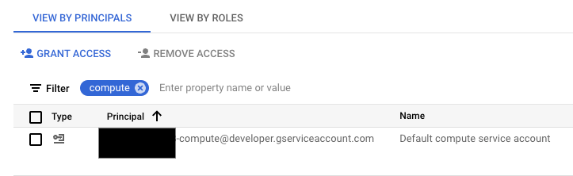

# **Google Cloud Cortex Framework**
[Google Cloud Cortex Framework](https://cloud.google.com/solutions/cortex) helps you accelerate business insights and outcomes with less risk, complexity, and cost with reference architectures, packaged solution deployment content, and integration services to kickstart your data and AI cloud journey.

## About Cortex Data Foundation
**Cortex Data Foundation** is the core architectual component of the Cortex Framework reference architecture and provides packaged analytics artifacts which can be automatically deployed for use with [Google Cloud BigQuery](https://cloud.google.com/bigquery).


This repository contains predfined analytical views and models to accelerate the build out of an enterprise wide data foundation in BigQuery. The data sources and models available are depicted in the entity-relationship diagrams below:

#### Operational related data sources
-  [SAP ECC](images/erd_ecc.png) ([PDF](docs/erd_ecc.pdf))
-  [SAP S/4](images/erd_s4.png)([PDF](docs/erd_s4.pdf))
-  [Salesforce Sales Cloud](images/erd_sfdc.png) ([PDF](docs/erd_sfdc.pdf))

#### Marketing related data sources
-  [Salesforce Marketing Cloud](images/erd_sfmc.png) ([PDF](docs/erd_sfmc.pdf))
-  [Google Ads](images/erd_gads.png) ([PDF](docs/erd_gads.pdf))
-  [Google CM360 enriched with DV360](images/erd_cm360.png) ([PDF](docs/erd_cm360.pdf))
-  [TikTok](images/erd_tiktok.png) ([PDF](docs/erd_tiktok.pdf))
-  [Meta](images/erd_meta.png) ([PDF](docs/erd_meta.pdf))

#### Sustainability related data sources
-  [Dun & Bradstreet with SAP](images/erd_sustainability.png) ([PDF](docs/erd_sustainability.pdf))
# Quick demo deployment
To explore this content you can create a **demo** instance, with automatic generation of BigQuery datasets, automatic permission granting and sample test data, with a click of a button here:

[](https://shell.cloud.google.com/cloudshell/?terminal=true&show=terminal&cloudshell_git_repo=https%3A%2F%2Fgithub.com%2FGoogleCloudPlatform%2Fcortex-data-foundation&cloudshell_tutorial=docs%2Ftutorial.md)

> **Warning** This demo deployment is **not suitable for production environments**.

# Deployment for development or production environments

### Clone the Data Foundation repository

We recommend using the [Cloud Shell](https://shell.cloud.google.com/?fromcloudshell=true&show=ide%2Cterminal).

> **Note** These steps will require the `gcloud sdk` (already installed in Cloud Shell).

1. Clone this repository with submodules (`--recurse-submodules`):
   ```bash
   git clone --recurse-submodules https://github.com/GoogleCloudPlatform/cortex-data-foundation
   ```

2. Navigate into the previously downloaded folder.
   ```bash
   cd cortex-data-foundation
   ```
   If this is not the first time you have cloned the repository, execute `git pull --recurse-submodules` to pull the latest changes. If you are already familair with the configuration and requirements, you can skip to the build command in section [Execute deployment](#execute-deployment).

## **Deployment steps**

These are the steps for deployment:

0.  [Prerequisites](#prerequisites)
1.  [Establish project and dataset structure](#establish-project-and-dataset-structure)
2.  [Establish integration mechanism](#establish-integration-mechanism)
3.  [Configure cloud platform components](#configure-google-cloud-platform-components)
4.  [Configure deployment](#configure-deployment)
5.  [Execute deployment](#execute-deployment)
6.  [Test, customize, prepare for upgrade](#test-customize-and-prepare-for-upgrade)
7.  [Next steps for reporting and add-ons](#next-steps)


## Prerequisites

### Understand your business requirements and the technical components of the Framework

A successful deployment depends on a good understanding of:
- Your company's business rules and requirements
- Functional understanding of the data workload (e.g. SAP, Salesforce, Meta, etc)
- Knowledge of Google Cloud and data and AI products

Before continuing, make sure you are familiar with:
-   Google Cloud Platform [fundamentals](https://www.cloudskillsboost.google/course_templates/60)
-   How to navigate the [Cloud Console](https://cloud.google.com/cloud-console), [Cloud Shell](https://cloud.google.com/shell/docs/using-cloud-shell) and [Cloud Shell Editor](https://cloud.google.com/shell/docs/editor-overview)
-   Fundamentals of [BigQuery](https://cloud.google.com/bigquery/docs/introduction)
-   Fundamental concepts of [Change Data Capture and dataset structures](#understanding-change-data-capture)
-   General navigation of [Cloud Build](https://cloud.google.com/build/docs/overview)
-   Fundamentals of [Identity and Access Management](https://cloud.google.com/iam/docs/)
-   Fundamentals of [Cloud Composer](https://cloud.google.com/composer/docs/concepts/overview) or [Apache Airflow](https://airflow.apache.org/docs/apache-airflow/stable/concepts/index.html)
-   Fundamentals of [Dataflow](https://cloud.google.com/dataflow)

## Establish project and dataset structure
You will require at least one Google Cloud project to host the BigQuery datasets and execute the deployment process.

This is where the deployment process will trigger Cloud Build runs. In the project structure, we refer to this as the [Source Project](#dataset-structure). Each workload should have at least one Change Data Capture (CDC) and one Reporting dataset (i.e. one CDC and one Reporting dataset for SAP, one CDC and one Reporting dataset for Salesforce).


> **Note** If you want to have separate sets of projects and datasets for each workload (e.g. one set of source and target projects for SAP and a different set of target and source projects for Salesforce), run separate deployments for each workload.

You will need to identify:
*   **Deploy SAP, Salesforce, etc:** Decide whether you want to deploy models for all workloads or only one set of models.
*   **Source Google Cloud Project:** Project where the source data is located, from which the data models will consume. This project is normally accessed by technical practitioners.
*   **Target Google Cloud Project:** Project where the Data Foundation predefined data models will be deployed and accessed by end-users. This may or may not be different from the source project depending on your needs.
*   **Source BigQuery Dataset (Raw):** BigQuery dataset where the source data is replicated to or where the test data will be created. The recommendation is to have separate datasets, one for each data source (e.g., one raw dataset for SAP and one raw dataset for Google Ads).
*   **CDC BigQuery Dataset:** BigQuery dataset where the CDC processed data lands the latest available records. This may or may not be the same as the source dataset if the tool landing the data performs the CDC merge operation. Some workloads allow for field name mapping here. The recommendation is to have two separate CDC datasets, one for each source (i.e., one cdc dataset for SAP and one CDC dataset for Salesforce).
*   **Target BigQuery reporting dataset:** BigQuery dataset where the Data Foundation predefined data models will be deployed. The recommendation is to have two separate reporting datasets, one for each source (i.e., one reporting dataset for SAP and one reporting dataset for Salesforce). This dataset is automatically created by the deployer if it does not exist.
*   **Target BigQuery machine learning dataset:** BigQuery dataset where the BQML predefined models will be deployed. This dataset is automatically created by the deployer if it does not exist.
*   **Pre-processing K9 dataset:** BigQuery dataset where cross-workload, reusable DAG components, such as time dimensions, can be deployed. The workloads will have a dependency on this dataset unless modified. This dataset is automatically created by the deployer if it does not exist.
*   **Post-processing K9 dataset:** BigQuery dataset where cross-workload reporting (e.g. SAP + Google Ads reporting for [CATGAP](https://github.com/GoogleCloudPlatform/cortex-data-foundation/tree/main/src/k9/src/catgap)) and additional external source DAGs (e.g. Google Trends ingestion) can be deployed. This dataset is automatically created by the deployer if it does not exist.


**Alternatively**, if you do not have a replication tool set up or do not wish to use the replicated data, the deployment process can generate test tables and fake data for you. You will still need to [create](https://cloud.google.com/bigquery/docs/datasets) and identify the CDC and Raw datasets ahead of time.

These parameters will be different for each workload depending on the integration mechanism.

## Establish integration mechanism

Each workload has different ways to integrate with BigQuery. This section explains the options for each source.

> **Note**: **Using test data?** You can skip this section.


* [Integration options for SAP ECC or SAP S/4HANA](./README_SAP.md)
* [Integration options for Salesforce Sales Cloud](./README_SFDC.md)
* [Integration options for Marketing data sources](./README_Marketing.md)
* [Integration options for Sustainability data sources](./README_Sustainability.md)


### Configure K9 deployments

The K9 deployer is responsible for ingestion, processing and modeling of components that are reusable across different data sources. For example, the time dimension is reusable across all data sources where tables may need to slice and dice analytical results based on a Gregorian calendar.

External data sources that can be combined across different workloads to gain enriched insights and are also reusable are part of the K9 deployer. For example, Weather data or Google Trends ingestion and processing can be combined across SAP, Salesforce and Marketing data sources. [CATGAP](https://github.com/GoogleCloudPlatform/cortex-data-foundation/tree/main/src/k9/src/catgap) is an example which combines Google Ads and SAP.


The pre-processing K9 step executes before all workloads start their deployment, so the reusable models are available during their deployment. Conversely, the post-processing K9 executes after all modules have deployed their reporting models so the cross-workload reporting or augmenting models find their dependencies within each reporting dataset.

> ℹ️ **Fun Fact**: The K9 receives its name because it's where the `DAGs` (`/dɑɡz/`) live.

The DAGs and models to be generated can be configured in [K9 configuration file](https://github.com/GoogleCloudPlatform/cortex-data-foundation/tree/main/src/k9/config/k9_settings.yaml).

If you are using submodules independently (e.g. only cortex-reporting) or a deployment framework like Dataform or dbt, we recommend porting the pre-k9 DAG execution into your scheduler of choice. The Reporting views that tap into reusable models select from the separate K9 datasets.


## Configure Google Cloud Platform components

### Enable required components

The following Google Cloud components are required:

*   Google Cloud Project
*   BigQuery instance and datasets
*   Service Account with Impersonation rights
*   Cloud Storage Buckets
*   Cloud Build API
*   Cloud Resource Manager API
*   Optional components:
    *   [Cloud Composer](https://console.cloud.google.com/marketplace/product/google/composer.googleapis.com) for change data capture (CDC) processing, hierarchy flattening (SAP only), and data replication (Non-SAP only) through Directed Acyclic Graphs ([DAGs](https://airflow.apache.org/docs/apache-airflow/stable/concepts/dags.html)). To set up an instance of Cloud Composer review the [documentation](https://cloud.google.com/composer/docs/how-to/managing/creating).
    *   Looker **(optional)** connects to reporting templates. Requires manual setup
    *   [Analytics Hub](https://cloud.google.com/analytics-hub) linked datasets **(optional)** are currently used for some external sources, such as the Weather DAG. You may choose to fill this structure with any other available source of your choice for advanced scenarios.
    *   [Dataflow](https://console.cloud.google.com/dataflow): Integration tool for many of the Marketing data sets like Google Ads.
    *   [Dataplex](https://cloud.google.com/dataplex): Used for building a Data Mesh, view [documentation](https://github.com/GoogleCloudPlatform/cortex-data-foundation/tree/main/docs/data_mesh/README.md).

From the [Cloud Shell](https://shell.cloud.google.com/?fromcloudshell=true&show=ide%2Cterminal), you can enable Google Cloud Services using the _gcloud_ command line interface in your Google Cloud project.

Replace the `<SOURCE_PROJECT>` placeholder with your source project. Copy and paste the following command into the cloud shell:


```bash
gcloud config set project <SOURCE_PROJECT>

gcloud services enable bigquery.googleapis.com \
                       cloudbuild.googleapis.com \
                       composer.googleapis.com \
                       storage-component.googleapis.com \
                       cloudresourcemanager.googleapis.com \
                       dataflow.googleapis.com

```

You should get a success message:


### Grant permissions to the executing user

If an individual is executing the deployment with their own account, they will need, at minimum, the following permissions in the project where Cloud Build will be triggered:

*   Service Usage Consumer
*   Storage Object Viewer for the Cloud Build default bucket or bucket for logs
*   Object Writer to the output buckets
*   Cloud Build Editor
*   Project Viewer or Storage Object Viewer

These permissions may vary depending on the setup of the project. Consider the following documentation if you run into errors:
*   [Permissions to run Cloud Build](https://cloud.google.com/build/docs/securing-builds/configure-access-to-resources)
*   [Permissions to storage for the Build Account](https://cloud.google.com/build/docs/securing-builds/store-manage-build-logs)
*   [Permissions for the Cloud Build service account](https://cloud.google.com/build/docs/securing-builds/configure-access-for-cloud-build-service-account)
*   [Viewing logs from Builds](https://cloud.google.com/build/docs/securing-builds/store-manage-build-logs#viewing_build_logs)

### Configure the Cloud Build account

You need to grant the Cloud Build service account permissions to deploy Cortex.

Cloud Build uses a service account to execute builds on your behalf. [Cloud Build service account](https://cloud.google.com/build/docs/cloud-build-service-account) describes how Cloud Build uses the default service account.

To grant the required permissions, perform the following steps:

1. Find the default Cloud Build service account by opening [Cloud Shell](https://shell.cloud.google.com/?show=terminal) and executing the following gcloud command:
    ```bash
    gcloud builds get-default-service-account --project <execution project id>
    ```

2.  You should see a response formatted as either:

    `serviceAccountEmail: projects/<project number>/serviceAccounts/<project number>-compute@developer.gserviceaccount.com`

    or

    `serviceAccountEmail: projects/<project number>/serviceAccounts/<project number>@cloudbuild.gserviceaccount.com`

     Note the last part, `<project number>-compute@developer.gserviceaccount.com` or `<project number>@cloudbuild.gserviceaccount.com`, This is your default Cloud Build service account.


3. Locate this service account in [IAM](https://console.cloud.google.com/iam-admin/iam):
    

    or

    

4. Grant the following permissions to the Cloud Build service account in the source project (and the target project if deploying to a separate target):

    - BigQuery Data Editor
    - BigQuery Job User

\[Optional\] If changing the default values for Data Mesh in `config/config.json` to implement features beyond descriptions, the executing account (Cloud Build service account) will need to have the following additional permissions:
- Policy Tag Admin
- Data Catalog TagTemplate Owner
- Dataplex Editor
- BigQuery Data Owner

<details>
  <summary> [Optional] Create a Service Account for deployment with impersonation</summary>

The deployment can run through a service account with impersonation rights, by adding the flag [\--impersonate-service-account](https://cloud.google.com/sdk/gcloud/reference/builds/submit). This service account will trigger a Cloud Build job that will in turn run specific steps through the Cloud Build service account. This allows a user to trigger a deployment process without direct access to the resources.

The impersonation rights to the new, triggering service account need to be granted to the person running the command.

Navigate to the [Google Cloud Platform Console](https://console.cloud.google.com/iam-admin/serviceaccounts/create) and follow the steps to create a service account with the following role:

*   Cloud Build Service Account

This role can be applied during the creation of the service account:


Authorize the ID of user who will be running the deployment to impersonate the service account that was created in the previous step. Authorize your own ID so you can run an initial check as well.


Once the service account has been created, navigate to the[ IAM Service Account administration](https://console.cloud.google.com/iam-admin/serviceaccounts), click on the service account, and into the Permissions tab.

Click **Grant Access**, type in the ID of the user who will execute the deployment and has impersonation rights, and assign the following role:

*   Service Account Token Creator


**Alternatively,** you can complete this step from the Cloud Shell:

```bash
gcloud iam service-accounts create <SERVICE ACCOUNT> \
    --description="Service account for Cortex deployment" \
    --display-name="my-cortex-service-account"

gcloud projects add-iam-policy-binding <SOURCE_PROJECT> \
--member="serviceAccount:<SERVICE ACCOUNT>@<SOURCE_PROJECT>.iam.gserviceaccount.com" \
--role="roles/cloudbuild.builds.editor"

gcloud iam service-accounts add-iam-policy-binding <SERVICE ACCOUNT>\
  --member="user:<EXECUTING USER EMAIL>" \
  --role="roles/iam.serviceAccountTokenCreator"
```

</details>

### Create a Storage bucket for storing DAG related files

A storage bucket will be required to store processing DAG scripts and other temporary files generated during deployment. These scripts will have to be manually moved into a Cloud Composer or Apache Airflow instance after deployment.

Navigate to [Cloud Storage](https://console.cloud.google.com/storage/create-bucket) and create a bucket **in the same region** as your BigQuery datasets.

**Alternatively**, you can use the following command to create a bucket from the Cloud Shell:

```bash
gsutil mb -l <REGION/MULTI-REGION> gs://<BUCKET NAME>
```

Navigate to the _Permissions_ tab. Grant `Storage Object Creator` to the user executing the Build command or to the Service account you created for impersonation.

### Create a Storage bucket for logs

You can create a specific bucket for the Cloud Build process to store the logs. This is useful if you want to restrict data that may be stored in logs to a specific region. Create a [GCS bucket](https://console.cloud.google.com/storage) with uniform access control, in the same region where the deployment will run.

**Alternatively**, here is the command line to create this bucket:

```bash
gsutil mb -l <REGION/MULTI-REGION> gs://<BUCKET NAME>
```

You will need to grant `Object Admin` permissions to the Cloud Build service account.

## Configure Data Mesh
The default configuration in `config/config.json` for Data Mesh will add the descriptions for all assets, but will not create any other structures or policies.

Enabling any other options (e.g., deployLakes, deployCatalog, deployACLs) requires the configuration of permissions for the Cloud Build service account and the necessary configuration of the yaml files.

Here is a high-level diagram of the available options:


You will find detailed instructions and examples to configure Data Mesh in the [documentation](https://github.com/GoogleCloudPlatform/cortex-data-foundation/tree/main/docs/data_mesh/README.md).

## Configure deployment

The behavior of the deployment is controlled by the configuration file [config.json](https://github.com/GoogleCloudPlatform/cortex-data-foundation/blob/main/config/config.json).

The file contains global configuration, configuration specific to each workload and optional Credly badger service.


Open the file in `config/config.json`. From the Cloud Shell:

```bash
edit config/config.json
```

### Global deployment configuration

Consider your target deployment:


| Parameter                 | Meaning                 | Default Value      | Description                                                                      |
| ------------------------- | ----------------------- | -------------------| ------------------------------------------------------------------------         |
| `testData`                | Deploy Test Data        | `true`             | Project where the source dataset is and the build will run.                      |
| `deploySAP`               | Deploy SAP              | `true`             | Execute the deployment for SAP workload (ECC or S/4HANA).                        |
| `deploySFDC`              | Deploy Salesforce       | `true`             | Execute the deployment for Salesforce workload.                                  |
| `deployMarketing`         | Deploy Marketing        | `true`             | Execute the deployment for Marketing  sources (Google Ads, CM360 and/or TikTok). |
| `deployDataMesh`          | Deploy Data Mesh        | `true`             | Execute the deployment for Data Mesh, see the Data Mesh [README](https://github.com/GoogleCloudPlatform/cortex-data-foundation/tree/main/docs/data_mesh/README.md) for more info. |
| `turboMode`               | Deploy in Turbo mode    | `true`             | Execute all views builds as a step in the same Cloud Build process, in parallel for a faster deployment. If set to `false`, each reporting view is generated in its own sequential build step. We recommend only setting it to `true` when using test data or after any mismatch between reporting columns and the source data have been resolved. |
| `projectIdSource`         | Source Project ID       | -                  | Project where the source dataset is and the build will run.                      |
| `projectIdTarget`         | Target Project ID       | -                  | Target project for user-facing datasets (reporting and ML datasets).             |
| `targetBucket`            | Target Bucket to storage generated DAG scripts | - | Bucket [created previously](#create-a-storage-bucket-for-storing-dag-related-files) where DAGs (and Dataflow temp files) will be generated. Avoid using the actual Airflow bucket. |
| `location`                | Location or Region      | `"US"`             | Location where the BigQuery dataset and GCS buckets are. <br><br> > **Note**: See restrictions listed under [BigQuery dataset locations](https://cloud.google.com/bigquery/docs/locations). |
| `languages`               | Filtering languages     | `[ "E", "S" ]`     | If not using test data, enter a single language (e.g., `[ "E" ]`) or multiple languages (e.g., `[ "E", "S" ]`) as relevant to your business. These values are used to replace placeholders in SQL in analytics models where available (SAP only for now - see the ERD). |
| `currencies`              | Filtering currencies    | `[ "USD" ]`        | If not using test data, enter a single currency (e.g., `[ "USD" ]`) or multiple currencies (e.g., `[ "USD", "CAD" ]`) as relevant to your business. These values are used to replace placeholders in SQL in analytics models where available (SAP only for now - see the ERD). |
| `testDataProject`         | Source for test harness | `kittycorn-public` | Source of the test data for demo deployments. Applies when `testData` is `true`. <br><br> > **Note**: Unless you have your own test harness, do not change this value. |
| `k9.datasets.processing`  | K9 datasets - Processing| `"K9_PROCESSING"`  | Execute cross-workload templates (e.g., date dimension) as defined in the [K9 configuration file](https://github.com/GoogleCloudPlatform/cortex-data-foundation/tree/main/src/k9/config/k9_settings.yaml). These templates are normally required by the downstream workloads. |
| `k9.datasets.reporting`   | K9 datasets - Reporting | `"K9_REPORTING"`   | Execute cross-workload templates and external data sources (e.g., Weather) as defined in the [K9 configuration file](https://github.com/GoogleCloudPlatform/cortex-data-foundation/tree/main/src/k9/config/k9_settings.yaml). Commented out by default. |
| `DataMesh.deployDescriptions` | Data Mesh - Asset descriptions | `true`  | Deploy BigQuery asset schema descriptions. |
| `DataMesh.deployLakes`    | Data Mesh - Lakes & Zones | `false`          | Deploy Dataplex Lakes & Zones that organize tables by processing layer, requires configuration before enabling. |
| `DataMesh.deployCatalog`  | Data Mesh - Catalog Tags & Templates | `false` | Deploy Data Catalog Tags that allow custom metadata on BigQuery assets or fields, requires configuration before enabling. |
| `DataMesh.deployACLs`     | Data Mesh - Access Control | `false`         | Deploy asset, row, or column level access control on BigQuery assets, requires configuration before enabling. |

### Workload-specific configuration

The following sections are specific to each workload. You do not need to configure them if the deployment parameter (e.g., `deploySAP` or `deployMarketing`) for the workload is set to `False`.

* [SAP](./README_SAP.md#deployment-configuration-for-sap)

* [Salesforce Sales Cloud](./README_SFDC.md#deployment-configuration-for-salesforce)

* [Marketing](./README_Marketing.md#deployment-configuration-for-marketing)

* [Sustainability](./README_Sustainability.md#deployment-configuration-for-sustainability)


### \[Optional\] Configure K9  external datasets

#### Configure external datasets for K9

Some advanced use cases may require external datasets to complement an enterprise system of record such as SAP. In addition to external exchanges consumed from [Analytics hub](https://cloud.google.com/analytics-hub), some datasets may need custom or tailored methods to ingest data and join them with the reporting models.

**Note:** You will need to configure the DAGs as follows:

1. **Holiday Calendar**: This DAG retrieves the holiday calendars from  [PyPi Holidays](https://pypi.org/project/holidays/). You can adjust the list of countries and years to retrieve holidays, as well as parameters of the DAG from the file `holiday_calendar.ini`. Leave the defaults if using test data.
1. **Product Hierarchy Texts**: This DAG flattens materials and their product hierarchies. The resulting table can be used to feed the `Trends` list of terms to retrieve Interest Over Time. You can adjust the parameters of the DAG from the file `prod_hierarchy_texts.py`. Leave the defaults if using test data. You will need to adjust the levels of the hierarchy and the language under the markers for `## CORTEX-CUSTOMER:`. If your product hierarchy contains more levels, you may need to add an additional SELECT statement similar to the CTE `h1_h2_h3`.
1. **Trends**: This DAG retrieves Interest Over Time for a specific set of terms from [Google Search trends](https://trends.google.com/trends/). The terms can be configured in `trends.ini`. You will need to adjust the time frame to `'today 7-d'` in `trends.py` after an initial run. We recommend getting familiarized with the results coming from the different terms to tune parameters. We also recommend partitioning large lists to multiple copies of this DAG running at different times. For more information about the underlying library being used, see [Pytrends](https://pypi.org/project/pytrends/).
1. **Weather**: By default, this DAG uses the publicly available test dataset [**bigquery-public-data.geo_openstreetmap.planet_layers**](https://console.cloud.google.com/bigquery/analytics-hub/exchanges(analyticshub:search)?queryText=open%20street%20map). The query also relies on an NOAA dataset only available through Analytics Hub, [**noaa_global_forecast_system**](https://console.cloud.google.com/bigquery/analytics-hub/exchanges(analyticshub:search)?queryText=noaa%20global%20forecast).  **`This dataset needs to be created in the same region as the other datasets prior to executing deployment`**. If the datasets are not available in your region, you can continue with the following instructions and follow additional steps to transfer the data into the desired region.

    **You can skip this configuration if using test data.**

    * Navigate to [BigQuery > Analytics Hub](https://console.cloud.google.com/bigquery/analytics-hub)
    * Click **Search Listings**. Search for "`NOAA Global Forecast System`"
    * Click **Add dataset to project**. When prompted, keep "`noaa_global_forecast_system`" as the name of the dataset. If needed, adjust the name of the dataset and table in the FROM clauses in `weather_daily.sql`.
    * Repeat the listing search for Dataset "`OpenStreetMap Public Dataset`".
    * Adjust the `FROM ` clauses containing `bigquery-public-data.geo_openstreetmap.planet_layers` in `postcode.sql`.

    [**Analytics hub is currently only supported in EU and US locations**](https://cloud.google.com/bigquery/docs/analytics-hub-introduction) and some datasets, such as NOAA Global Forecast, are only offered in a single multilocation.
    If you are targeting a location different from the one available for the required dataset, we recommend creating a [scheduled query](https://cloud.google.com/bigquery/docs/scheduling-queries) to copy the new records from the Analytics hub linked dataset followed by a [transfer service](https://cloud.google.com/bigquery-transfer/docs/introduction) to copy those new records into a dataset located in the same location or region as the rest of your deployment. You will then need to adjust the SQL files .

    **Important Note:** Before copying these DAGs to Cloud Composer, you will need to **add the required python modules [as dependencies](https://cloud.google.com/composer/docs/how-to/using/installing-python-dependencies#options_for_managing_python_packages)**.

    Required modules
    ```
    pytrends~=4.9.2
    holidays
    ```

1. **Sustainability & ESG insights**. Cortex Data Framework combines SAP supplier performance data with advanced ESG insights to compare delivery performance, sustainability & risks more holistically across global operations. For more details, see guide [here](README_Sustainability.md).

### \[Optional\] Credly badger configuration

The following section enables the Credly badger service, which will award a Cortex deployment badge to you after a successful deployment.

All configuration items including a valid email address must be provided for the badge to be granted.

| Parameter                                | Meaning                                   | Default Value           | Description                                                             |
| ------------------                       | -------------                             | ---------------------   | --------------------------------------------------                      |
| `shareWithCredly`                        | Opt in Credly badger service              | `false`                 | Call Credly service to assign a badge after a successful deployment.                      |
| `userInfo.email`                         | User's email                              | -                       | Provide email for the Credly badger service.                         |
| `userInfo.firstName`                     | User's first Name                         | -                       | Provide first name for the Credly badger service.                         |
| `userInfo.lastName`                      | User's last Name                          | -                       | Provide last name for the Credly badger service.                         |


## Check for `CORTEX_CUSTOMER` tags
Many SAP and Salesforce customers will have specific customizations of their systems, such as additional documents in a flow or specific types of a record. These are specific to each customer and configured by functional analysts as the business needs arise. The spots on the SQL code where these specific enhancements could be done are marked with a comment starting with `## CORTEX-CUSTOMER`. You can check for these comments after cloning the repository with a command like:

```bash
grep -R CORTEX-CUSTOMER
```

> **Note**: There may be additional customizations depending on the source systems. We recommend getting the business users or analysts involved early in the process to help spot these.

## Performance optimization for Reporting views

Reporting artifacts can be created as views or as tables refreshed regularly through DAGs. On the one hand, views will compute the data on each execution of a query, which will keep the results always fresh. On the other hand, the table will run the computations once, and the results can be queried multiple times without incurring higher computing costs and achieving faster runtime. This balance is very specific to each customer, so we encourage each customer to create their own configuration to serve their needs.

Materialized results are updated into a table. These tables can be further fine-tuned by adding Partitioning and Clustering properties to these tables.

The configuration files for each workload are:
| Data Source             | Settings files                                               |
| ------------------------| ------------------------------------------------------------ |
| SAP                                          | `src/SAP/SAP_REPORTING/reporting_settings_ecc.yaml`          |
| Salesforce Sales Cloud                       | `src/SFDC/config/reporting_settings.yaml`                    |
| Marketing - Google Ads                       | `src/marketing/src/GoogleAds/config/reporting_settings.yaml` |
| Marketing - CM360                            | `src/marketing/src/CM360/config/reporting_settings.yaml`     |
| Marketing - Meta                             | `src/marketing/src/Meta/config/reporting_settings.yaml`      |
| Marketing - Salesforce Marketing Cloud       | `src/marketing/src/SFMC/config/reporting_settings.yaml`      |
| Marketing - TikTok                           | `src/marketing/src/TikTok/config/reporting_settings.yaml`      |


###  Customizing `reporting_settings` file configuration

This settings file drives how the BQ objects (tables or views) for Reporting datasets are created.

There are two sections:

 1. `bq_independent_objects`:
    All BigQuery objects that can be created independently, without any other dependencies.
    > **Note**: When Turbo mode is enabled, these BQ objects are created in parallel during the deployment time, speeding up the deployment process.

 2. `bq_dependent_objects`:
     All BigQuery objects that need to be created in a specific order due to dependencies on other BQ objects.
     > **Note**: Turbo mode does not apply to this section - i.e., each object will be created one after another.

The deployer will first create all the BQ Objects listed in `bq_independent_objects` first, and then all the objects
listed in `bq_dependent_objects`.

Following properties need to be defined for each object:
1. `sql_file`:  Name of the sql file that will create a given object.

2. `type`: Type of BQ Object.
    Possible values:
    * `view` : If we want the object to be a BQ view.
    * `table`: If we want the object to be a BQ table.
    * `script`: This is to create other types of objects (BQ Functions, Stored Procs etc)

3. If `type` is `'table'`, then following optional properties can be defined:
     * `load_frequency`: Frequency at which a Composer DAG will be executed to refresh this table. Mandatory. See [Airflow documentation](https://airflow.apache.org/docs/apache-airflow/1.10.1/scheduler.html#dag-runs) for details on possible values.
     * `partition_details`: How the table should be partitioned. **Optional.** See Appendix section [Table Partition and Cluster Settings](#table-partition-and-cluster-settings) for details on how to configure this.
     * `cluster_details`: How the table should be clustered. **Optional.** See Appendix section [Table Partition and Cluster Settings](#table-partition-and-cluster-settings) for details on how to configure this.

## Execute deployment

This step requires `config.json` to be configured as described in the section [Configure Deployment](#configure-deployment).

Run the Build command with the target log bucket.

```bash
gcloud builds submit --project <execution project, likely the source> \
    --substitutions=_GCS_BUCKET=<Bucket for logs - Cloud Build Service Account needs access to write here>
```
You can follow the main Build process from the first link of logs:


Alternatively, if you have enough permissions, you can see the progress from [Cloud Build](https://console.cloud.google.com/cloud-build/).


Each build step will trigger child build steps. These can be tracked from the Cloud Build console:


Or finding the logs for the child build within the log from a step:


And identify any issues with individual builds:


We recommend pasting the generated SQL into BigQuery to identify and correct the errors more easily. Most errors will be related to fields that are selected but not present in the replicated source. The BigQuery UI will help identify and comment those out.

## Move the files into the DAG bucket

If you opted to generate integration or CDC files and have an instance of Airflow, you can move them into their final bucket with the following command:

```bash
gsutil -m cp -r  gs://<output bucket>/dags/ gs://<composer dag bucket>/
gsutil -m cp -r  gs://<output bucket>/data/ gs://<composer sql bucket>/
```

## Test, customize and prepare for upgrade

In addition to the `CORTEX-CUSTOMER` tags, you may need to further customize the content to add business rules, add other datasets and join them with existing views or tables, reuse the provided templates to call additional APIs, modify deployment scripts, apply further data mesh concepts, etc.  You may also need to slightly adapt some tables or landed APIs to include additional fields not included in our standard. We recommend committing all of these changes with a clear tag in the code to your own fork or clone of our git repositories.

We recommend adopting a CICD pipeline that works for your organization, to keep these enhancements tested and your overall solution in a reliable, robust state. A simple pipeline can reuse our `cloudbuild*.yaml` scripts to trigger end to end deployment periodically, or based on git operations depending on your repository of choice by [automating builds](https://cloud.google.com/build/docs/automating-builds/create-manage-triggers). Using automated testing with your own sample data will help ensure the models always produce what you expect every time someone commits a change. The `config.json` file plays an important role in defining different sets of projects and datasets for development, staging and production environments.

Tagging your own changes visibly in your fork or clone of a repository together with some deployment and testing automation will be very helpful when performing upgrades. Check out this [guide for upgrade instructions](https://github.com/GoogleCloudPlatform/cortex-data-foundation/blob/main/docs/upgrade_recommendations/upgrade_recommendations.md).

## Next steps

## Looker deployment
Instructions for deploying the pre-built Looker blocks can be found [here](https://cloud.google.com/looker/docs/marketplace#installing_a_tool_from_a_git_url). Please follow the individual block READMEs for detailed instructions on required dependencies to ensure successful deployment.

Optionally, you may also customize the blocks by forking the GitHub repositories into your own Looker project. Instructions can be found [here](https://cloud.google.com/looker/docs/blocks).

Available blocks for the Data Foundation include the following:

**Operational Dashboards**
* [SAP Operational Dashboards for Cortex](https://github.com/looker-open-source/block-cortex-sap)
* [Salesforce Sales Cloud Dashboards for Cortex](https://github.com/looker-open-source/block-cortex-salesforce)

**Marketing Dashboards**
* [Salesforce Marketing Cloud Dashboards for Cortex](https://github.com/looker-open-source/block-cortex-sfmc)
* [Meta Dashboards for Cortex](https://github.com/looker-open-source/block-cortex-meta)

**Sustainability Dashboards**
* [Dun & Bradstreet with SAP Dashboards for Cortex](https://lookerstudio.google.com/c/reporting/cab436f2-ff83-4cfa-b7e4-e99b9fd9a8d0/page/p_wa5lq4dsfd)

## Demand Sensing
You can deploy the Demand Sensing use case [from the Marketplace](https://console.cloud.google.com/marketplace/product/cortex-public/cortex-demand-sensing). Learn more from the documentation.
## Application Layer
Deploy a sample micro-services based application through the [Google Cloud Marketplace](https://console.cloud.google.com/marketplace/product/cortex-public/cloud-cortex-application-layer).

## Customizations and upgrades
We strongly encourage you to fork this repository and apply your changes to the code in your own fork. You can make use of the delivered deployment scripts in your development cycles and incorporate your own test scripts as needed. When a new release is published, you can compare the new release from our repository with your own changes by merging our code into your own fork in a separate branch. Suggestions for changes or possible customizations in the code are flagged with the comment `## CORTEX-CUSTOMER`. We recommend listing these after the initial deployment.

## Enable TURBO mode

For your own customizations and a faster deployment in your own development pipelines, you can use the `turboMode` variable in `config/config.json`. When set to true, the deployment process will dynamically generate a `cloudbuild.views.yaml` file with each view in the right dependencies file (e.g., dependencies_ecc.txt or dependencies_s4.txt) as a single step of the build. This allows for a 10x faster deployment. The limitation is that if an error occurs when deploying a view, the build process will stop, and this is a slow way to find out all possible mismatches between the Cortex views and your datasource when compared to the turboMode=false option. If you are still fixing potential structure mismatches between the SELECT clauses in the views and the fields available in your replicated tables, `TURBO=false` will take longer but will attempt to generate all views even if one fails. This will help identify and fix more errors in a single run.

# Support

To file issues and feature requests against these models or deployers, create an issue in this repo. For help gathering the information required to help troubleshoot, execute `support.sh` from the cloned directory and follow instructions.

# Appendix


## Understanding Change Data Capture

### Change Data Capture (CDC) Processing

BigQuery is an append preferred database. This means that the data is not updated or merged during replication. For example, an update to an existing record can be replicated as the same record containing the change. To avoid duplicates, a merge operation needs to be applied afterwards. This is referred to as [Change Data Capture processing](https://cloud.google.com/architecture/database-replication-to-bigquery-using-change-data-capture).

The Data Foundation for SAP includes the option to create scripts for Cloud Composer or Apache Airflow to [merge](https://cloud.google.com/bigquery/docs/reference/standard-sql/dml-syntax) or “upsert” the new records resulting from updates and only keep the latest version in a new dataset. For these scripts to work the tables need to have a field with an operation flag named **operation\_flag**  **(I = insert, U = update, D = delete) **and a timestamp named recordstamp.

For example, the following image shows the latest records for each partner record, based on the timestamp and latest operation flag:


### Dataset structure

For all supported data sources, data from upstream systems are first replicated into a BigQuery dataset (the _source_ or _replicated dataset_), and the updated or merged results are inserted into another dataset (the _CDC dataset_). The reporting views select data from the CDC dataset, to ensure the reporting tools and applications always have the latest version of a table.

The following flow depicts the CDC processing for SAP, dependent on the `operational_flag` and `recordstamp`.


The following flow depicts the integration from APIs into Raw and CDC processing for Salesforce, dependent on the `Id` and `SystemModStamp` fields produced by Salesforce APIs.


Some replication tools can merge or upsert the records when inserting them into BigQuery, so the generation of these scripts is optional. In this case, the setup will only have a single dataset. The REPORTING  dataset will fetch updated records for reporting from that dataset.

## Optional - Using different projects to segregate access

Some customers choose to have different projects for different functions to keep users from having excessive access to some data. The deployment allows for using two projects, one for processing replicated data, where only technical users have access to the raw data, and one for reporting, where business users can query the predefined models or views.


Using two different projects is optional. A single project can be used to deploy all datasets.

## Gathering Cloud Composer Settings

If Cloud Composer is available, create connection(s) to the Source Project [in Cloud Composer](https://cloud.google.com/composer/docs/how-to/managing/connections#creating_new_airflow_connections).

Please create connections with the following names for DAG execution, based on the types of deployments below.

NOTE: If you are creating [tables in the Reporting layer](#performance-optimization-for-reporting-views), please make sure to create separate connections for Reporting DAGs.

If you are deploying... | Create for Raw    |  Create for CDC     |  Create for Reporting    |
----------------|---------------------------|---------------------|--------------------------|
SAP             |       N/A                 |  `sap_cdc_bq`       |   `sap_reporting_bq`     |
SFDC            | `sfdc_cdc_bq` (*)         |  `sfdc_cdc_bq`      |   `sfdc_reporting_bq`    |
Google Ads      | `googleads_raw_dataflow`  |  `googleads_cdc_bq` | `googleads_reporting_bq` |
CM360           | `cm360_raw_dataflow`      |  `cm360_cdc_bq`     | `cm360_reporting_bq`     |
TikTok          | `tiktok_raw_dataflow`     |  `tiktok_cdc_bq`    | `tiktok_reporting_bq`    |
LiveRamp        |       N/A                 |  `liveramp_cdc_bq`  |           N/A            |

_* SFDC Raw Ingestion module uses the same Airflow connection as SFDC CDC module._

Please refer to sections for each individual data sources for details.

**Notes:**
*   Connection name suffixes indicate their intended usage. `_bq` are meant for BigQuery access, while `_dataflow` are meant to run Google Cloud DataFlow jobs.
*   You only need to create connections for Raw if you are using the ingestion modules provided by Cortex.
*   If you are deploying multiple data sources, for example both SAP and Salesforce, we recommend creating all connections assuming security limitations will be applied to separate service accounts. Alternatively, modify the name of the connection in the template prior to deployment to use the same connection to write into BigQuery as shown below.
*   We do not recommend using the default connections and service accounts in Airflow, specially in production environments. This recommendation is to comply with the [principle of least privilege ](https://cloud.google.com/iam/docs/using-iam-securely#least_privilege)
*   If you have [Secret Manager Backend enabled for Airflow](https://cloud.google.com/composer/docs/secret-manager), you can also create these connections within Secret Manager under the same name. Connections in Secret Manager takes precedence over connections created in Airflow.

The GCS bucket structure for some of the template DAG expects the folders to be in /data/bq\_data\_replication. You can modify this path prior to deployment.


If you do not have an environment of Cloud Composer available yet, you can create one afterwards and move the files into the DAG bucket.

**Note**: The scripts that process data in Airflow or Cloud Composer are purposefully generated separately from the Airflow-specific scripts. This allows you to port those scripts to another tool of choice.

## Table Partition and Cluster Settings
For certain settings files (e.g. SAP CDC settings file `cdc_settings.yaml` or all Reporting settings yaml file `reporting_settings.yaml`) provide a way to create materialized tables with clusters or partitions of your choice. This is controlled by the following properties in the settings file:

#### Table Partitioning
Partition can be enabled by specifying `partition_details`:

Example:
```yaml
   - base_table: vbap
     load_frequency: "@daily"
     partition_details: {
       column: "erdat", partition_type: "time", time_grain: "day"
     }
```
Use following parameters to control partitioning details for a given table:

| Property               | Description                                                            | Value           |
| ---------------------  | ---------------------------------------------------------------------- | --------------- |
| `column`               | Column by which the CDC table will be partitioned                      | Column name     |
| `partition_type`       | Type of Partition                                                      | `"time"` for time based partition ([More details](https://cloud.google.com/bigquery/docs/partitioned-tables#date_timestamp_partitioned_tables))<br>`"integer_range"` for integer based partition ([More details](https://cloud.google.com/bigquery/docs/partitioned-tables#integer_range)) |
| `time_grain`           | Time part to partition with <br>Required when `partition_type = "time"`| `"hour"`, `"day"`, `"month"` OR `"year"` |
| `integer_range_bucket` | Bucket range <br>Required when `partition_type = "integer_range"`      | `"start"` = Start value<br> `"end"` = End value<br>`"interval`" = Interval of range |

> **NOTE** See BigQuery Table Partition [documentation](https://cloud.google.com/bigquery/docs/partitioned-tables) details to understand these options and related limitations.

#### Table Clustering
Similarly, clustering can be by specifying `cluster_details`:

Example:
```yaml
   - base_table: vbak
     load_frequency: "@daily"
     cluster_details: {columns: ["vkorg"]}
```
| Property               | Description                                | Value                                             |
| ---------------------  | -------------------------------------------| ------------------------------------------------- |
| `columns`              | Columns by which a table will be clustered | List of column names<br>e.g. `["mjahr", "matnr"]` |

> **NOTE**: See BigQuery Table Cluster [documentation](https://cloud.google.com/bigquery/docs/clustered-tables) details to understand these options and related limitations.


# License
This source code is licensed under Apache 2.0. Full license text is available in [LICENSE](https://github.com/GoogleCloudPlatform/cortex-data-foundation/blob/main/LICENSE).
