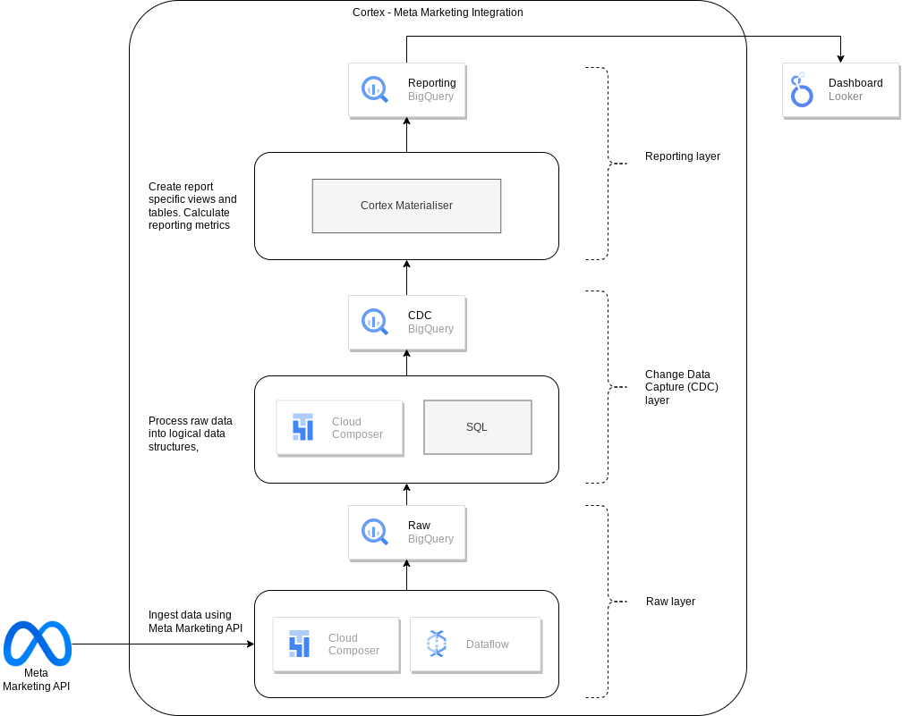

# Integration options for Marketing workload

The following data sources are available through the Marketing workload:
- Google Ads
  
- Campaign Manager 360 (CM360)
  
- TikTok
  
- LiveRamp
  
- Meta (Facebook / Instagram)
  
- Salesforce Marketing Cloud (SFMC)
  

We use Dataflow pipelines to obtain data from upstream systems. Cloud Composer is used to schedule and monitor these Dataflow pipelines.

## Deployment Configuration for Marketing

| Parameter                                | Meaning                                   | Default Value           | Description                                                             |
| ------------------                       | -------------                             | ---------------------   | --------------------------------------------------                      |
| `marketing.deployGoogleAds`              | Deploy Google Ads                         | `true`                  | Execute the deployment for Google Ads data source.                      |
| `marketing.deployCM360`                  | Deploy CM360                              | `true`                  | Execute the deployment for CM360 data source.                           |
| `marketing.deployTikTok`                 | Deploy TikTok                             | `true`                  | Execute the deployment for TikTok data source.                          |
| `marketing.dataflowRegion`               | Dataflow region                           | -                       | Region for Dataflow pipelines (See [available values](https://cloud.google.com/dataflow/docs/resources/locations)). |
| `marketing.GoogleAds.deployCDC`          | Deploy CDC for Google Ads                 | `true`                  | Generate Google Ads CDC processing scripts to run as DAGs in Cloud Composer.
| `marketing.GoogleAds.lookbackDays`       | Lookback days for Google Ads              | `180`                   | Number of days to start fetching data from Google Ads API.              |
| `marketing.GoogleAds.datasets.cdc`       | CDC dataset for Google Ads                |                         | CDC dataset for Google Ads.                                             |
| `marketing.GoogleAds.datasets.raw`       | Raw dataset for Google Ads                |                         | Raw dataset for Google Ads.                                             |
| `marketing.GoogleAds.datasets.reporting` | Reporting dataset for Google Ads          | `"REPORTING_GoogleAds"` | Reporting dataset for Google Ads.                                       |
| `marketing.CM360.deployCDC`              | Deploy CDC scripts for CM360              | `true`                  | Generate CM360 CDC processing scripts to run as DAGs in Cloud Composer. |
| `marketing.CM360.dataTransferBucket`     | Bucket with Data Transfer Service results | -                       | Bucket where DTv2 files are stored.                                     |
| `marketing.CM360.datasets.cdc`           | CDC dataset for CM360                     |                         | CDC dataset for CM360.                                                  |
| `marketing.CM360.datasets.raw`           | Raw dataset for CM360                     |                         | Raw dataset for CM360.                                                  |
| `marketing.CM360.datasets.reporting`     | Reporting dataset for CM360               | `"REPORTING_CM360"`     | Reporting dataset for CM360.                                            |
| `marketing.TikTok.deployCDC`             | Deploy CDC scripts for TikTok             | `true`                  | Generate TikTok CDC processing scripts to run as DAGs in Cloud Composer.|
| `marketing.TikTok.datasets.cdc`          | CDC dataset for TikTok                    |                         | CDC dataset for TikTok.                                                 |
| `marketing.TikTok.datasets.raw`          | Raw dataset for TikTok                    |                         | Raw dataset for TikTok.                                                 |
| `marketing.TikTok.datasets.reporting`    | Reporting dataset for TikTok              | `"REPORTING_TikTok"`    | Reporting dataset for TikTok.                                           |
| `marketing.Meta.deployCDC`               | Deploy CDC scripts for Meta               | `true`                  | Generate Meta CDC processing scripts to run as DAGs in Cloud Composer.  |
| `marketing.Meta.datasets.cdc`            | CDC dataset for Meta                      |                         | CDC dataset for Meta.                                                   |
| `marketing.Meta.datasets.raw`            | Raw dataset for Meta                      |                         | Raw dataset for Meta.                                                   |
| `marketing.Meta.datasets.reporting`      | Reporting dataset for Meta                | `"REPORTING_Meta"`      | Reporting dataset for Meta.                                             |
| `marketing.SFMC.deployCDC`               | Deploy CDC scripts for SFMC               | `true`                  | Generate SFMC CDC processing scripts to run as DAGs in Cloud Composer.  |
| `marketing.SFMC.fileTransferBucket`      | Bucket with Data Extract files            | -                       | Bucket where SFMC Automation Studio Data Extract files are stored.      |
| `marketing.SFMC.datasets.cdc`            | CDC dataset for SFMC                      |                         | CDC dataset for SFMC.                                                   |
| `marketing.SFMC.datasets.raw`            | Raw dataset for SFMC                      |                         | Raw dataset for SFMC.                                                   |
| `marketing.SFMC.datasets.reporting`      | Reporting dataset for SFMC                | `"REPORTING_SFMC"`      | Reporting dataset for SFMC.                                             |


## Configure integration for Google Ads

Cortex Data Foundation integrates with Google Ads in the following way:
1. **Source to Raw layer**: Ingest data from Google Ads to raw dataset using Google Ads APIs. This is achieved by using Dataflow pipelines triggered through Cloud Composer DAGs.
2. **Raw layer to CDC layer**: Apply CDC processing on raw dataset and store the output in CDC dataset. This is accomplished by Cloud Composer DAGs running BigQuery SQLs.
3. **CDC layer to Reporting layer**: Create final reporting tables from CDC tables in the Reporting dataset. This is accomplished by either creating runtime views on top of CDC tables or running Cloud Composer DAGs for materialized data in BigQuery tables - depending on [how it's configured](./README.md#customizing-reporting_settings-file-configuration).

### Google Ads API

The ingestion templates for Google Ads use the [Google Ads API](https://developers.google.com/google-ads/api/docs/start) to retrieve reporting attributes and metrics. The current templates use [version 15](https://developers.google.com/google-ads/api/fields/v15/overview).

#### API Limits:
Relevant limits fo the API (as of this release):
- Basic access operations/day: 15000 (paginated requests containing valid next_page_token are not counted).
- Max page size: 10000 rows per page.
- Recommended default parameters: Page size = 10000 rows per page.
For more details on these API, please consult documents referred above.

### Configurations
Following configs are required to be in place for Cortex to successfully bring data from Ads into the Cortex reporting layer.

#### Configure Google Ads Account Authentication
1.  Go to Google Cloud Console -> API & Services -> Credentials and create a new credential under “OAuth Client ID”.
    ```
    Application type: “Web Application”
    Name: Give it a name (e.g. “Cortex Authentication Client”).
    Authorized redirect URIs: http://127.0.0.1
    ```
    For more information, see [Using OAuth 2.0 to Access Google APIs](https://developers.google.com/identity/protocols/oauth2/)
2.  Once the above credential is configured, note the values for `Client ID` and `Client secret` - it will be used later.
3.  Generate refresh token using "[How to refresh token](https://developers.google.com/identity/protocols/oauth2#5.-refresh-the-access-token,-if-necessary.)".
4.  Now create a secret using Google Cloud Secret Manager (Security -> Secret Manager) with name “`cortex-framework-google-ads-yaml`” using the following format:
    ```
    {"developer_token": "developer_token_value", "refresh_token": "refresh_token_value", "client_id": "client_id_value", "client_secret": "client_secret_value", "use_proto_plus": False, "login_customer_id": "ads_customer_id"}
    ```
    For the values:
    * `developer_token` value : Available in Google Ads account
    * `refresh_token` value: From the step #3 above.
    * `login_customer_id` value: Available in Google Ads account (Please note that this value should not contain dashes or hyphens)
    * `client_id` value: From the OAuth setup in step #2 above.
    * `client_secret` value: From the configurations in step #2 above.

#### Cloud Composer Connections
Create the following connections in Cloud Composer / Airflow:
Connection Name          | Purpose
-------------------------|------------------------------------------------------
`googleads_raw_dataflow` | For Google Ads API -> Bigquery Raw Dataset
`googleads_cdc_bq`       | For Raw dataset -> CDC dataset transfer
`googleads_reporting_bq` | For CDC dataset -> Reporting dataset transfer

#### Cloud Composer Service Account permissions
The service account used in Cloud Composer (as configured in the `googleads_raw_dataflow` connection above) needs Dataflow related permissions. For more, please check [Dataflow documentation](https://cloud.google.com/dataflow/docs/concepts/security-and-permissions#df-service-account).

#### Ingestion settings
File `src/GoogleAds/config/ingestion_settings.yaml` contains further settings that controls
"Source to Raw" and "Raw to CDC" data pipelines.

##### `source_to_raw_tables`:
This section has entries that control which entities are fetched by APIs and how. Each entry corresponds with one Google Ads entity. Based on this config, Cortex creates Airflow DAGs that run Dataflow pipelines to fetch data using Google Ads APIs.

Parameters for each entry:

Parameter           | Description
------------------- | ------------
`load_frequency`    | How frequently a DAG for this entity will run to fetch data from Google Ads. (See [Airflow documentation](https://airflow.apache.org/docs/apache-airflow/stable/authoring-and-scheduling/cron.html#) for details on possible values.)
`api_name`          | API Resource Name (e.g. `customer` for https://developers.google.com/google-ads/api/fields/v15/customer)
`table_name`        | Table in Raw dataset where the fetched data will be stored (e.g. `customer`)
`schema_file`       | Schema file in `src/table_schema` directory that maps API response fields to destination table's column names.
`key`               | Columns (separated by comma) that form a unique record for this table.
`is_metrics_table`  | Indicates if a given entry is for a metric entity (in Google Ads API). System treats such tables a bit differently due to aggregated nature of such tables.
`partition_details` | (Optional) If you want this table to be partitioned for performance considerations. See Appendix section [Table Partition and Cluster Settings](./README.md#table-partition-and-cluster-settings) for details on how to configure this.
`cluster_details`   | (Optional) If you want this table to be clustered for performance considerations. See Appendix section [Table Partition and Cluster Settings](./README.md#table-partition-and-cluster-settings) for details on how to configure this.

##### `raw_to_cdc_tables`:
This section has entries that control how data is moved from Raw tables to CDC tables. Each entry
corresponds with a raw table (which in turn corresponds with Google Ads API entity as mentioned above.)

Parameters for each entry:
Parameter           | Description
------------------- | ------------
`table_name`        | Table in CDC dataset where the raw data after CDC transformation will be stored (e.g. `customer`)
`raw_table`         | Table on which raw data has been replicated
`key`               | Columns (separated by comma) that form a unique record for this table.
`load_frequency`    | How frequently a DAG for this entity will run to populate CDC table. (See [Airflow documentation](https://airflow.apache.org/docs/apache-airflow/stable/authoring-and-scheduling/cron.html#) for details on possible values.)
`schema_file`       | Schema file in `src/table_schema` directory that maps raw columns to CDC columns and data type of the CDC column. (NOTE: This is the same schema file that's referred to in earlier section.)
`partition_details` | (Optional) If you want this table to be partitioned for performance considerations. See Appendix section [Table Partition and Cluster Settings](./README.md#table-partition-and-cluster-settings) for details on how to configure this.
`cluster_details`   | (Optional) If you want this table to be clustered for performance considerations. See Appendix section [Table Partition and Cluster Settings](./README.md#table-partition-and-cluster-settings) for details on how to configure this.

#### Reporting settings
You can configure and control how Cortex generates data for the Google Ads final reporting layer using reporting settings file (`src/GoogleAds/config/reporting_settings.yaml`). This file controls how reporting layer BQ objects (tables, views, functions or stored procs are generated.)

For more details, please see [Customizing reporting_settings file configuration](./README.md#customizing-reporting_settings-file-configuration) section.


## Configure integration for CM360

Cortex Data Foundation integrates with CM360 in the following way:
1. **Source to Raw layer**: Ingest data from CM360 to raw dataset using CM360 Data Transfer V2 files. This is achieved by using Dataflow pipelines triggered through Cloud Composer DAGs.
2. **Raw layer to CDC layer**: Apply CDC process on raw dataset and store the output in CDC dataset. This is accomplished by Cloud Composer DAGs running BigQuery SQLs.
3. **CDC layer to Reporting layer**: Create final reporting tables from CDC tables in the Reporting dataset. This is accomplished by either creating runtime views on top of CDC tables or running Cloud Composer DAGs for materialized data in BigQuery tables - depending on [how it's configured](./README.md#customizing-reporting_settings-file-configuration).

### CM360 Data Transfer V2
For CM360, we use files generated by [Data Transfer V2.0](https://developers.google.com/doubleclick-advertisers/dtv2/overview) as source of truth. In order to use CM360 with Cortex,
set up Data Transfer process by following the documentation.

### Configurations
Following configs are required to be in place for Cortex to successfully bring data from CM360 system into Cortex Reporting layer.

#### DTv2 Files GCS Bucket
Once the Data Transfer V2 is set up, obtain the GCS Bucket name, and make sure the GCS bucket and files under the bucket are readable by the service account running DAGs in Cloud Composer.

#### Set up Cloud Composer Connections
Create following connections in Cloud Composer / Airflow:
Connection Name       | Purpose
----------------------|------------------------------------------------------
`cm360_raw_dataflow`  | For CM360 DTv2 files -> Bigquery Raw Dataset
`cm360_cdc_bq`        | For Raw dataset -> CDC dataset transfer
`cm360_reporting_bq`  | For CDC dataset -> Reporting dataset transfer

#### Cloud Composer Service Account permissions
The service account used in Cloud Composer (as configured in the `cm360_raw_dataflow` connection above) needs Dataflow related permissions. For more, please check [Dataflow documentation](https://cloud.google.com/dataflow/docs/concepts/security-and-permissions#df-service-account).

#### Ingestion settings
File `src/CM360/config/ingestion_settings.yaml` contains further settings that control "Source to Raw" and "Raw to CDC" data pipelines.

##### `source_to_raw_tables`:
This section has entries that control which files from DTv2 are processed and how. Each entry corresponds with files associated with one entity. Based on this config, Cortex creates Airflow DAGs that
run Dataflow pipelines to process data from the DTv2 files.

Parameters for each entry:
Parameter           | Description
------------------- | ------------
`base_table`        | Table in Raw dataset where the data for an entity (like 'Clicks' data) will be stored.
`load_frequency`    |  How frequently a DAG for this entity will run to process data from DTv2 files. (See [Airflow documentation](https://airflow.apache.org/docs/apache-airflow/stable/authoring-and-scheduling/cron.html#) for details on possible values.)
`file_pattern`      | Regex based file name patterns that corresponds to an entity.
`schema_file`       | Schema file in `src/table_schema` directory that maps DTv2 fields to destination table's column names and data types.
`partition_details` | (Optional) If you want this table to be partitioned for performance considerations. See Appendix section [Table Partition and Cluster Settings](./README.md#table-partition-and-cluster-settings) for details on how to configure this.
`cluster_details`   | (Optional) If you want this table to be clustered for performance considerations. See Appendix section [Table Partition and Cluster Settings](./README.md#table-partition-and-cluster-settings) for details on how to configure this.

##### `raw_to_cdc_tables`:
This section has entries that control how data is moved from Raw tables to CDC tables. Each entry
corresponds with a raw table (which in turn corresponds with DTv2 entity as mentioned above.)

Parameters for each entry:
Parameter           | Description
------------------- | ------------
`base_table`        | Table in CDC dataset where the raw data after CDC transformation will be stored (e.g. `customer`)
`load_frequency`    |  How frequently a DAG for this entity will run to populate CDC table. (See [Airflow documentation](https://airflow.apache.org/docs/apache-airflow/stable/authoring-and-scheduling/cron.html#) for details on possible values.)
`row_identifiers`   | List of columns (separated by comma) that forms a unique record for this table.
`partition_details` | (Optional) If you want this table to be partitioned for performance considerations. See Appendix section [Table Partition and Cluster Settings](./README.md#table-partition-and-cluster-settings) for details on how to configure this.
`cluster_details`   | (Optional) If you want this table to be clustered for performance considerations. See Appendix section [Table Partition and Cluster Settings](./README.md#table-partition-and-cluster-settings) for details on how to configure this.

#### Reporting settings
You can configure and control how Cortex generates data for the CM360 final reporting layer using the reporting settings file (`src/CM360/config/reporting_settings.yaml`). This file controls how reporting layer BQ objects (tables, views, functions or stored procedures are generated.)

For more details, please see [Customizing reporting_settings file configuration](./README.md#customizing-reporting_settings-file-configuration) section.

## Configure integration for TikTok

Cortex Data Foundation integrates with TikTok in the following way:
1. **Source to Raw layer**: Ingest data from TikTok to raw dataset using [TikTok Reporting APIs](https://business-api.tiktok.com/portal/docs?id=1751087777884161). This is achieved by using Dataflow pipelines triggered through Cloud Composer DAGs.
2. **Raw layer to CDC layer**: Apply CDC process on raw dataset and store the output in CDC dataset. This is accomplished by Cloud Composer DAGs running BigQuery SQLs.
3. **CDC layer to Reporting layer**: Create final reporting tables from CDC tables in the Reporting dataset. This is accomplished by either creating runtime views on top of CDC tables or running Cloud Composer DAGs for materialized data in BigQuery tables - depending on [how it's configured](./README.md#customizing-reporting_settings-file-configuration).

### TikTok Reporting APIs

For TikTok, Cortex uses [TikTok Reporting APIs](https://business-api.tiktok.com/portal/docs?id=1751087777884161) as source of truth. The current version is [v1.3](https://business-api.tiktok.com/portal/docs?id=1740579480076290).

Cortex uses [Synchronous](https://business-api.tiktok.com/portal/docs?id=1738864778664961) mode, and calls [Basic Reporting](https://business-api.tiktok.com/portal/docs?id=1738864915188737) APIs to obtain Ad and Ad Group performance data.

### Configurations
Following configs are required to for Cortex to successfully bring data from TikTok into Cortex Reporting layer.

#### Configure TikTok Account and Account Authentication
1. Set up a [TikTok Developer Account](https://business-api.tiktok.com/portal/docs?id=1738855176671234), if you don't have it already.
2. Create an app for Cortex integration if you need to, as guided [here](https://business-api.tiktok.com/portal/docs?id=1738855242728450). Make sure you have selected the following two in the scopes for the app:
    * `Ad Account Management/Ad Account Information`
    * `Reporting/All`

3. Get app id, secret and long term access token as described in the [TikTok guide](https://business-api.tiktok.com/portal/docs?id=1738373141733378), and store them respectively in Google Cloud Secret Manager with the following names:
    `cortex_tiktok_app_id`
    `cortex_tiktok_app_secret`
    `cortex_tiktok_access_token`

#### Set up Cloud Composer Connections
Create following connections in Cloud Composer / Airflow:
Connection Name       | Purpose
----------------------|------------------------------------------------------
`tiktok_raw_dataflow` | For TikTok API  -> Bigquery Raw Dataset
`tiktok_cdc_bq`       | For Raw dataset -> CDC dataset transfer
`tiktok_reporting_bq` | For CDC dataset -> Reporting dataset transfer

#### Cloud Composer Service Account permissions
The service account used in Cloud Composer (as configured in the `tiktok_raw_dataflow` connection above) needs Dataflow related permissions. For more, please check [Dataflow documentation](https://cloud.google.com/dataflow/docs/concepts/security-and-permissions#df-service-account). Also, the same service account should also have Secret Manager Accessor access.

#### Ingestion settings
File `src/TikTok/config/ingestion_settings.yaml` contains further settings that control "Source to Raw" and "Raw to CDC" data pipelines.

##### `source_to_raw_tables`:
This section has entries that control how data from TikTok is fetched and where they end up in raw dataset. Each entry corresponds with one raw table that will have data fetched from TikTok API for that entity. Based on this config, Cortex creates Airflow DAGs that run Dataflow pipelines to process data from TikTok APIs.

Parameters for each entry:

Parameter           | Description
------------------- | ------------
`base_table`        | Table in Raw dataset where the data for an entity (like 'Ad' data) will be stored.
`load_frequency`    | How frequently a DAG for this entity will run to process data from DTv2 files. (See [Airflow documentation](https://airflow.apache.org/docs/apache-airflow/stable/authoring-and-scheduling/cron.html#) for details on possible values.)
`schema_file`       | Schema file in `src/table_schema` directory that maps API response fields to destination table's column names.
`partition_details` | (Optional) If you want this table to be partitioned for performance considerations. See Appendix section [Table Partition and Cluster Settings](./README.md#table-partition-and-cluster-settings) for details on how to configure this.
`cluster_details`   | (Optional) If you want this table to be clustered for performance considerations. See Appendix section [Table Partition and Cluster Settings](./README.md#table-partition-and-cluster-settings) for details on how to configure this.


##### `raw_to_cdc_tables`:
This section has entries that control how data moves from raw tables to CDC tables. Each entry corresponds with a CDC table (which in turn corresponds with an entity mentioned above for the `source_to_raw_tables`.)

Parameters for each entry:
Parameter           | Description
------------------- | ------------
`base_table`        | Table in CDC dataset where the raw data after CDC transformation will be stored (e.g. `auction_ad_performance`)
`load_frequency`    | How frequently a DAG for this entity will run to populate CDC table. (See [Airflow documentation](https://airflow.apache.org/docs/apache-airflow/stable/authoring-and-scheduling/cron.html#) for details on possible values.)
`row_identifiers`   | List of columns (separated by comma) that forms a unique record for this table.
`partition_details` | (Optional) If you want this table to be partitioned for performance considerations. See Appendix section [Table Partition and Cluster Settings](./README.md#table-partition-and-cluster-settings) for details on how to configure this.
`cluster_details`   | (Optional) If you want this table to be clustered for performance considerations. See Appendix section [Table Partition and Cluster Settings](./README.md#table-partition-and-cluster-settings) for details on how to configure this.

#### Reporting settings
You can configure and control how Cortex generates data for the TikTok final reporting layer using the reporting settings file (`src/TikTok/config/reporting_settings.yaml`). This file controls how reporting layer BQ objects (tables, views, functions or stored procedures are generated.)

For more details, please see [Customizing reporting_settings file configuration](./README.md#customizing-reporting_settings-file-configuration) section.

## Configure integration for LiveRamp

Cortex Data Foundation enables Identity Resolution by [integrating with LiveRamp](https://docs.liveramp.com/identity/en/identity-resolution.html).

Cortex frameworks can perform [RampId](https://docs.liveramp.com/connect/en/rampid-methodology.html) lookup for a known audience / customer segment (e.g. ‘high-value customers’, ‘cat lovers’) from CRM (or other) systems.

Using PII information (Email, Phone, Name, Phone number etc), the LiveRamp API returns a RampID, which is an identifier that allows businesses to identify and consolidate records across multiple systems - such as the audience of different campaigns.

### LiveRamp APIs
[LiveRamp Identity Resolution Retrieval API](https://developers.liveramp.com/rampid-api/reference/getting-started) allows businesses to programmatically resolve PII data to individuals. Cortex uses LiveRamp's [Lookup Endpoint](https://developers.liveramp.com/rampid-api/docs/the-lookup-endpoint-1) by sending hashed PII data over the API call.

### Input and Output tables
After deploying Cortex, system will create two BQ tables in relevant dataset provided in `config.json`:

1. `rampid_lookup_input` table

    This table is input for the RampId Lookup process.

    | Column              | Data Type | Description                               | Example               | Is Primary Key? |
    | -------             |-----      | -------------------------                 | --------              | --------------  |
    | id                  | STRING    | Unique Id of this record.                 | "123"                 | Yes             |
    | segment_name        | STRING    | Name of audience/CRM/Customer segment.    | "High Value"          | No              |
    | source_system_name  | STRING    | Source system where the record came from. | "Salesforce"          | No              |
    | name                | STRING    | Customer Name                             | "John Doe"            | No              |
    | email               | STRING    | Customer Email                            | "example@example.com" | No              |
    | phone_number        | STRING    | Customer Phone                            | "1234567890"          | No              |
    | postal_code         | STRING    | Customer postal code                      | "12345"               | No              |
    | is_processed        | BOOL      | Indicates if a record is already processed. <br> For new records, populate this with FALSE. <br> System will update this to TRUE once it's processed.| FALSE | No|
    | load_timestamp      | TIMESTAMP | Timestamp when the record was inserted in the system. This is purely for audit purpose. | "2020-01-01 00:00:00 UTC" | No |
    | processed_timestamp | TIMESTAMP | Timestamp when system performed API Lookup for this record. This is always populated by system. | "2020-01-01 00:00:00 UTC" | No |

    Note that `id` needs to be unique.

2. `rampid_lookup` table

This is output table containing RampIds for each segment in the input record.  Please note that LiveRamp by design does not allow to map RampId to an individual record.

| Column       | Data Type | Description                                      |
| -------      | ------    | -------------------------------------------------|
| segment_name | STRING    | Segment name from input table.                   |
| ramp_id      | STRING    | LiveRamp RampId                                  |
| recordstamp  | TIMESTAMP | Timestamp when this rampid lookup was performed. |

####  Notes on the lookup tables

1. `rampid_lookup_input` table needs to be populated on periodic basis (based on your business needs) with your customer's PII details like Name, Email etc. Cortex does not provide an automated way to do so. But Cortex provides a sample script `ddls/samples/populate_rampid_lookup_input.sql` that shows how you could populate this table using data in your Salesforce system already deployed with Cortex. You can use that as guide too in case your data comes from other system.

2. Also, ensure you do not have duplicates in the `rampid_lookup_input` table (as in, same individual is present multiple times with same PII information, even if their `id` may be different). Cortex Lookup DAG will fail if a segment contains too many duplicate entries. This is enforced by LiveRamp APIs.

3. LiveRamp RampIds [can change over period of time](https://docs.liveramp.com/connect/en/interpreting-rampid,-liveramp-s-people-based-identifier.html#idm45078819449264_body), for the same individual. This means, you need to perform a fresh lookup for already processed data time to time. Cortex provides a sample script `ddls/samples/clean_up_segment_matching.sql` that shows how you can do this at a segment level. This way, you can reset a whole segment, and system will perform a lookup for that segment and give you up to date RampIds.

4. `rampid_lookup` - the output table - may contain slightly less number of records compared to the input table. This is by design, as Cortex tries to dedup the input records using PII details to ensure LiveRamp API lookup does not fail.

### Configurations

#### Configure LiveRamp Authentication
1. [Contact LiveRamp](https://liveramp.com/contact/) to obtain authentication credentials. This should include two fields: Client Id,  Client Secret.
2. Create a secret using Google Cloud Secret Manager with name "cortex-framework-liveramp", and use the following as value:
```
{
  'client_id':'<your client id obtained above>',
  'client_secret':'<your client secret obtained above>',
  'grant_type':'client_credentials'
}
```

#### Set up Cloud Composer Connection
Create following connections in Cloud Composer / Airflow:
Connection Name   | Purpose
------------------|------------------------------------------------------
`liveramp_cdc_bq` | For LiveRamp API -> CDC dataset transfer

#### config.ini
This config file controls some behavior of the Cloud Composer DAG, as well as how LiveRamp APIs are consumed.

Configure `LiveRamp/src/pipelines/config.ini` based on your needs. While these parameters are already described in the file, pay attention to `liveramp_api_base_url`.
This parameter by default points to LiveRamp's production API url, for testing purpose, you may need to point it to the staging version, depending on your setup.

## Configure integration for Meta (Facebook / Instagram Ads)

Cortex Data Foundation integrates with Meta (Facebook / Instagram Ads) in the following way:
1. **Source to Raw layer**: Ingest data from Meta to raw dataset using Meta Marketing APIs. This is achieved by using Dataflow pipelines triggered through Cloud Composer DAGs.
2. **Raw layer to CDC layer**: Apply CDC processing on raw dataset and store the output in CDC dataset. This is accomplished by Cloud Composer DAGs running BigQuery SQLs.
3. **CDC layer to Reporting layer**: Create final reporting tables from CDC tables in the Reporting dataset. This is accomplished by either creating runtime views on top of CDC tables or running Cloud Composer DAGs for materialized data in BigQuery tables - depending on [how it is configured](./README.md#customizing-reporting_settings-file-configuration).

### Meta Marketing API

The ingestion templates for Meta use the [Meta Marketing API](https://developers.facebook.com/docs/marketing-apis/) to retrieve reporting attributes and metrics. The current templates use [version v19.0](https://developers.facebook.com/docs/graph-api/changelog/version19.0).

#### API Limits
Meta imposes a dynamic rate limit when querying the Marketing API. When the rate limit is reached, Source to Raw ingestion DAGs may not complete successfully. In such cases, you can see relevant error messages in the log, and the next execution of the DAGs will retroactively load any missing data.

Meta Marketing API has 2 tiers of access, Basic and Standard. Standard tier offers much higher limit, and is recommended if you plan to use the Source to Raw ingestion extensively. For more details on these limits and how to attain a higher access tier, please consult [Meta's official documentation](https://developers.facebook.com/docs/marketing-apis/rate-limiting).

If you have Standard tier access, you can lower the value of `_NEXT_REQUEST_DELAY_SEC` constant in `src/Meta/src/raw/pipelines/helpers/meta_client.py` for faster loading times.

#### Setting up access and generating access token
Following steps are required in [Meta Business Manager](https://business.facebook.com/) and [Developer Console](https://developers.facebook.com/) to successfully bring data from Meta into the Cortex.

1.  Identify an App you'd like to use. You can also [create a new App](https://developers.facebook.com/docs/development/create-an-app/) that is connected to the Business account. Make sure your app is of type `Business`.

2.  Set up App permissions. You must be assigned to the app as an Administrator before you can create tokens with it. See [here](https://developers.facebook.com/docs/development/build-and-test/app-roles/) for details. Make sure you assign relevant assets (accounts) to your app.

3.  Generate access token. Access tokens are required to access Meta Marketing API, and they are always associated with an app and a user. You can either create the token with a system user, or with your own login.

    Note that, regardless of how you create your token, `ads_read` and `business_management` permissions are required to access the supported objects.

    *  To create a token with a system user, you need to first create an [Admin System User](https://www.facebook.com/business/help/327596604689624?id=2190812977867143) and then [generate a token](https://www.facebook.com/business/help/503306463479099?id=2190812977867143).

    *  Alternatively you can [create a User access token](https://developers.facebook.com/docs/facebook-login/guides/access-tokens/#usertokens) using your own login. Tokens created this way has the same access to all accounts and pages as you do, without need for further specifications.

    >**IMPORTANT**: Make sure to note down your token as soon as they are generated, as they will not be retrievable again once you leave the page.

### Configurations

#### Setting up Meta Access Token
Follow [Cloud Composer documentation](https://cloud.google.com/composer/docs/secret-manager) to enable Secret Manager in Cloud Composer.
Then, create a secret named `cortex_meta_access_token`, and store the token you've generated in the previous step as content.

#### Cloud Composer Connections
Create the following connections in Cloud Composer / Airflow:
Connection Name          | Purpose
-------------------------|------------------------------------------------------
`meta_raw_dataflow` | For Meta Marketing API -> Bigquery Raw Dataset
`meta_cdc_bq`       | For Raw dataset -> CDC dataset transfer
`meta_reporting_bq` | For CDC dataset -> Reporting dataset transfer

#### Cloud Composer Service Account permissions
The service account used in Cloud Composer (as configured in the `meta_raw_dataflow` connection above) needs Dataflow related permissions. For more, please check [Dataflow documentation](https://cloud.google.com/dataflow/docs/concepts/security-and-permissions#df-service-account).

The service account also require `Secret Manager Secret Accessor` permission. See details [in the access control documentation](https://cloud.google.com/composer/docs/secret-manager#configure_access_control).

#### Raw DAG settings
`src/Meta/src/raw/pipelines/config.ini` controls some behavior of the Cloud Composer DAG, as well as how Meta Marketing APIs are consumed. You can find descriptions for each parameter in the file.

#### Request Parameters
Directory `src/Meta/config/request_parameters` contains an API request specification file for each entity that's extracted from Meta Marketing API.

Each request file contains a list of fields to fetch from Meta Marketing API, one field per row. Consult [Meta Marketing API Reference](https://developers.facebook.com/docs/marketing-api/reference/v19.0) for detailed specifications.

#### Ingestion settings
File `src/Meta/config/ingestion_settings.yaml` contains further settings that controls
"Source to Raw" and "Raw to CDC" data pipelines.

##### `source_to_raw_tables`
This section has entries that control which entities are fetched by APIs and how. Each entry corresponds with one Meta Marketing API entity. Based on this config, Cortex creates Airflow DAGs that run Dataflow pipelines to fetch data using Meta Marketing APIs.

Parameters for each entry:

Parameter           | Description
------------------- | ------------
`base_table`        | Table in Raw dataset where the fetched data will be stored (e.g. `customer`)
`load_frequency`    | How frequently a DAG for this entity will run to fetch data from Meta (Facebook / Instagram). (See [Airflow documentation](https://airflow.apache.org/docs/apache-airflow/stable/authoring-and-scheduling/cron.html#) for details on possible values.)
`object_endpoint`   | API endpoint path (e.g. `campaigns` for `/{account_id}/campaigns` endpoint)
`entity_type`       | Type of table - should be one of `fact`, `dimension` or `adaccount`.
`object_id_column`  | Columns (separated by comma) that form a unique record for this table. Only required when `entity_type` is `fact`.
`breakdowns`  | Breakdown columns (separated by comma) for insights endpoints. Optional. Only applicable when `entity_type` is `fact`.
`action_breakdowns`  | Action breakdown columns (separated by comma) for insights endpoints. Optional. Only applicable when `entity_type` is `fact`.
`partition_details` | (Optional) If you want this table to be partitioned for performance considerations. See Appendix section [Table Partition and Cluster Settings](./README.md#table-partition-and-cluster-settings) for details on how to configure this.
`cluster_details`   | (Optional) If you want this table to be clustered for performance considerations. See Appendix section [Table Partition and Cluster Settings](./README.md#table-partition-and-cluster-settings) for details on how to configure this.

##### `raw_to_cdc_tables`
This section has entries that control how data is moved from Raw tables to CDC tables. Each entry
corresponds with a raw table (which in turn corresponds with Google Ads API entity as mentioned above.)

Parameters for each entry:
Parameter           | Description
------------------- | ------------
`base_table`        | Table on which raw data has been replicated. A table with the same name in CDC dataset will store the raw data after CDC transformation  (e.g. `campaign_insights`).
`row_identifiers`   | Columns (separated by comma) that form a unique record for this table.
`load_frequency`    | How frequently a DAG for this entity will run to populate CDC table. (See [Airflow documentation](https://airflow.apache.org/docs/apache-airflow/stable/authoring-and-scheduling/cron.html#) for details on possible values.)
`partition_details` | (Optional) If you want this table to be partitioned for performance considerations. See Appendix section [Table Partition and Cluster Settings](./README.md#table-partition-and-cluster-settings) for details on how to configure this.
`cluster_details`   | (Optional) If you want this table to be clustered for performance considerations. See Appendix section [Table Partition and Cluster Settings](./README.md#table-partition-and-cluster-settings) for details on how to configure this.

#### CDC table schema
For Meta, all fields are stored in string format in raw layer. On the other hand, in CDC layer, primitive types will be converted to relevant business data types. and all complex types will be stored in BigQuery JSON format.

To enable this conversion, directory `src/Meta/config/table_schema` contains one schema file for each entity specified in `raw_to_cdc_tables` section that explains how to properly translate each BigQuery raw table into CDC table.

Each schema file contains three columns:
`SourceField`: Field name of the raw table for this entity.
`TargetField`: Column name in the cdc table for this entity.
`DataType`: Data type of each cdc table field.

#### Reporting settings
You can configure and control how Cortex generates data for the Meta final reporting layer using reporting settings file (`src/Meta/config/reporting_settings.yaml`). This file controls how reporting layer BQ objects (tables, views, functions or stored procs are generated.)

For more details, please see [Customizing reporting_settings file configuration](./README.md#customizing-reporting_settings-file-configuration) section.

## Configure integration for Salesforce Marketing Cloud (SFMC)

Cortex Data Foundation integrates with Salesforce Marketing Cloud in the following way:
1. **Source to Raw layer**: Ingest data from files extracted from SFMC to raw dataset using SFMC Automation Studio.
This is achieved by using Dataflow pipelines triggered through Cloud Composer DAGs.
2. **Raw layer to CDC layer**: Apply CDC processing on raw dataset and store the output in CDC dataset.
This is accomplished by Cloud Composer DAGs running BigQuery SQLs.
3. **CDC layer to Reporting layer**: Create final reporting tables or views from CDC tables in the Reporting dataset.
This is accomplished by either creating runtime views on top of CDC tables or running
Cloud Composer DAGs for materialized data in BigQuery tables - depending on [how it's configured](./README.md#customizing-reporting_settings-file-configuration).

### SFMC Data Extraction using Automation Studio

[SFMC Automation Studio](https://help.salesforce.com/s/articleView?id=sf.mc_as_automation_studio.htm) allows consumers of SFMC to export their SFMC data to various storage systems.
Cortex Data Foundation looks for a set of files created with Automation Studio in a GCS bucket.
We will also need to use [SFMC Email Studio](https://help.salesforce.com/s/articleView?id=sf.mc_es_email_studio.htm&type=5) in this process.

> **NOTE**: Please note that the base version of Salesforce Marketing Cloud does not offer Automation Studio,
but it is available for all the other versions.

Here is the high-level instruction to set up these data extract and export processes.

1. Set up GCS bucket.

    [Set up a GCS bucket](https://help.salesforce.com/s/articleView?id=sf.mc_overview_set_up_google_cloud_location.htm) that will be used to store files exported from SFMC. Use this bucket name for
    `marketing.SFMC.fileTransferBucket` config parameter.

2. Create Data Extensions.

    For [each entity](#raw-table-schema) we want to extract data for, create a [Data Extension in Email Studio](https://help.salesforce.com/s/articleView?id=sf.mc_es_create_data_extension.htm&type=5).
    This is needed to identify the data sources from the SFMC internal database.

    > **Note**: List all the fields that are defined in `src/SFMC/config/table_schema` for the entity. If
    you need to customize this to extract more or less fields, make sure list of fields are aligned in these steps as well as in the table schema files.

    Example:
    ```
    Entity: unsubscribe

    Fields:
      AccountID
      OYBAccountID
      JobID
      ListID
      BatchID
      SubscriberID
      SubscriberKey
      EventDate
      IsUnique
      Domain
    ```

3. Create SQL Query Activities.

    For each entity, create a [SQL Query Activity](https://help.salesforce.com/s/articleView?id=sf.mc_as_use_the_sql_query_activity.htm&type=5). This activity is connected to its corresponding
    data extension created earlier.


    In this step:
    *  Define SQL query with all the relevant fields.  Again, the query needs to select all the fields relevant
    to the entity that's defined in the data extension in the previous step.
    *  Select correct data extension as target.
    *  Select “Overwrite” as Data Action.

    Example Query:
    ```sql
    SELECT
      AccountID,
      OYBAccountID,
      JobID,
      ListID,
      BatchID,
      SubscriberID,
      SubscriberKey,
      EventDate,
      IsUnique,
      Domain
    FROM
      _Unsubscribe

    ```


4. Create Data Extract Activities.

    Create a [Data Extract Activity ](https://help.salesforce.com/s/articleView?id=sf.mc_as_use_a_data_extract_activity.htm&language=en_us&type=5) for each entity. This activity gets the data
    from the Salesforce Data Extension and extracts it to a csv file.

    For this step:
    * Use correct naming pattern. It should match the pattern defined in the [settings](#source_to_raw_tables-3).  E.g. For `Unsubscribe` entity, the file name can be something like `unsubscribe_%%Year%%_%%Month%%_%%Day%% %%Hour%%.csv`
    * Set Extract Type to `Data Extension Extract`.
    * Select "Has column Headers" and "Text Qualified" options.

5. Create File Conversion Activities to convert format from UTF-16 to UTF-8.

    By default Salesforce exports CSV files in UTF-16. In this step we convert it to UTF-8 format.

    For each entity, create another [Data Extract Activity](https://help.salesforce.com/s/articleView?id=sf.mc_as_use_a_data_extract_activity.htm&language=en_us&type=5), for file conversion.

    For this step:
    * Use the same File Naming Pattern that was used in the previous step of Data Extraction Activity.
    * Set Extract Type to `File Convert`
    * Select `UTF8` form the dropdown at `Convert To`.

6. Create File Transfer Activities.

    Create a [File Transfer Activity](https://help.salesforce.com/s/articleView?id=sf.mc_as_using_the_file_transfer_activity.htm&type=5) for each entity.  These activities will move
    the extracted csv files from the Salesforce Safehouse to Google Cloud Buckets.

    For this step:
    * Use the same naming pattern used in the prior step.
    * Select GCS bucket that was setup earlier in the process as Destination.

7. Schedule the execution.
    After all the activities are setup, set up [automated schedules](https://help.salesforce.com/s/articleView?id=sf.mc_as_schedule_an_automation.htm&type=5) to run them.


### Configurations

#### Cloud Composer Connections
Create the following connections in Cloud Composer / Airflow:
Connection Name     | Purpose
--------------------|------------------------------------------------------
`sfmc_raw_dataflow` | For SFMC Extracted files -> Bigquery Raw dataset
`sfmc_cdc_bq`       | For Raw dataset -> CDC dataset transfer
`sfmc_reporting_bq` | For CDC dataset -> Reporting dataset transfer

#### Cloud Composer Service Account permissions
The service account used in Cloud Composer (as configured in the `sfmc_raw_dataflow` connection above) needs Dataflow related permissions. For more, please check [Dataflow documentation](https://cloud.google.com/dataflow/docs/concepts/security-and-permissions#df-service-account).


#### Raw table schema
Directory `src/SFMC/config/table_schema` contains a schema file for each entity that's extracted from SFMC.
Each file explains how to read the csv files extracted from Automaton Studio in order to successfully load them
into BigQuery raw dataset.

Each schema file contains three columns:
`SourceField`: Field name of the csv file.
`TargetField`: Column name in the raw table for this entity.
`DataType`: Data type of each raw table field.

#### Ingestion settings
File `src/SFMC/config/ingestion_settings.yaml` contains further settings that controls
"Source to Raw" and "Raw to CDC" data pipelines.

##### `source_to_raw_tables`:
This section has entries that control how files extracted from Automation Studio are used.
Each entry corresponds with one SFMC entity. Based on this config, Cortex creates Airflow
DAGs that run Dataflow pipelines to load data from exported file into BigQuery tables in raw dataset.

Parameters for each entry:

Parameter           | Description
------------------- | ------------
`base_table`        | Raw table name in which an SFMC entity extracted data will be loaded.
`load_frequency`    | How frequently a DAG for this entity will run to load data from extracted files. (See [Airflow documentation](https://airflow.apache.org/docs/apache-airflow/stable/authoring-and-scheduling/cron.html#) for details on possible values.)
`file_pattern`      | Regex pattern for file for this table that's exported from Automation Studio into GCS bucket. Change this only if you chose a different names than the ones suggested for extracted files.
`partition_details` | How the raw table will be partitioned for performance considerations. See Appendix section [Table Partition and Cluster Settings](./README.md#table-partition-and-cluster-settings) for details on how to configure this.
`cluster_details`   | (Optional) If you want the raw table to be clustered for performance considerations. See Appendix section [Table Partition and Cluster Settings](./README.md#table-partition-and-cluster-settings) for details on how to configure this.

##### `raw_to_cdc_tables`:
This section has entries that control how data is moved from Raw tables to CDC tables. Each entry
corresponds with a raw table which is configured in the section above.

Parameters for each entry:
Parameter           | Description
------------------- | ------------
`base_table`        | Table in CDC dataset where the raw data after CDC transformation will be stored.
`load_frequency`    | How frequently a DAG for this entity will run to populate CDC table. (See [Airflow documentation](https://airflow.apache.org/docs/apache-airflow/stable/authoring-and-scheduling/cron.html#) for details on possible values.)
`raw_table`         | Source table from raw dataset.
`row_identifiers`   | Columns (separated by comma) that form a unique record for this table.
`partition_details` | How the CDC table will be partitioned for performance considerations. See Appendix section [Table Partition and Cluster Settings](./README.md#table-partition-and-cluster-settings) for details on how to configure this.
`cluster_details`   | (Optional) If you want this table to be clustered for performance considerations. See Appendix section [Table Partition and Cluster Settings](./README.md#table-partition-and-cluster-settings) for details on how to configure this.

#### Reporting settings
You can configure and control how Cortex generates data for the SFMC final reporting layer using reporting settings file (`src/SFMC/config/reporting_settings.yaml`). This file controls how reporting layer BQ objects (tables, views, functions or stored procs are generated.)

For more details, please see [Customizing reporting_settings file configuration](./README.md#customizing-reporting_settings-file-configuration) section.