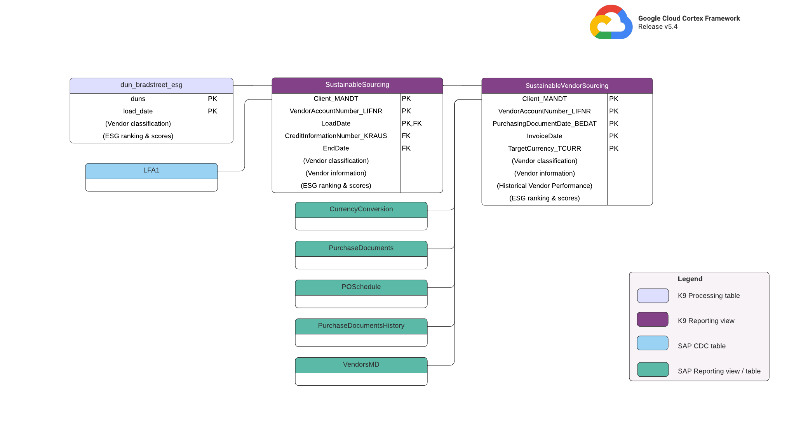

# Sustainability & ESG Insights with Cortex Framework

Due to an increasing demand for transparency and visibility from corporate investors and regulators on climate risk, many corporations have to start reporting on their carbon footprints. Traditionally, sustainability teams rely on spreadsheets and emails to report on their ESG data as it involves various new data sources.

Cortex Data Framework combines supplier performance data with advanced ESG insights to compare delivery performance, sustainability & risks more holistically across global operations.

## Overview

Two Sustainability views are provided for this module, in the `K9 Reporting` dataset:

* `SustainableSourcing` provides ESG Insights for each vendor.
* `SustainableVendorSourcing` additionally provides vendor performance insights alongside ESG Insights.

You can adjust the [reporting settings file](src/k9/src/sustainability/reporting/sustainability_reporting.yaml) as described in our [README](https://github.com/GoogleCloudPlatform/cortex-data-foundation/blob/main/README.md#customizing-reporting_settings-file-configuration).

## Prerequisites

The following is required for this module to function:

*   Dun & Brandstreet source table - loaded as `dun_bradstreet_esg` table in `K9 Processing` dataset. See section below for details.
*   A full Cortex SAP ECC or S/4 deployment, containing CDC and Reporting datasets. Refer to the [main README](README.md) for details.

## Acquiring Dun & Bradstreet data

Navigate to the [BigQuery Analytics Hub](https://cloud.google.com/analytics-hub) and search for "esg ranking". There is an option to choose between four datasets: `US Full File`, `UK Full File`, `Global Full File` & `Global Financial Services`. Click on one of them, then select `Request Access` to get in touch with D&B for further instructions.

## Loading Dun & Bradstreet data

Table `dun_bradstreet_esg` in `K9 Processing` dataset hosts [Dun & Bradstreet ESG data](https://www.dnb.co.uk/content/dam/english/dnb-solutions/ESG%20Methodology%20Whitepaper.pdf), and it should be loaded through a CSV file provided by DnB. Please refer to the [data dictionary](/src/k9/src/sustainability/data/dnb_esg_data_dict.csv) and [sample data](/src/k9/src/sustainability/data/dnb_esg_sample_record.csv).

## Looker Studio Dashboard

Refer to this [sample Looker Studio dashboard](https://lookerstudio.google.com/c/u/0/reporting/cab436f2-ff83-4cfa-b7e4-e99b9fd9a8d0/page/RJ2qD) on how the data could be used to showcase insights.
