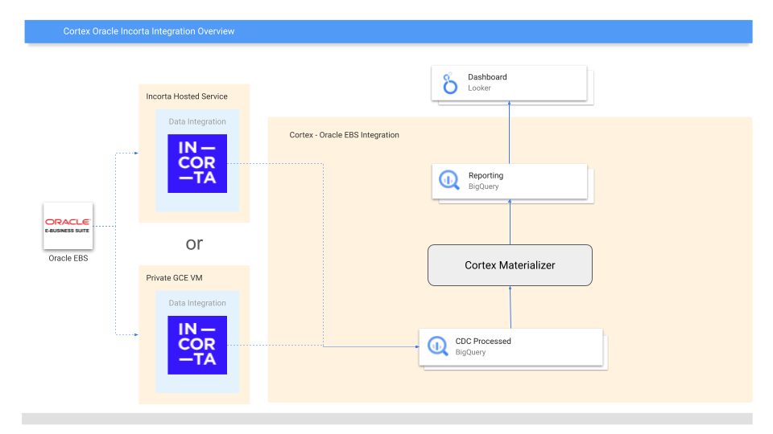
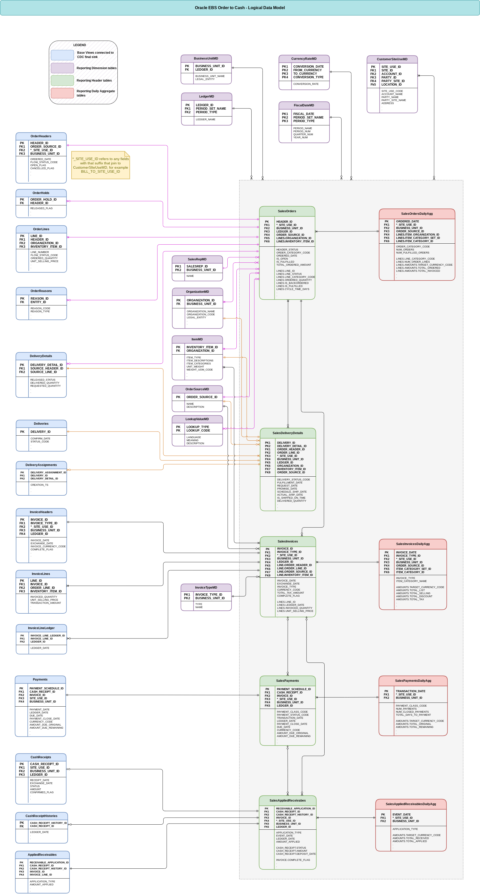

# Oracle EBS with Cortex Framework

**IMPORTANT: This README file is obsolete and no longer receives updates.** For the most current and reliable information, refer to the new documentation at [Cortex Framework: integration with Oracle EBS](https://cloud.google.com/cortex/docs/operational-oracle-ebs).

The Oracle EBS integration currently supports Order to Cash data models with data
ingestion leveraging [Incorta](https://www.incorta.com/). Incorta uses a hosted
or private instance to ingest the data from Oracle into a BigQuery CDC dataset
and handles the CDC processing. From there, Cortex transforms and materializes
the CDC data into reporting assets using Cloud Composer to orchestrate BigQuery
jobs.

## Deployment configuration

| Parameter | Meaning | Default Value | Description | Matching Oracle source field |
| --------- | ------- | ------------- | ----------- | ---------------------------- |
| `OracleEBS.itemCategorySetIDs` | Item category sets | `[1100000425]` | List of sets to use for categorizing items. | `MTL_ITEM_CATEGORIES.CATEGORY_SET_ID` |
| `OracleEBS.currencyConversionType` | Currency conversion type | `"Corporate"` | Type of currency conversion to use in aggregate tables. | `GL_DAILY_RATES.CONVERSION_TYPE` |
| `OracleEBS.currencyConversionTargets` | Currency conversion targets | `["USD"]` | List of target currencies to include in aggregate tables. | `GL_DAILY_RATES.TO_CURRENCY` |
| `OracleEBS.languages` | Languages | `["US"]` | List of languages to present translations of fields like item descriptions. | `FND_LANGUAGES.LANGUAGE_CODE` |
| `OracleEBS.datasets.cdc` | CDC dataset | - | CDC dataset. | - |
| `OracleEBS.datasets.reporting` | Reporting dataset | `"REPORTING_OracleEBS"` | Reporting dataset. | - |

The default values for `itemCategorySetIDs`, `currencyConversionType`,
`currencyConversionTargets`, and `languages` will work with the test data deployment.
However for a production deployment, these will depend on your Oracle EBS instance.
For help with determining appropriate values, please contact your Oracle administrator.

## Data Ingestion

Please reach out to an Incorta representative and refer to
[this help page](https://docs.incorta.com/latest/blueprints-oracle-ebs-google-cortex-setup-guide)
for details on ingesting data from Oracle to BigQuery.

### Recommended configurations

Although Incorta supports scheduling data ingestion jobs at various intervals, we
recommend running the ingestion once per day given that the reporting views will
likely be refreshed daily as well. If your use case requires handling deleted data,
be sure to enable those by following the
[provided instructions](https://docs.incortaops.com/latest/blueprints-oracle-ebs-google-cortex#handling-source-deletes).

## Reporting configurations

### Cloud Composer/Airflow connection

Create a BigQuery Airflow connection named `oracleebs_reporting_bq` that will be used
by the BigQuery operator to perform reporting transforms.

### Materializer settings

Materialization settings can be found in `src/OracleEBS/config/reporting_settings.yaml`.
By default the [dimensions](#dimension-tables), [headers](#header-tables), and
[aggregates](#aggregate-tables) are materialized as tables daily.
The reporting layer tables are also date partitioned.
[Partitions and clustering can be customized](https://github.com/GoogleCloudPlatform/cortex-data-foundation/blob/main/README.md#table-partition-and-cluster-settings)
if needed.

## Data Model

### Base fact views

These are the blue objects in the ERD and are simple views on CDC tables with
no transforms other than some column name aliases.

### Dimension tables

These are the purple objects in the ERD and contain the relevant dimensional attributes
used by the reporting tables. By default, these dimensions are filtered down based on
the [deployment configuration](#deployment-configuration) parameter values where
applicable. This integration also uses the Cortex K9 Gregorian calendar dimension for
date attributes, which is deployed by default.

### Header tables

These are the green objects in the ERD and contain the joined facts and dimensions that
describe business entities like orders and invoices at the header level. The header tables
are partitioned by a primary event date corresponding to each entity, for example
`ORDERED_DATE` or `INVOICE_DATE`.

#### Nested and repeated Lines

The `SalesOrders` and `SalesInvoices` tables contain
[nested repeated fields](https://cloud.google.com/bigquery/docs/best-practices-performance-nested)
named `LINES`. These fields group the various order lines and invoice lines
under their associated headers. To query these nested fields, use the `UNNEST` operator to
[flatten the elements into rows](https://cloud.google.com/bigquery/docs/arrays) as shown in
the provided sample scripts (`src/OracleEBS/src/reporting/ddls/samples/`).

> [!CAUTION]
> Be careful when unnesting repeated fields to avoid double counting the top level measures.

#### Nested and repeated attributes

Some tables contain additional nested repeated fields such as `ITEM_CATEGORIES` or
`ITEM_DESCRIPTIONS` where multiple values of the same attribute may apply to the entity.
If unnesting these repeated attributes, be sure to filter down to a single attribute value
to avoid over counting measures.

#### Applied Receivables

`SalesAppliedReceivables` is a unique table in that the entities can reference either invoices
on their own, or an invoice with a cash receipt. As such there are nested (but not repeated)
`INVOICE` and `CASH_RECEIPT` fields, where the `CASH_RECEIPT` field is only populated when
`APPLICATION_TYPE = 'CASH'`.

### Aggregate tables

These are the red objects in the ERD and aggregate from the header tables up to daily measures.
Each of these tables are also partitioned by a primary event date. The aggregate tables only
contain additive measures (e.g. counts, sums) and do not include measures like averages and
ratios. This means that users must derive the non-additive measures to ensure they can be
derived appropriately when aggregating up to a higher grain, such as monthly. See sample
scripts like `src/OracleEBS/src/reporting/ddls/samples/SalesOrderAggMetrics.sql`.

#### Currency conversion Amounts

Each aggregate table uses the `CurrencyRateMD` dimension to create a nested repeated field of
`AMOUNTS` containing currency measures converted into each of the target currencies specified
in the [deployment configuration](#deployment-configuration). When using these measures, be sure
to filter to a single target currency or group on target currencies for reporting to avoid over
counting. This can also be seen in the sample scripts like `src/OracleEBS/src/reporting/ddls/samples/SalesOrderAggMetrics.sql`.

#### Nested line attributes and measures

The `SalesOrdersDailyAgg` table contains a nested repeated field named `LINES` to differentiate
between line level attributes and measures (e.g. `ITEM_CATEGORY_NAME` and `AMOUNTS`) vs header
level attributes and measures (e.g. `BILL_TO_CUSTOMER_NAME` and `NUM_ORDERS`). Take care to
query these grains separately to avoid over counting.

Although invoices also have a notion of headers vs lines, the table `SalesInvoicesDailyAgg`
only contains measures at the line level, so it does not follow the same structure as
`SalesOrdersDailyAgg`.
