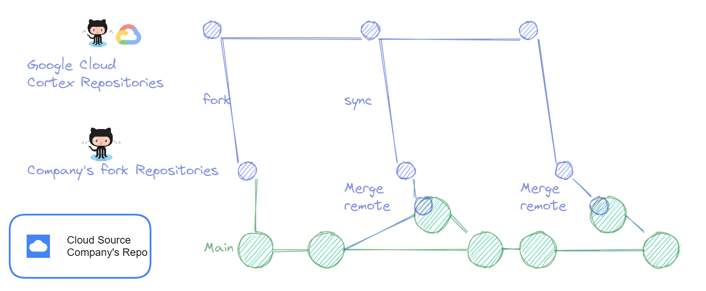
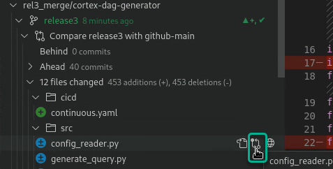
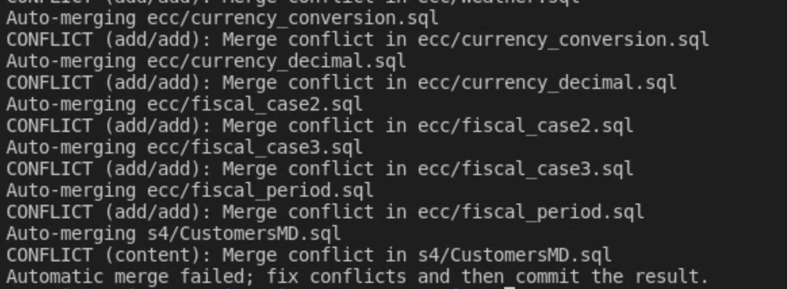
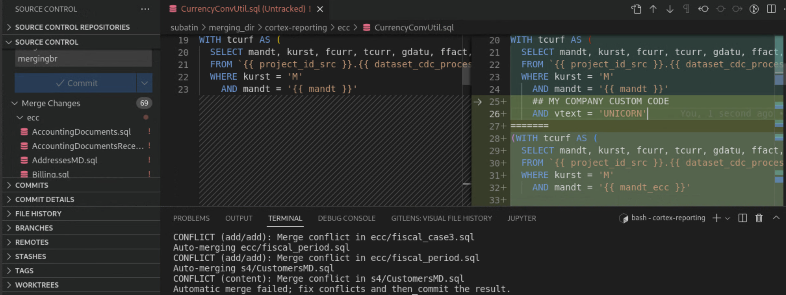

# Recommendations to Upgrade from customized Data Foundation

**IMPORTANT: This README file is obsolete and no longer receives updates.** For the most current and reliable information, refer to the new documentation at [Upgrade recommendations](https://cloud.google.com/cortex/docs/upgrade-recommendations).

**TL;DR:** [Cortex Data Foundation](https://github.com/GoogleCloudPlatform/cortex-data-foundation) helps accelerate deployments with our [Data Cloud](https://cloud.google.com/data-cloud) and includes a set of predefined content and templates for organizations to use, modify and discard as needed. Each organization should optimize content for its own unique needs around data quality, security, performance and costs by making adjustments as needed. We will strive to release non-breaking changes as much as technically possible to avoid disrupting customizations.


## Introduction

[Cortex Data Foundation](https://github.com/GoogleCloudPlatform/cortex-data-foundation) provides a set of predefined content and templates to accelerate value from data replicated into [BigQuery](https://cloud.google.com/bigquery). Organizations should adapt these templates, modules, SQL, Python scripts, pipelines and other content provided to fit their unique needs.

Cortex Data Foundation content is designed with a principle of openness in mind. Organizations should be able to use the tools that work best for them when working with the BigQuery data models provided The only platform on which the foundation has a tight dependency on is Google BigQuery. All other tools can be interchanged as required:


*   **Data Integration:** Any integration tool that has interconnectivity with BigQuery can be leveraged provided it can replicate raw tables and structures. For example, raw tables should resemble the same schema as they were created in SAP (same names, same names of fields, same data types). In addition, the integration tool should be able to provide basic transformation services such as updating target data types for BigQuery compatibility as well as adding additional fields like timestamp or operations flag for highlighting new and changed records.
*   **Data Processing:** The change data capture (CDC) processing scripts provided work with [Cloud Composer](https://cloud.google.com/composer) (or Apache Airflow) are optional, and the implementation of this submodule may be ignored completely if another tool is achieving this goal. Conversely, the SQL statements are produced separately from the Airflow-specific files where possible, so that customers can make use of the separate SQL files in another tool as needed.
*   **Data Visualization:** While [Looker](https://cloud.google.com/looker) dashboarding templates are provided and contain visualizations and minimum logic, the core logic remains available in the data foundation within BigQuery by design so it’s easy for organizations to create visualizations with their reporting tool of choice.

Scripts are built with interchangeability in mind. SQL views are built with markers for organizations to implement, expand or discard logic depending on their configurations and business needs. No two organizations are the same, and that means that their data modeling may also divert from the standard. Organizations are encouraged to make these accelerators their own, customize them and, if applicable, contribute back to the community with their learnings.

The same applies to optimizations for cost and performance. Some companies may have higher throughput, some companies may have higher historical volume. This means partitioning, data quality checks, clusters and materialization strategy will be different. The business' needs for updated information will also influence this.

With this in mind, **the Cortex Framework development team will strive to keep changes as _non-breaking_ as possible**. For example, SQL views may gain new fields, but not lose them from their output or change their level of aggregation. We recommend keeping the Release Notes in mind and watching for major verison changes as these indicate how big a new release can be. As of the date of publishing, Release v3.0 is by far the biggest change we have ever released at once in terms of upgrade efforts. We hope this is an exception.

The following instructions illustrate one of the many ways in which developers can keep their code up-to-date with the Cortex Data Foundation repository while retaining their customizations. Use of the pre-delivered deployment scripts in CI/CD pipelines is also included in this example. Organizations may also opt to use other tools to create artifacts and pipelines, [such as Dataform](https://dataform.co/), or automation tools provided by the different Git hosts, such as GitHub actions.




## Setup your repository
There are multiple paths to do this. This illustrates only one of them.

We strongly recommend you are familiar with Git's innero workings and commands before tackling these steps.


1. One option is to [fork](https://github.com/GoogleCloudPlatform/cortex-data-foundation/fork) the repository. Some organizations may opt for having their own clone with an upstream branch as described in step 3. In this example, we will start with a fork to keep that repository receiving updates from the Google Cloud repository, and a separate repository for the Company's _main_. For the data foundation, we assume you are using the deployment included there and all the submodules (e.g., CDC, SAP Reporting, ML Models) that you intend to deploy and customize.


2. In this example, we are establishing Cloud Source as the host for our company’s repository. The aim of this step is to show an example of a different tool being used as a customer’s main repository where developers collaborate to create and adjust models. This tool can be any Git host of choice. We will refer to the repository created in Cloud Source as the _company’s repository_.


3. Copy the code from the fork into the new repository. Add the new repository as an [upstream remote repository](https://docs.github.com/en/pull-requests/collaborating-with-pull-requests/working-with-forks/configuring-a-remote-for-a-fork) and verify the remote has been added.

```
git remote add google <<remote URL>>
git remote -v
git push --all google
```


You should see the two remotes, origin and the one you added after **git remote -v**:


You now have the repository, the _company’s repository_, where developers can submit their changes. Developers can now clone and work in branches in the new repository.


## Merge Your Changes with a New Cortex Release

This section will illustrate the process of merging changes from the _company’s repository_ and changes coming from the Google Cloud repository.


1. Update your forks for your repository with the changes from the Google Cloud repository.


2. In this example, we made the following changes to the Company’s repository:
    1. Created and incorporated the use of a new view in SQL
    2. Modified existing views
    3. Replaced a script entirely with our own logic

    There have also been some changes in the Data Foundation repository owned by Google Cloud in a new release.


    The following sample sequence adds the fork repository as an upstream remote repository to pull the updated release from as _github_ and checks out its main branch as _github-main_. Then, this example checks out the main branch from the Company’s repository in Google Cloud Source and creates a branch for merging called _merging\_br_.


```
git remote add github <<github fork>>
git fetch github main
git checkout -b github-main github/main
git checkout  main
git checkout -b merging_br
```


<div style="background-color: #cfc ; padding: 10px; border: 1px solid green; color: green;">
<b>NOTE</b>: There are multiple ways to build this flow. The merging process could also happen in the fork in GitHub, be replaced by a rebase instead of a merge, and the merging branch could also be sent as a merge request. These variations of the process will depend on current organizational policies, depth of changes and convenience.
</div>

With this setup in place, you can easily compare the incoming changes to your local changes. We recommend using a tool in a graphic IDE of choice for this.


In our experience, the easiest way to see the changes and choose what gets merged is using a visual tool. In this example, we are using Visual Studio:




We recommend flagging customizations using comments that stand out visually, to make the diff process easier.


3. Start the merge process

In the previous step, you created a branch called _merging\_br_. You will use this branch to converge all changes and discard files. When ready, you can merge this branch back into the main or another branch for your Company's repository to create a merge request.

From that merging branch that was checked out from your Company's repository's main (`git checkout merging_br`), merge the incoming changes from the remote fork.

```bash
## git branch -a
## The command above shows github-main which was created from the GitHub fork
## You are currently in merging_br
git merge github-main

## If you do not want a list of the commits coming form GitHub in your history, use --squash

```
This should generate a list of conflicts:



We recommend using the graphical comparison to understand the changes and choose between Current, Incoming and both. This is where having a comment in the code around customizations becomes handy.



Here you can choose to discard changes altogether, delete files that you do not want to merge at all and ignore changes to views or scripts that you have already customized.

After you have decided on the changes to apply, check the summary and commit them:

```bash
git status
## If something does not look right, you can use git rm or git restore accordingly
git add --all #Or . or individual files
git commit -m "Your commit message"
```

<div style="background-color: #cfc ; padding: 10px; border: 1px solid green; color: green;">
<b>PANIC?</b> Here is a useful resource: <a href="https://git-scm.com/book/en/v2/Git-Basics-Undoing-Things"> Git - Basic Undoing things </a>
</div>


So far you are only merging into a "temporary" branch. We recommend running a test deployment from the cloudbuild*.yaml scripts at this point to make sure everything is executing as expected. Automated testing can help streamline this process.

Once this merging branch looks good, you can checkout your main target branch and merge the _merging\_br_ branch into it.


<br>


_Copyright 2024 Google LLC. All rights reserved._