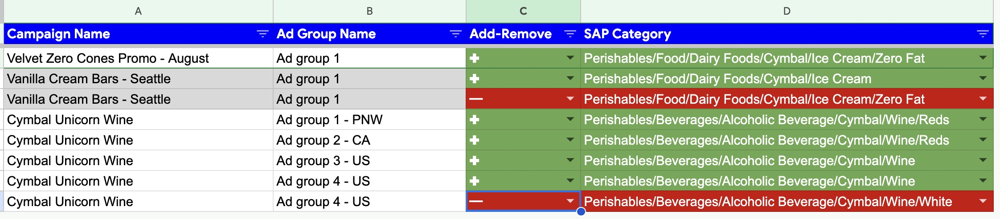
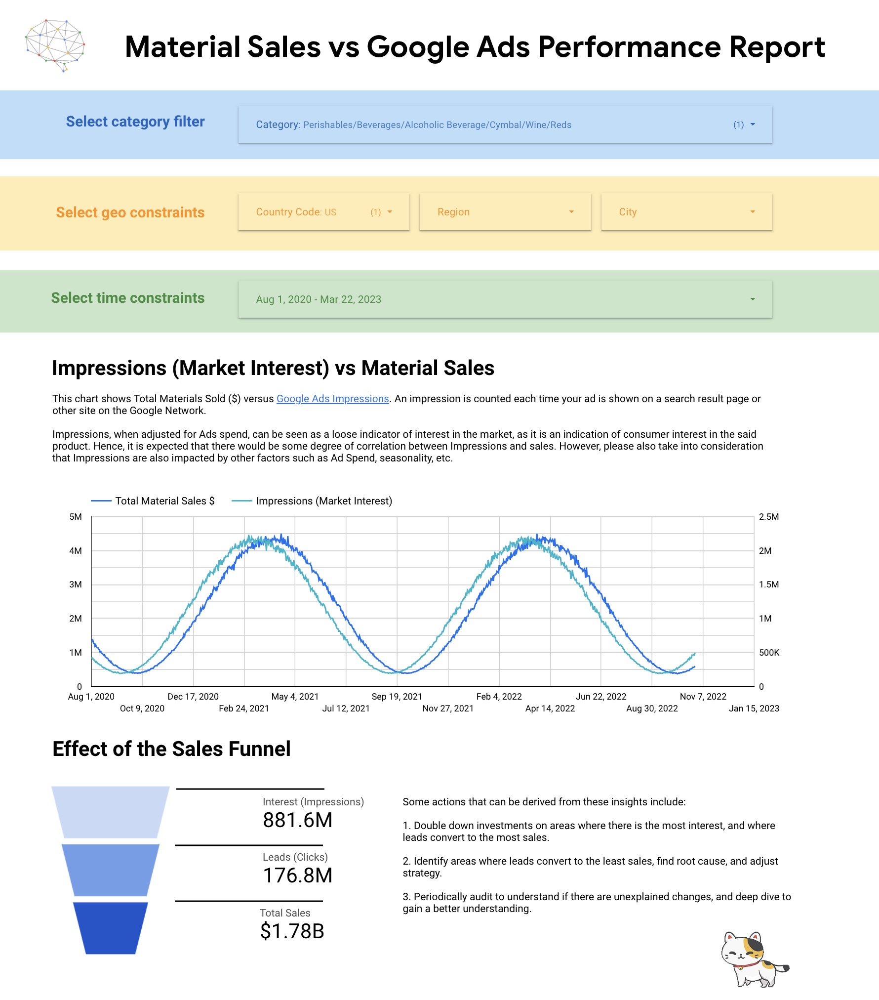
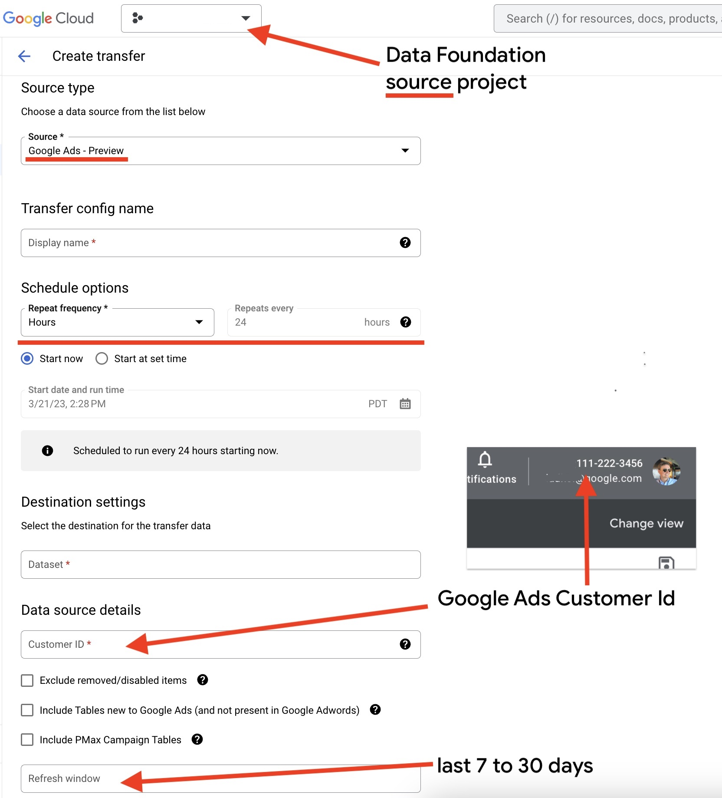

# CATGAP: Cortex Analytics Templates - Google Ads Pipelines (Experimental)

😺😺😺 LET'S 😺😺😺 BRIDGE 😺😺😺 THE 😺😺😺 GAP! 😺😺😺

## What is CATGAP?

**C**ortex **A**nalytics **T**emplates - **G**oogle **A**ds **P**ipelines,
an experimental Data Pipeline that uses [Large Language Models](https://en.wikipedia.org/wiki/Large_language_model) for joining SAP Product Hierarchy with Google Ads Campaigns.

It enables Google Ads analytics on the SAP Material/Product level, and SAP sales analytics in correlation to Ads Performance.

Machine Learning models do all the hard work of mapping Ad Groups to Product Hierarchy.
And you can always adjust it if necessary, simply by making changes in a spreadsheet.



You will be able to perform Marketing Analytics on the product level versus campaign level,
with direct attribution between Ad Campaigns/Groups and respective Materials in SAP.
This includes profiling sales of specific product categories over Ads performance data by
date ranges, geographies, age, gender, etc.

CATGAP is an experimental add-on for Cortex Data Foundation, currently in Preview.
If you are interested in exploring this solution, please contact [Cloud Cortex Support](mailto:cortex-support@google.com).



## Before deploying CATGAP

1. **Deploy Data Foundation for SAP**.
2. Configure [BigQuery Data Transfer](https://console.cloud.google.com/bigquery/transfers) for **Google Ads - Preview**
with a dataset in the *source project of Cortex Data Foundation* with **24 hours** transfer interval.

3. Let configured Data Transfer run for **at least 2 days**.

> CATGAP must be deployed from a recursively-cloned [**Cortex Data Foundation**](https://github.com/GoogleCloudPlatform/cortex-data-foundation) repository.

## Prerequisites

### APIs to enable

*Additional APIs on top of ones required by Data Foundation*

```
gcloud services enable \
    sheets.googleapis.com \
    drive.googleapis.com \
    dataflow.googleapis.com \
    datapipelines.googleapis.com
```

> If using custom Dataflow SDK container for faster execution, you also need to enable Artifact Registry API
(`artifactregistry.googleapis.com`).

### Resources to create

1. **Cloud Storage Bucket** (Dataflow bucket).
    It must not be in a multi-region, and must be in the same region as you configure for Dataflow compute.
1. **Dataflow Service Account**.

> Dataflow region must be in the same multi-region as Cortex Data Foundation datasets
and BigQuery DTS for Google Ads.

### Roles and Permissions:

*All permissions below are for the source project if not specified otherwise*

- Cloud Build Account:
    - Service Usage Consumer
    - Service Account Token Creator for Dataflow Service Account
    - Dataflow Admin
    - Storage Object Admin
    - BigQuery Job User (for source and target projects)
    - BigQuery Data Editor (for source and target projects)
    - Artifact Registry Administrator (*Only if using custom Dataflow SDK container*)

- Dataflow Service account:
    - BigQuery Data Editor (for source and target projects)
    - BigQuery Job User (for source and target projects)
    - Dataflow Worker
    - Service Account Token Creator for itself
    - Service Usage Consumer
    - Storage Object Admin for Dataflow bucket
    - Artifact Registry Reader (*Only if using custom Dataflow SDK container*)

- Cloud Composer Service account:
    - Dataflow Developer
    - Service Account User for Dataflow Service Account
    - Storage Object Admin for Dataflow bucket

### Cloud Composer

We support both Airflow 1 and Airflow 2 in Google Cloud Composer.

With Airflow 1, CATGAP requires `apache-airflow-backport-providers-google>=2021.3.3` package to be added
to your Airflow Environment's PyPI packages.

With Airflow 2, CATGAP requires `apache-airflow-providers-google>=2.2.0`.

Just as with Data Foundation, CATGAP DAG is copied to the target bucket's
`dags` folder. Once you are ready to run CATGAP pipeline, you can copy CATGAP pipeline's files from target bucket's `dag` folder to your Composer Environment's bucket, `dags` folder.

## Configuration

1. **CATGAP configuration** is stored in `config/settings.yaml`

- `user_email` - [optional] Google account email of a user to share the mapping spreadsheet with.
- `ads.dts_dataset` - name of the dataset of BigQuery Data Transfer for Google Ads in the source project.
- `ads.customer_id` - Google Ads customer id
- `sap.max_prod_hierarchy_level` - the deepest level of the product hierarchy
to use when mapping Google Ads campaigns and groups. Must be at least 3, but not more than 9.
- `dataflow.service_account` - Service Account to use with Dataflow.
- `dataflow.gcs_bucket` - GCS Bucket to use with Dataflow.
- `dataflow.region` - Cloud Region to run Dataflow jobs in.
- `dataflow.use_container` - Use a custom Dataflow SDK container (true/false).
It makes the CATGAP pipeline run faster, but requires enabling Artifact Registry API and configuring necessary permissions.

2. **Cortex Data Foundation `config.json`** must be in `config/config.json`
(`config` subdirectory of the Data Foundation repository).

## Deployment

The deployment command must be executed from the root of the Data Foundation repository
with its configuration file (`config/config.json`) having common and SAP parameters as
they were used for deploying Data Foundation.

```
src/k9/src/catgap/deploy_catgap.sh CONFIG_JSON_PATH GCS_BUCKET_NAME
```

* `CONFIG_JSON_PATH` - config.json path. Use to be `config/config.json`.
* `GCS_BUCKET` - GCS Bucket for Cloud Build logs. Cloud Build Service Account needs access to write here.

You may use same bucket as `_GCS_BUCKET` with Data Foundation.

### Alternative deployment path

> This path is for experienced engineers who may want to test their changes in the CATGAP code.
We recommend running these commands in a Python Virtual Environment.

```
python3 -m pip install -U -r src/k9/src/catgap/requirements.txt
python3 -m pip install -U -r src/k9/src/catgap/catgap_pipeline/requirements.txt
python3 src/k9/src/catgap/catgap_dag_generator.py --beam-sdk-version "2.45.0"
bash generated_dag/run_pipeline.sh DeployTemplate
bash generated_dag/run_pipeline.sh RunTemplate
```

## Mapping Spreadsheet

Mapping spreadsheet is the main artifact of the CATGAP pipeline.
It defines mapping between Google Ads Ad Groups and their Campaigns to SAP Material/Product Hierarchy.
If mapping that CATGAP's Machine Learning models produced is not how you actually designed your Ads Campaigns,
you can adjust it by making changes in the Mapping Spreadsheet.

> When making changes, especially adding rows, please make sure Campaign and Ad Group names
are specified exactly how they are configured in Google Ads. Names are case-sensitive.
The easiest way is to copy names from existing rows.

If `user_email` option was specified in the CATGAP configuration, the spreadsheet will be shared with that user via email.

If you haven't configured `user_email` or lost that message,
look in Cloud Build logs for a line starting with:
`Use this spreadsheet to review and adjust mappings between Ad Groups and SAP product hierarchy: https://docs.google.com/spreadsheets/`. This line will contain the full sharing link to the spreadsheet.

## CATGAP views in BigQuery

CATGAP pipeline produces the following views you may find insightful:

1. `AdsDailyStatsByHierAndCountry` in the Reporting dataset of the target project.
This view contains key Ads metrics (impressions, clicks, cost) attributed to SAP Product Hierarchy
and grouped by Country.
2. `WeeklySAPSalesAndAdsStatsByHierAndCountry` in the Reporting dataset of the target project.
This view contains key Ads metrics (impressions, clicks, cost) attributed to SAP sales in USD
attributed to SAP Product Hierarchy and grouped by Country
(matching between SAP customer and Ads impression/click).
3. `ads_to_sap_prod_hier` in CDC dataset of the source project.
This view contains mapping between Ad Groups and SAP Product hierarchy. **Use this view to model additional views that leverage mapping between Ad Groups/Campaigns and SAP Products Hierarchy.

> When `is_negative` is `TRUE`, it means there that respective Ad Group was configured with [Negative Keywords](https://support.google.com/google-ads/answer/12437241?hl=en) and/or [Audience Exclusions](https://support.google.com/google-ads/answer/2549058?hl=en).

!!! **IMPORTANT** !!!

> `AdsDailyStatsByHierAndCountry` and `WeeklySAPSalesAndAdsStatsByHierAndCountry` rows provide
attribution of Ad Groups metrics by country to one or more Product Hierarchy nodes.
If an Ad Group is mapped to multiple Product Hierarchy nodes, all metrics of such Ad Group
are still only segmented by country, and repeated for every Product Hierarchy attribution.
Therefore aggregation of these metrics across multiple Product Hierarchies
will result in multiplication.
In such situations, rather than analyzing absolute values, focus on trends and variances.
Alternatively, always make sure you aggregate Ads metrics only for a single Product Hierarchy node.

## Release Notes

CATGAP is an experimental add-on for Cortex Data Foundation. CATGAP source code is provided "as is" without warrantees or conditions of any kind.

While CATGAP is developed in accordance with our [AI Principles](https://ai.google/principles/), Machine Learning models powering CATGAP may produce inaccurate results.

In this first public preview, CATGAP only supports Search Ads.
Display Ads support is in development, and some of Display Ads groups may be mapped incorrectly.

## Monitoring

Navigate to [console.cloud.google.com/dataflow](https://console.cloud.google.com/dataflow)
in your source project.

🐈 Good luck! 🦄
